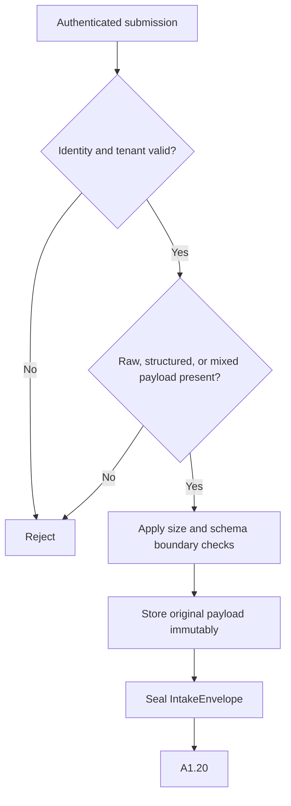

# A1.10 — Accept and Register Input

## Business Purpose

Create the auditable intake boundary for a manual optimization case. The node
records who submitted what, under which tenant and policy context, without
interpreting the optimization request or accessing source content.

## Actors and Dependencies

- Requester or host coding agent submits raw, structured, or mixed input.
- Identity provider supplies an authenticated actor and tenant context.
- LangGraph owns case/thread state and routing.
- Artifact store preserves the original payload by immutable digest.

## Input

| Input | Required validation |
|---|---|
| Graph identity | Non-empty `case_id`, `thread_id`, `tenant_id`; manual lane and entrypoint. |
| Caller identity | Authenticated actor ID, roles, tenant, and authentication time. |
| Request payload | Raw text, structured fields, or both; bounded byte/field sizes. |
| Source locator | Local path and allowed-root reference; syntax only at this node. |
| Policy context | Effective intake policy and schema version. |

## Output

`IntakeEnvelope@1.0` containing input mode, actor identity reference, source
locator, original-payload digest/ref, schema/policy versions, and audit time.
Graph state receives artifact/event refs only.

## Use-Case Flow

## Business Rules

1. At least one accepted input mode is present; mode is derived, not hardcoded.
2. Structured values do not silently override conflicting raw values; conflict
   policy is applied during extraction/quality validation.
3. Actor identity comes from the trusted host, not an unauthenticated payload
   string.
4. Source files are not read and raw source is not sent to a model here.
5. Original input is immutable and its digest is included in all downstream
   lineage.
6. Oversized, malformed, cross-tenant, or unsupported-schema requests fail
   before business processing.

## State Transition

| Condition | Route | Result |
|---|---|---|
| Intake boundary valid | `continue` | Append `IntakeEnvelope` ref; go to A1.20. |
| Missing/invalid payload or identity | `rejected` | Typed error and audit event; terminate. |
| Temporary artifact-store failure | `retry` | Bounded idempotent retry. |

## Acceptance Criteria

- Raw-only, structured-only, and mixed fixtures produce the correct input mode.
- Cross-tenant actor/payload combinations are rejected.
- Payload size limits are enforced before storage/model invocation.
- Replay produces the same envelope identity and no duplicate original payload.
- No raw request content is written into graph state or telemetry.

## Current Implementation Gap

The current contract accepts structured input only and A1.10 hardcodes
`input_mode=structured`. Host-authenticated identity is not yet the sole actor
authority, and raw/mixed input remains unimplemented.

