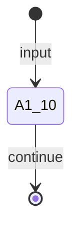

# A1.10 — Accept Input

## Purpose / BA Description

A1.10 validates tenant, case, and thread identities; verifies the input path is accessible and within allowed bounds; and creates the intake envelope that wraps the structured request for downstream processing.

---

## Actors

| Actor | Role |
|-------|------|
| Platform | Validates tenant/case identity and input path; creates `IntakeEnvelope` |

---

## Preconditions

- `ManualCasePayload` reference available (input payload, not yet an artifact)

---

## Inputs (Contract)

| Field | Type | Required | Description |
|-------|------|----------|-------------|
| case_id | string | ✓ | Unique case identifier |
| thread_id | string | ✓ | Thread within case (1–255 chars) |
| tenant_id | string | ✓ | Tenant isolation context |
| local_path | string | ✓ | Repository path to optimize |
| allowed_root | string | ✓ | Root that local_path must be contained by |

---

## Processing Logic

1. (Handler: `a1_handlers._a1_10`, lines 169–185)
2. Validate thread_id is non-empty and ≤255 characters
3. Check that local_path is readable and exists
4. Verify local_path is within allowed_root (no symlink escape, no traversal attack)
5. Hard-code input_mode = "structured" (A1 accepts structured input only)
6. Seal and return `IntakeEnvelope` artifact

---

## Outputs (Contract)

| Field | Type | Constraints | Description |
|-------|------|-------------|-------------|
| artifact_type | string | Literal["IntakeEnvelope"] | Fixed artifact type |
| schema_version | string | Literal["1.0"] | Canonical version |
| artifact_id | string | unique | Stable per case/thread |
| case_id | string | matches input | Propagated tenant context |
| input_mode | string | Literal["structured"] | Always structured for A1 |
| content_digest | string | sha256:[0-9a-f]{64} | Canonical JSON digest |

---

## Routing / State Transitions

All happy-path completions route → continue (A1.20).

---

## Business Rules & Edge Cases

- **Invalid path**: raises ValueError if local_path is outside allowed_root or contains forbidden characters
- **Symlink escape**: raises ValueError if any component of the path resolves outside allowed_root
- **Non-existent path**: raises FileNotFoundError
- **Non-readable path**: raises PermissionError
- **Empty/oversized thread_id**: raises ValueError if empty or > 255 chars
- **Input mode**: always "structured"; no raw/mixed input paths in A1

