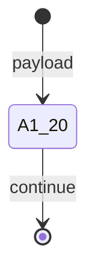

# A1.20 — Classify and Extract

## Purpose / BA Description

A1.20 maps structured fields from `ManualCasePayload` directly to `RawRequestDraft` (1:1 field copy). It performs no LLM extraction, no confidence ladder, no unresolved-fields discovery. This reflects A1's design choice to accept structured input only.

---

## Actors

| Actor | Role |
|-------|------|
| Platform | Direct field mapping; no model calls |

---

## Preconditions

- `IntakeEnvelope` (from A1.10)
- `ManualCasePayload` reference available

---

## Inputs (Contract)

Reads all fields from `ManualCasePayload` (feature_id, metric_id, direction, target, unit, workload_id, environment_id, command_id, actor_id, actor_role, etc.)

---

## Processing Logic

1. (Handler: `a1_handlers._a1_20` + `a1_handlers._draft_from_payload`, lines 188–192, 734–759)
2. Read `ManualCasePayload` from artifact store
3. Copy feature_id, metric_id, direction, target, unit, workload_id, environment_id, command_id to draft
4. Hard-code extraction_confidence = 1.0 (structured input always has full confidence)
5. Hard-code unresolved_fields = [] (no extraction, so no unresolved fields)
6. Seal and return `RawRequestDraft`

---

## Outputs (Contract)

| Field | Type | Constraints | Description |
|-------|------|-------------|-------------|
| feature_id | string | non-empty | From payload.feature_id |
| metric_id | string | non-empty | From payload.metric_id |
| direction | string | minimize\|maximize\|target | From payload.direction |
| target | float | non-null | From payload.target |
| unit | string | non-empty | From payload.unit |
| extraction_confidence | float | Literal[1.0] | Always 1.0 for structured input |
| unresolved_fields | list | Literal[[]] | Always empty; no extraction |

---

## Routing / State Transitions

---

## Business Rules & Edge Cases

- **Structured input only**: no LLM call, no confidence ladder
- **All fields required at payload level**: Pydantic validation prevents null values before A1.10 runs
- **Direct copy**: 1:1 field mapping, no transformation
- **extraction_confidence and unresolved_fields are structural placeholders**: they exist for defensive compatibility with future non-manual producers of `RawRequestDraft`, but they are always 1.0 and [] in this path

[Detailed content to be completed in next session]
