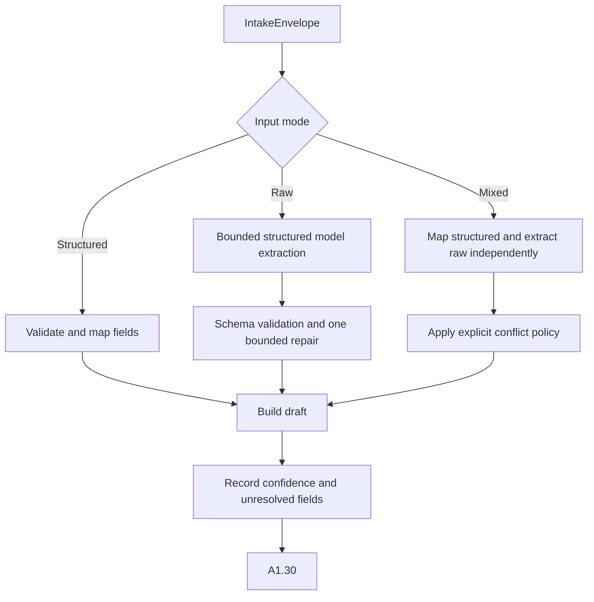

# A1.20 — Classify and Extract Request Draft

## Business Purpose

Convert the accepted input into a typed but explicitly unapproved draft. The
node extracts intent; it must preserve uncertainty and must never invent a
metric, target, scope, workload, or approval fact.

## Input

- `IntakeEnvelope` and immutable original payload.
- Structured-request schema and optional raw text.
- Versioned extraction prompt/model policy and metric vocabulary.
- Request budget for model calls and bounded repair.

## Output

`RawRequestDraft@1.0` containing objective statement, requester hypothesis,
feature, metric, direction, target, unit, guardrail hints, workload/dataset,
environment, command, extraction confidence, field-level provenance,
conflicts, and unresolved fields.

## Use-Case Flow

## Business Rules

1. Structured fields bypass model extraction but still require schema and
   semantic validation.
2. Raw extraction uses structured output and a pinned prompt/model version.
3. Unknown or ambiguous values remain null/unresolved.
4. Mixed-input conflicts remain explicit unless versioned policy selects an
   authoritative value.
5. Requested remedies are stored as hypotheses, never verified causes.
6. Model output has no approval or policy authority.
7. Model transcripts and raw text remain in protected artifacts, not graph
   state.

## State Transition

| Condition | Route | Result |
|---|---|---|
| Valid draft produced | `continue` | Publish draft; continue to A1.30. |
| Model output invalid after bounded repair | `missing` | Typed clarification/extraction failure. |
| Input conflict forbidden by policy | `rejected` or `clarification` | Request authoritative values. |
| Provider transient failure | `retry` | Retry within token/time budget and idempotency key. |

## Acceptance Criteria

- Structured input does not invoke a model.
- Raw ambiguous values remain unresolved rather than guessed.
- Mixed conflicts include both values and provenance.
- Prompt/model/version/token usage is auditable.
- A requested solution is separated from the measurable objective.

## Current Implementation Gap

Current code maps a fully structured payload with confidence 1.0. Raw/mixed
extraction, field provenance, conflict representation, and bounded model repair
are not implemented.
