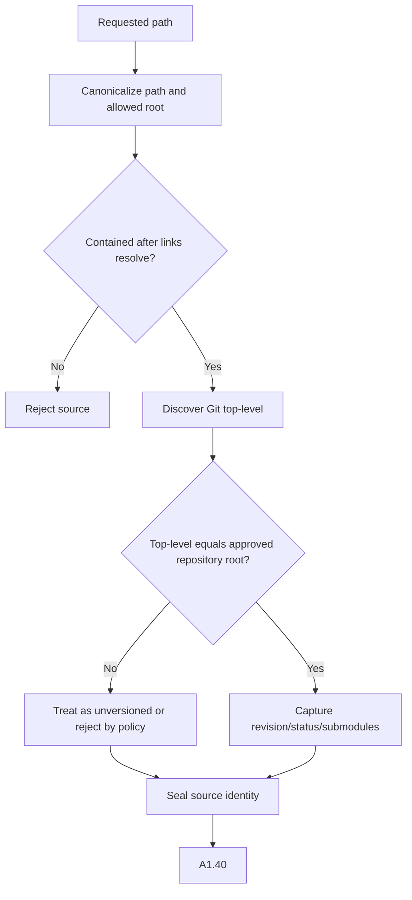

# A1.30 — Resolve Local Source Identity

## Business Purpose

Resolve the requested local path into an authorized repository identity while
preventing traversal, symlink/junction escape, and accidental inheritance of
an ancestor Git repository. This is source identification; A2 owns immutable
snapshot creation.

## Input

- `RawRequestDraft`, source locator, and allowed-root policy.
- Authenticated tenant/workspace identity.
- Filesystem metadata and Git CLI capability.

## Output

`LocalSourceIdentity@1.0` with repository ID, allowed-root ID, canonical path,
relative path, exact Git-root/revision when applicable, dirty/untracked state,
submodule identities, source kind, and resolution evidence.

## Use-Case Flow

## Business Rules

1. Canonical path must remain inside the canonical allowed root.
2. Git metadata is accepted only when `--show-toplevel` equals the intended
   repository root; ancestor metadata is prohibited.
3. Dirty and untracked content is explicitly recorded; HEAD alone cannot
   represent a dirty tree.
4. Repository ID is stable for the registered repository identity and does not
   expose an unrestricted host path externally.
5. Submodule and nested repository policy is explicit.
6. No performance diagnosis or broad source parsing occurs here.

## State Transition

| Condition | Route | Result |
|---|---|---|
| Authorized source resolved | `continue` | Publish identity; continue to A1.40. |
| Missing/inaccessible path | `missing` | Source clarification with owner. |
| Root/link escape or forbidden repository | `rejected` | Stop and audit policy violation. |
| Git unavailable | `continue` only if unversioned source policy permits | Record capability gap. |

## Acceptance Criteria

- Clean, dirty, untracked, unversioned, submodule, symlink, junction, nested,
  and ancestor-repository fixtures are distinguished correctly.
- Path containment is checked after resolution.
- A child directory cannot inherit an unrelated parent Git revision.
- Source identity is deterministic and tenant-bound.
- A2 receives enough information to create a content-addressed snapshot.

## Current Implementation Gap

Current code performs canonical containment and Git status capture, but Git can
resolve an ancestor repository. Submodule identities and host-to-registry
repository identity require further hardening.
