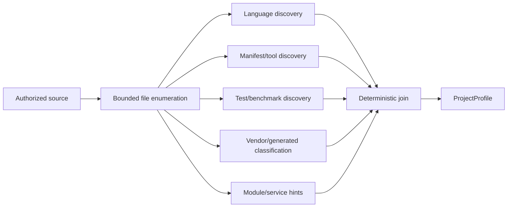

# A1.40 — Discover Project Context

## Business Purpose

Perform bounded, read-only discovery sufficient to understand repository shape
and support feature/workload resolution. This node does not search for
bottlenecks, establish causes, or collect the baseline.

## Input

- `LocalSourceIdentity` and approved discovery policy.
- Versioned language, manifest, generated/vendor, build/test, and service
  discovery registries.
- File/byte/time budget.

## Output

`ProjectProfile@1.0` with languages and confidence, manifests/lockfiles, test
and benchmark roots, build tools, likely modules/services, generated/vendor
paths, file/byte counts, parser coverage, unresolved items, and truncation flag.

## Use-Case Flow

## Business Rules

1. Discovery is read-only, bounded, and restricted to the authorized source.
2. Vendor/generated content is excluded from owned-source language ratios but
   remains visible in classification coverage.
3. Detection includes evidence and version; suffix-only guesses have limited
   confidence.
4. Unsupported files/parsers are reported rather than silently ignored.
5. Truncation or size-budget exhaustion is explicit and normally triggers A1.80
   clarification/policy review.
6. Source content is not sent to a model by this node.
7. Project context may suggest scope/workload candidates but cannot approve
   them.

## State Transition

| Condition | Route | Result |
|---|---|---|
| Required discovery completes | `continue` | Publish profile; continue to A1.50. |
| Optional parser unsupported | `continue` with coverage gap | Record unresolved paths. |
| Discovery truncated/material context missing | `missing` | A1.80 must request clarification or policy decision. |
| Path escape/read policy violation | `rejected` | Stop discovery. |

## Acceptance Criteria

- Supported multi-language fixtures produce deterministic profiles.
- Vendor/generated files do not distort owned-source statistics.
- Enumeration-order changes do not change the profile digest.
- Truncation and parser failures remain observable.
- Discovery never modifies source or diagnoses performance.

## Current Implementation Gap

Current implementation performs bounded file/suffix and manifest/test/vendor
discovery. It lacks richer multi-language parser coverage, dependency/service
boundaries, byte budget, and field-level discovery evidence.
