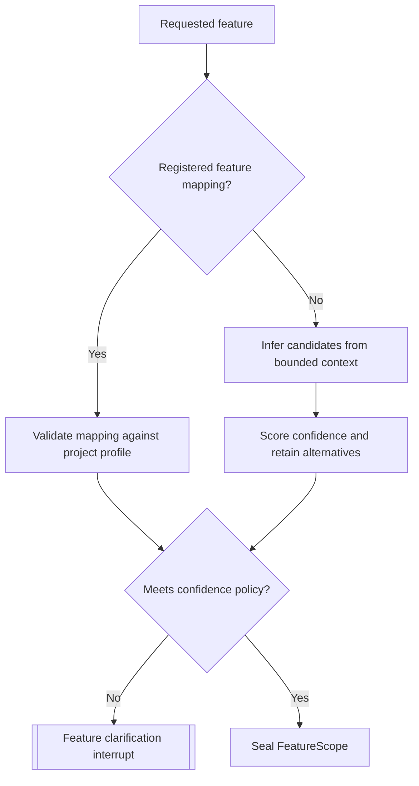

# A1.50 — Resolve Feature Scope

## Business Purpose

Translate the requested business feature into an evidence-backed technical
scope of repositories, modules, files, entry points, or symbols. The scope
limits later collection and analysis without pretending an inferred mapping is
certain.

## Input

- `RawRequestDraft`, `LocalSourceIdentity`, and `ProjectProfile`.
- Optional tenant feature registry and ownership/source mappings.
- Scope confidence policy and include/exclude rules.

## Output

`FeatureScope@1.0` with canonical feature ID, include/exclude paths, optional
modules/symbols/entry points, candidate alternatives, supporting evidence,
confidence, rationale, registry/version identity, and unresolved mappings.

## Use-Case Flow

## Business Rules

1. Registered, effective-dated mappings take precedence when they resolve
   against the current source.
2. Inferred scope carries evidence, alternatives, and calibrated confidence.
3. Below-threshold or ambiguous scope requires clarification.
4. Include paths must exist or be justified future selectors; exclusions are
   deterministic and cannot erase the entire scope silently.
5. Vendor/generated paths follow project classification and policy.
6. Scope paths resolve inside the authorized repository.
7. A broad wildcard is not high-confidence feature resolution by itself.

## State Transition

| Condition | Route | Result |
|---|---|---|
| One policy-valid scope resolved | `continue` | Publish scope; continue to A1.60. |
| Multiple/low-confidence candidates | `clarification` | Ask requester to select or refine. |
| Requested feature absent | `missing` | Return candidate context without inventing mapping. |
| Scope escapes source/policy | `rejected` | Stop A1. |

## Acceptance Criteria

- Registered and inferred mappings are distinguishable.
- Ambiguous fixtures produce candidate scopes and an interrupt.
- Every selected path resolves within source and excludes prohibited content.
- Same inputs and registry version produce the same scope digest.
- A2/A3 can enforce the resulting scope without free-form interpretation.

## Current Implementation Gap

Current code generally scopes the feature to the source relative path or a
wildcard, with discovered exclusions. Feature registry, symbol/entry-point
mapping, alternatives, and meaningful confidence calibration are missing.
