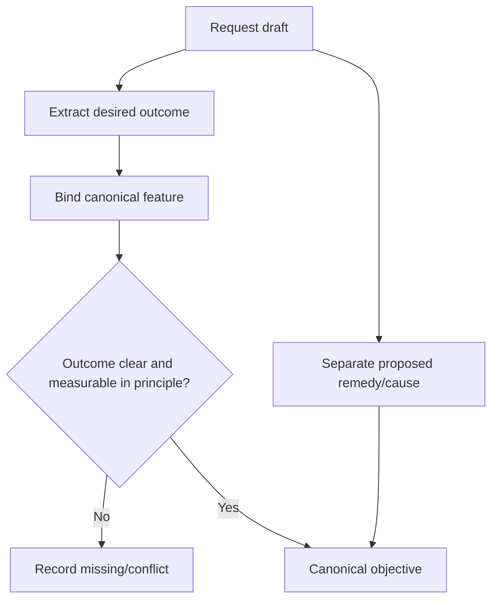

# A1.60 — Normalize Objective

## Business Purpose

Create one canonical statement of the desired measurable outcome while keeping
the requester's suggested remedy separate as an unverified hypothesis.

## Input

- `RawRequestDraft` and resolved `FeatureScope`.
- Objective vocabulary/policy and optional bounded intent critic.

## Output

`CanonicalObjective@1.0` containing objective statement, feature ID, outcome
category, requester hypothesis, source-field provenance, confidence, and
missing/conflicting fields.

## Use-Case Flow

## Business Rules

1. Exactly one primary objective statement is produced per request version.
2. The objective states desired outcome, not an assumed implementation.
3. Requested remedies and causal claims remain hypotheses.
4. Objective feature ID must equal the resolved feature scope.
5. Normalization preserves original semantic intent and field provenance.
6. A model may suggest wording but deterministic validation owns completeness
   and conflict decisions.
7. Missing measurable outcome remains explicit for A1.80.

## State Transition

| Condition | Route | Result |
|---|---|---|
| Objective normalized | `continue` | Publish objective; continue to A1.61. |
| Outcome/feature ambiguous | `continue` with missing fields | A1.80 later issues clarification. |
| Objective violates policy | `rejected` | Stop request. |

## Acceptance Criteria

- “Cache X to fix latency” yields a latency outcome plus a separate cache
  hypothesis.
- Objective feature matches `FeatureScope.feature_id`.
- Empty, contradictory, or solution-only requests remain unresolved.
- Model wording cannot add a target or cause not present in evidence/input.
- Canonicalization is deterministic for equivalent structured input.

## Current Implementation Gap

Current implementation constructs a simple statement from feature/metric/target
and can retain a hypothesis. It lacks outcome taxonomy, detailed provenance,
and bounded critic behavior for raw/mixed requests.
