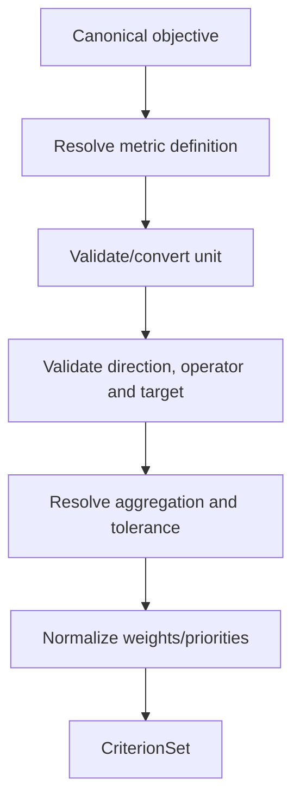

# A1.61 — Define Primary Criteria

## Business Purpose

Turn the objective into one or more executable success criteria with explicit
metric semantics. A criterion defines what A2 must measure and how later stages
decide whether the optimization succeeded.

## Input

- `CanonicalObjective`, request draft, and feature scope.
- Tenant metric registry with units, dimensions, supported aggregations,
  direction/operator rules, and tolerances.
- Priority/weight policy.

## Output

`CriterionSet@1.0` containing criterion ID, registered metric ID/version,
direction, acceptance operator, target, canonical unit, aggregation, tolerance,
weight/priority, observation-window requirement, and missing/conflicting fields.

## Use-Case Flow

## Business Rules

1. At least one primary criterion is mandatory.
2. Every criterion uses a registered metric/version or is explicitly
   unresolved.
3. Metric, direction, target, unit, aggregation, operator, and tolerance are
   required for execution; none is guessed from a label alone.
4. Units must be compatible with the metric dimension.
5. Criterion IDs are unique and stable within the request version.
6. Weights are positive and normalized by deterministic policy where needed.
7. Conflicting criteria remain visible and are resolved before approval.

## State Transition

| Condition | Route | Result |
|---|---|---|
| All criteria executable in principle | `continue` | Publish set; continue to A1.62. |
| Metric/unit/target ambiguous | `continue` with missing/conflicts | A1.80 clarification. |
| Impossible or prohibited criterion | `rejected` | Stop or require request revision. |

## Acceptance Criteria

- Latency, throughput, memory, cost, token, gas, quality, and domain metric
  fixtures validate against registry semantics.
- Incompatible units are rejected or explicitly converted.
- Duplicate IDs and contradictory targets fail quality validation.
- Each criterion provides sufficient identity for an A2 collector binding.
- A2 cannot substitute a different metric with the same source type.

## Current Implementation Gap

Current `Criterion` contains ID, metric, direction, target, unit, and weight.
Aggregation, acceptance operator, tolerance, registry version, and metric
collectability metadata are absent.
