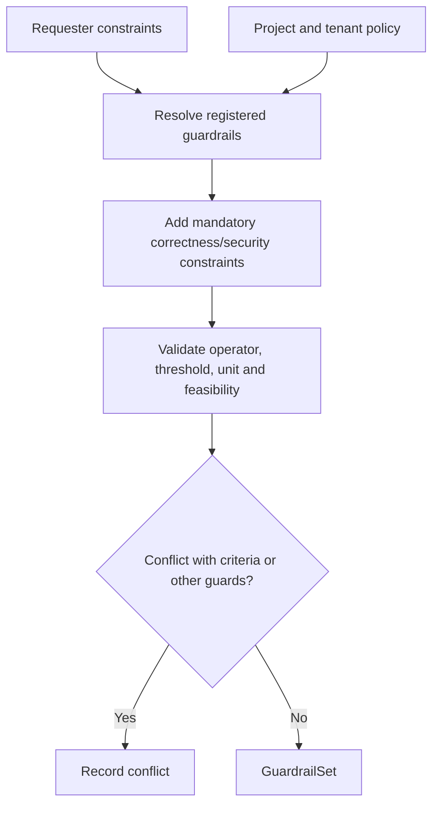

# A1.62 — Define Guardrails

## Business Purpose

Define the correctness, security, reliability, compatibility, quality, memory,
and cost conditions that must not regress while optimizing the primary
criteria.

## Input

- Request draft, canonical objective, criterion set, and project profile.
- Guardrail/metric registry, repository-required checks, and tenant policy.

## Output

`GuardrailSet@1.0` containing guardrail ID, category, registered metric/check,
operator, threshold/tolerance, unit, severity, mandatory status, evaluation
protocol hint, policy/version, and missing/conflicting fields.

## Use-Case Flow

## Business Rules

1. At least one executable correctness guardrail is mandatory unless an
   explicit policy exception exists.
2. Guardrails use registered metrics or repository-owned verification checks.
3. Operator, threshold/tolerance, unit, severity, and mandatory status are
   explicit.
4. “Tests must pass” requires A2 command discovery; it is not assumed true.
5. Guardrails cannot contradict primary criteria without clarification.
6. Missing security/reliability policy constraints cannot be waived by a model.
7. Each guardrail must map to an A1.71 evidence requirement.

## State Transition

| Condition | Route | Result |
|---|---|---|
| Required guardrails valid | `continue` | Publish set; continue to A1.63. |
| Required guardrail unresolved | `continue` with missing fields | A1.80 clarification. |
| Hard policy conflict | `rejected` | Stop request. |

## Acceptance Criteria

- Correctness, security, compatibility, and resource guardrail fixtures are
  represented without prose-only rules.
- Missing test command is not treated as a passing guardrail.
- Criterion/guardrail unit or threshold conflicts are detected.
- Every mandatory guardrail has one evidence requirement.
- Policy-required guards cannot be removed by requester/model input.

## Current Implementation Gap

Current code creates an optional guardrail from one metric ID and otherwise
uses limited defaults. Category, severity, tolerance, check identity, registry
version, and full mandatory correctness policy are not represented.
