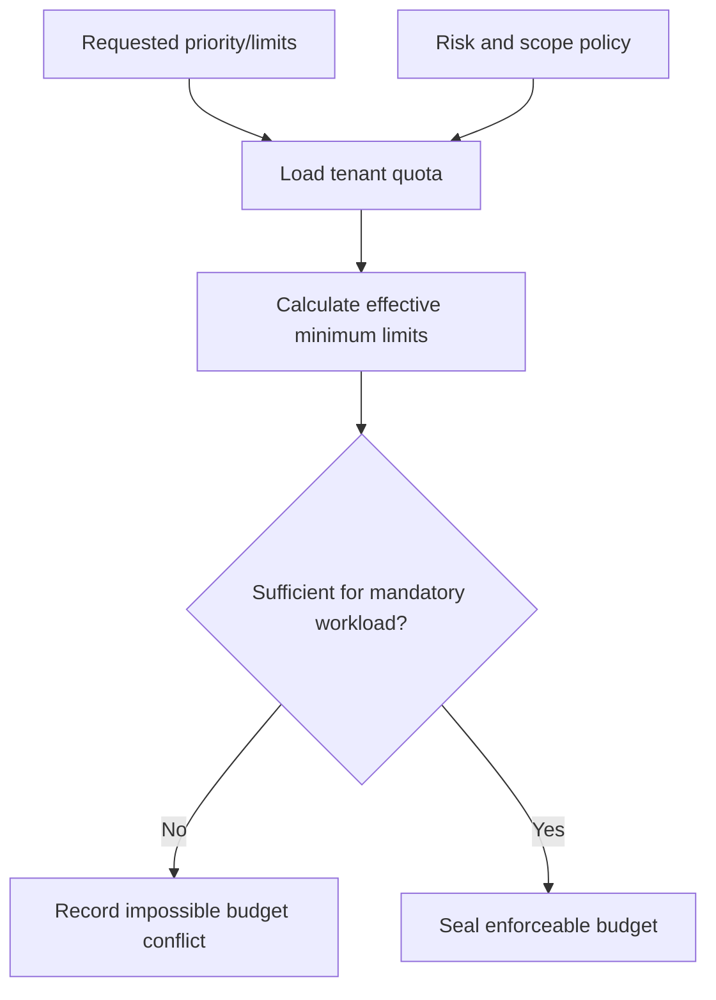

# A1.63 — Set Priority and Execution Budget

## Business Purpose

Define the maximum time, compute, model, storage, analyzer, and operational
resources that downstream stages may consume. The budget is an enforceable
contract, not an informational estimate.

## Input

- Request priority and optional requested limits.
- Tenant quotas, risk class, scope profile, platform capacity, and policy.
- Project profile and anticipated workload/analyzer classes.

## Output

`ExecutionBudgetArtifact@1.0` containing effective deadline, worker/model/query
time, token/cost/storage limits, concurrency, allowed analyzers/collectors,
retry limits, priority, quota source, policy decision/version, and expiry.

## Use-Case Flow

## Business Rules

1. Effective limits cannot exceed tenant/platform policy.
2. Requested lower limits are preserved when feasible.
3. Budget must be sufficient to attempt mandatory warmups, repetitions,
   collectors, and storage; otherwise the request is unresolved.
4. Allowed analyzers/collectors are explicit and versioned.
5. Retries consume the same total budget; retry does not reset quota.
6. Priority affects scheduling, not evidence quality or policy bypass.
7. Downstream nodes meter and stop before exceeding hard limits.

## State Transition

| Condition | Route | Result |
|---|---|---|
| Effective feasible budget resolved | `continue` | Publish budget; continue to A1.70. |
| Budget insufficient but adjustable | `clarification` via A1.80 | Request scope/budget revision. |
| Quota/policy prohibits request | `rejected` | Stop before collection. |

## Acceptance Criteria

- Tenant limits always cap requester values.
- Impossible workload/budget combinations are detected before A2.
- Retry, token, storage, and worker limits are individually testable.
- Priority cannot authorize forbidden analyzers or increase trust.
- Policy and quota versions are auditable.

## Current Implementation Gap

Current code creates fixed/local policy-oriented limits. It does not resolve a
tenant quota service, priority, monetary cost, query budget, concurrency, or
complete downstream metering contract.
