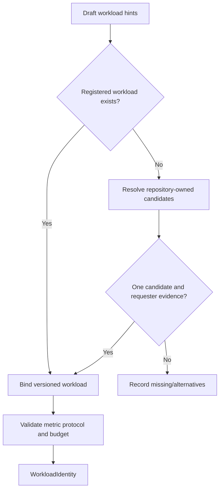

# A1.70 — Define Workload Identity

## Business Purpose

Define the exact scenario under which A2 will establish the baseline and later
stages will remeasure treatment behavior. Missing workload identity must remain
explicit because measurements without stable dimensions are not comparable.

## Input

- Request draft, criteria, guardrails, feature scope, and project profile.
- Workload/command/dataset/environment registries.
- Metric protocol and execution budget.

## Output

`WorkloadIdentity@1.0` containing workload and protocol version, command/scenario
ID, dataset ID/version/digest, environment/image ID, repetitions, warmups,
concurrency, cache state, parameters, seed, observation window, registry refs,
and missing/conflicting fields.

## Use-Case Flow

## Business Rules

1. Workload, environment, and command/scenario identity are mandatory for
   active collection.
2. Dataset identity is mandatory when data affects the requested metric.
3. Repetitions/warmups derive from registered measurement protocol or explicit
   approved input, not language alone.
4. Concurrency and cache state are material dimensions.
5. Default values must be policy-defined, visible, and appropriate for the
   metric/collector; convenience defaults cannot weaken sample rigor.
6. Commands are identities here; A2.31 resolves safe argv.
7. Workload parameters contain no raw secrets.

## State Transition

| Condition | Route | Result |
|---|---|---|
| Complete feasible workload | `continue` | Publish identity; continue to A1.71. |
| Missing/ambiguous workload dimension | `continue` with missing fields | A1.80 clarification. |
| Workload conflicts with budget/policy | `rejected` or clarification | Require revision. |

## Acceptance Criteria

- Same workload/version produces stable identity.
- Dataset, environment, concurrency, cache, warmup, and repetition differences
  produce different identities.
- Performance criteria require a measurement-capable protocol.
- Missing command/workload cannot be replaced with placeholder data.
- A2 can resolve every declared identity via registries or interrupt.

## Current Implementation Gap

Current code maps structured IDs and selects repetitions/warmups from detected
language defaults. It lacks workload registry versions, dataset digest,
parameters/seed/window, metric-specific measurement protocol, and robust
budget feasibility.
