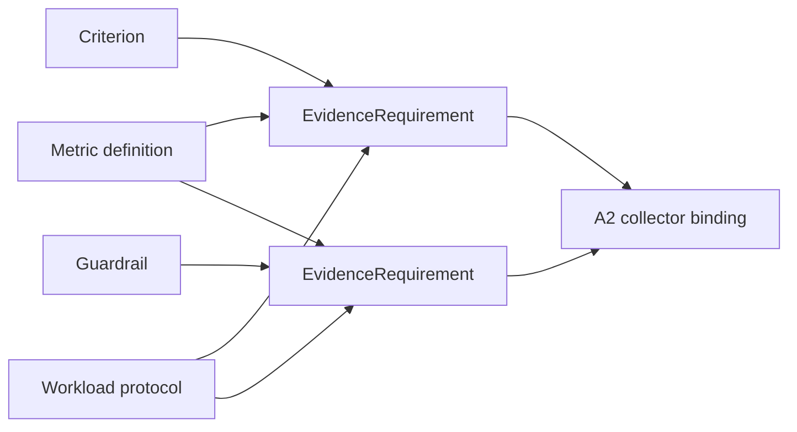

# A1.71 — Build Evidence Requirements

## Business Purpose

Define exactly what evidence A2 must collect for every criterion and guardrail,
without selecting deployment-specific credentials or executable query text.

## Input

- `CriterionSet`, `GuardrailSet`, `WorkloadIdentity`, feature scope, project
  profile, metric registry, and evidence policy.

## Output

`EvidenceRequirementSet@1.0` containing one or more requirements per criterion
or guardrail. Each requirement includes owner type/ID, metric ID/version,
accepted evidence source types, minimum samples, aggregation, canonical unit,
required dimensions, freshness, provenance/trust floor, mandatory status, and
missing feasibility information.

## Traceability Model

## Business Rules

1. Every criterion and mandatory guardrail has explicit coverage requirements.
2. Requirement IDs are unique and retain the owning criterion/guardrail ID.
3. Accepted source types are metric-specific. A generic test result cannot
   satisfy a latency requirement without a registered latency extractor.
4. Minimum samples follow the metric/workload protocol; deterministic verdicts
   use an explicit cardinality rule rather than an implicit exception.
5. Required workload, dataset, source, environment, model/prompt, and collector
   dimensions are declared for later comparability.
6. A1 declares evidence semantics; A2 resolves concrete collectors/queries.
7. Credentials, endpoints, and raw query text are excluded.
8. No feasible evidence path results in clarification, not a weakened request.

## State Transition

| Condition | Route | Result |
|---|---|---|
| All mandatory requirements feasible in principle | `continue` | Publish set; continue to A1.80. |
| Evidence path missing/ambiguous | `continue` with missing fields | A1.80 clarification. |
| Requirement contradicts metric/workload | `rejected` or clarification | Return to A1.61/A1.70. |

## Acceptance Criteria

- Coverage matrix contains every criterion and mandatory guardrail.
- Latency, correctness, cost/token, memory, throughput, quality, and gas map to
  semantically appropriate evidence types.
- Requirement IDs permit direct A2 sample and aggregate traceability.
- Sample/freshness/trust requirements are explicit and versioned.
- No collector credential or endpoint is embedded.

## Current Implementation Gap

Current requirements include criterion ID, broad accepted source types, sample
count, and mandatory flag. They omit metric/unit/aggregation/dimension/trust/
freshness semantics, and every primary criterion currently accepts benchmark,
test, or telemetry regardless of metric meaning.
