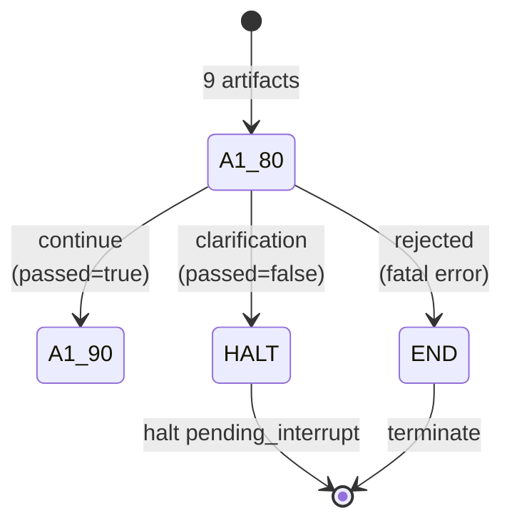

# A1.80 — Detect Ambiguity and Conflict

## Purpose / BA Description

A1.80 is the quality gate that validates the entire request before approval. It checks for missing required fields, unit/target conflicts, impossible budget combinations, and flags discovery truncation. If any conflict is found, it halts with a clarification interrupt; otherwise, it routes to approval.

---

## Actors

| Actor | Role |
|-------|------|
| Platform | Performs deterministic validation; creates `A1QualityReport` |
| Requester | May receive clarification interrupt if conflicts detected |

---

## Preconditions

- `RawRequestDraft` (from A1.20)
- `LocalSourceIdentity` (from A1.30)
- `ProjectProfile` (from A1.40)
- `FeatureScope` (from A1.50)
- `CanonicalObjective` (from A1.60)
- `CriterionSet` (from A1.61)
- `GuardrailSet` (from A1.62)
- `ExecutionBudgetArtifact` (from A1.63)
- `WorkloadIdentity` (from A1.70)
- `EvidenceRequirementSet` (from A1.71)

---

## Inputs (Contract)

Reads all 9 upstream artifacts (listed in Preconditions).

| Aspect | Validation |
|--------|-----------|
| Objective | Non-null, non-empty statement |
| Criteria | At least one criterion present |
| Guardrails | At least one guardrail (correctness) present |
| Criterion units | Target value is non-negative; unit is valid |
| Workload | Repetitions > 0; warmup >= 0 |
| Evidence | At least one evidence requirement per criterion/guardrail |
| Budget | Deadline, tokens, storage within policy ceiling |
| Discovery | If `discovery_truncated = true`, flag as conflict |

---

## Processing Logic

1. (Handler: `a1_handlers._a1_80`, lines 529–615)
2. Aggregate all upstream artifacts via `_require_ref`
3. Check objective is non-null and non-empty
4. Check at least one criterion exists and at least one is marked primary
5. Check at least one guardrail exists (must be correctness)
6. Check all criterion targets are non-negative
7. Check all units are in known/valid set
8. Check workload.repetitions > 0
9. Check evidence requirements exist for all criteria and guardrails
10. Check budget is within policy ceiling
11. If `project_profile.discovery_truncated = true`, add conflict: "discovery was truncated at 500 files; feature scope may be incomplete"
12. If any conflict found, set `passed = false` and route to "clarification"; else route to "continue"

---

## Outputs (Contract)

| Field | Type | Constraints | Description |
|-------|------|-------------|-------------|
| artifact_type | string | Literal["A1QualityReport"] | Fixed type |
| schema_version | string | Literal["1.0"] | Version |
| passed | boolean | true if no conflicts | Whether request passed all quality checks |
| missing_fields | list[str] | empty if all present | Names of missing required fields |
| conflicts | list[str] | empty if passed=true | Human-readable conflict descriptions |
| content_digest | string | sha256:... | Canonical digest |

---

## Routing / State Transitions

**Clarification halt parameters** (if conflicts found):
- `allowed_decisions = ["revise", "reject"]`
- `required_actor_role = payload.actor_role` (requester's own role)
- `interrupt_id = f"{case_id}-A1-CLARIFICATION"`
- `expires_at = now + 24h`

---

## Business Rules & Edge Cases

- **Missing objective**: conflict, route to clarification
- **Zero criteria**: conflict, route to clarification
- **Zero guardrails**: conflict, route to clarification
- **Negative criterion target**: conflict, route to clarification
- **Invalid unit**: conflict (e.g., "miliseconds" instead of "ms"), route to clarification
- **Discovery truncated**: conflict, route to clarification (indicates feature scope may be incomplete due to file discovery cap)
- **Workload repetitions <= 0**: conflict, route to clarification
- **Budget exceeded**: conflict, route to clarification
- **No evidence requirements**: conflict (at least one per criterion/guardrail), route to clarification
- **All checks pass**: route to continue → A1.90 (approval gate)

