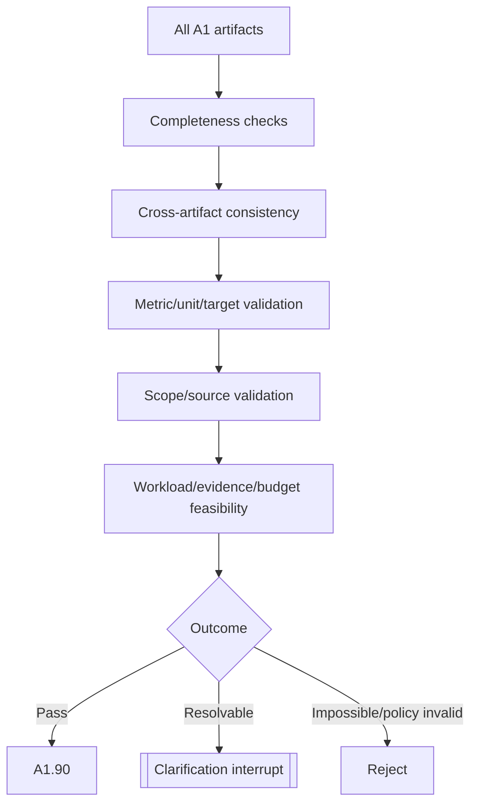

# A1.80 — Evaluate Ambiguity and Conflict

## Business Purpose

Apply the deterministic completeness and consistency gate before policy
approval. This node ensures A2 receives an executable evidence contract rather
than discovering basic requirement ambiguity after side effects begin.

## Input

- Intake/draft, source identity, project profile, feature scope, canonical
  objective, criteria, guardrails, budget, workload, and evidence requirements.
- Quality policy and optional advisory critic output.

## Output

`A1QualityReport@1.0` containing overall status, missing fields, conflicts,
invalid values, feasibility failures, warnings, source evidence, policy/version,
repair owner/node, and optional typed clarification interrupt.

## Gate Flow

## Business Rules

1. Hard checks are deterministic; an LLM critic is advisory only.
2. Missing, conflicting, and invalid values are different categories.
3. Checks include duplicate IDs, incompatible metric units/operators,
   contradictory targets/guardrails, overlapping/empty scope, source-policy
   state, workload/evidence feasibility, discovery truncation, and impossible
   budget.
4. Clarification identifies fields, alternatives, expected schema, owning node,
   exact artifact digest, actor role, policy, and expiry.
5. Resumption occurs on the same durable thread and does not repeat completed
   side effects.
6. Material clarification creates new affected artifacts/digests; old approval
   cannot survive.
7. Impossible or forbidden requests are rejected, not endlessly clarified.

## State Transition

| Condition | Route | Result |
|---|---|---|
| No hard issues | `continue` | Publish passed report; continue to A1.90. |
| Resolvable omissions/conflicts | `clarification` | Persist interrupt; halt and resume at owning stage. |
| Impossible or policy-forbidden contract | `rejected` | Terminate A1 with typed reasons. |

## Acceptance Criteria

- Each documented conflict class has positive and negative tests.
- Clarification payload is field-specific, digest-bound, expiring, and
  authorized.
- A model cannot waive a hard validation failure.
- Rejected requests cannot reach A1.90/A1.95.
- Resume after restart preserves audit lineage and idempotency.

## Current Implementation Gap

Current quality logic checks a useful subset of missing fields, conflicts, and
discovery truncation and creates a clarification interrupt. It does not cover
the complete metric registry, feature-confidence, guardrail executability,
scope overlap, and budget/workload feasibility matrix described here.

