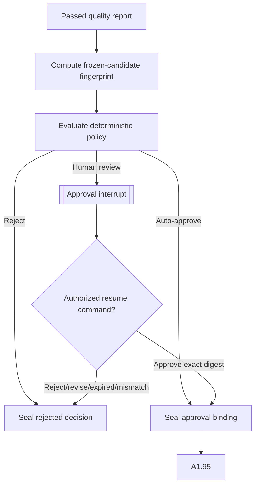

# A1.90 — Evaluate Policy and Approval

## Business Purpose

Determine whether the exact validated request may be accepted automatically,
requires authorized human approval, or must be rejected. Approval is bound to
content and identity; it is not a reusable role assertion.

## Input

- Passed `A1QualityReport` and all material A1 component artifacts.
- Authenticated actor context, risk/scope classification, tenant policy,
  quotas, source state, and approval rules.
- Optional `ResumeInterruptCommand` for a previously halted approval.

## Output

`A1ApprovalDecision@1.0` with decision route, reasons, policy version, evaluated
facts digest, approval requirement, and—only when approved—an
`ApprovalBinding` containing actor, role, exact request fingerprint, policy
version, time, and expiry. Pending review also produces an `InterruptEnvelope`.

## Decision Flow

## Business Rules

1. Quality must pass before approval evaluation.
2. Policy receives typed facts and owns hard decisions; model output cannot
   authorize.
3. Approval binds actor, authenticated roles, tenant, case, thread, candidate
   fingerprint, policy version, allowed decision, issued time, and expiry.
4. Self-approval is policy-driven, not a hardcoded role shortcut.
5. Any material content or policy change invalidates the pending/issued
   approval.
6. Resume validates identity, tenant, case, thread, interrupt, artifact digest,
   role, decision, policy version, and expiry.
7. Approval side effects are idempotent and checkpoint-safe.

## State Transition

| Condition | Route | Result |
|---|---|---|
| Policy permits automatic approval | `continue` | Publish approved decision; go to A1.95. |
| Human approval required | `approval` | Persist interrupt and halt same thread. |
| Valid approved resume | `continue` | Publish bound approval; go to A1.95. |
| Policy denial, rejection, expiry, or mismatch | `rejected` | Stop or require a new request version. |

## Acceptance Criteria

- Changing one candidate field invalidates approval.
- Cross-tenant/thread/case actors cannot resume.
- Asserted roles cannot exceed authenticated roles.
- Expired or policy-version-mismatched decisions fail closed.
- Replay does not duplicate approval artifacts.
- Policy decision inputs and version are auditable without storing secrets.

## Current Implementation Gap

Current code supports digest-bound approval interrupts and authorized resume,
but also auto-approves a hardcoded set of roles. Full host identity integration,
risk/scope facts, policy-derived self-approval, signing, and organizational
approval matrices remain incomplete.
