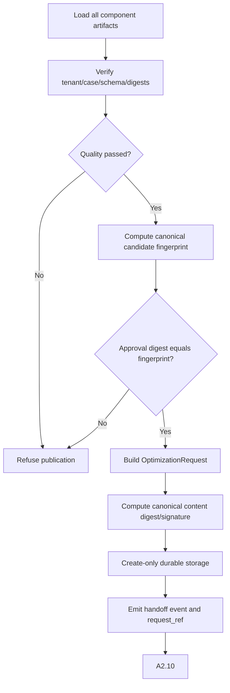

# A1.95 — Freeze and Publish Optimization Request

## Business Purpose

Assemble all validated and approved A1 components into the immutable canonical
contract consumed by A2 and A3. This node does not infer or repair information;
it only verifies, freezes, stores, and publishes.

## Input

- `LocalSourceIdentity`, `FeatureScope`, `CanonicalObjective`, `CriterionSet`,
  `GuardrailSet`, `ExecutionBudgetArtifact`, `WorkloadIdentity`,
  `EvidenceRequirementSet`, passed `A1QualityReport`, and approved
  `A1ApprovalDecision`.
- Artifact/signing service and schema registry.

## Output

`OptimizationRequest@1.0`, its `request_fingerprint`, `request_ref`, immutable
artifact-store object, and audit/handoff event. The request contains canonical
origin/scope profile, source, objective, criteria, guardrails, workload,
evidence requirements, budget, approval, parent lineage, schema, producer, and
policy versions.

## Publication Flow

## Business Rules

1. Every input artifact must match tenant/case and verify against immutable
   storage.
2. Quality report must pass and approval decision must be approved.
3. Approval artifact digest equals the canonical fingerprint of all material
   request components.
4. Parent digest lineage includes every material component; no field is read
   from mutable draft state when a sealed component exists.
5. Canonical serialization and digest rules are versioned and deterministic.
6. Production publishing is create-only, tenant-isolated, and optionally
   KMS-signed; conflicting identity/digest is a hard failure.
7. Any material revision creates a new request version and approval.
8. `request_ref` is written only after durable storage succeeds or is safely
   reconciled.

## State Transition

| Condition | Route | Result |
|---|---|---|
| All invariants and durable write pass | `continue` | Set `request_ref`; mark A1.95 complete; route to A2.10. |
| Missing/failed quality or approval | `rejected` | Refuse publication. |
| Digest/schema/tenant conflict | `rejected` | Integrity error and producer repair. |
| Store outcome unknown | `reconcile` | Check intent/object before retry. |

## Acceptance Criteria

- Equivalent component content yields the same fingerprint regardless of map
  or filesystem ordering.
- Any material field change yields a new fingerprint and invalid approval.
- Corrupted/cross-tenant component refs fail.
- Published request reconstructs all A1 decisions and source input lineage.
- Crash before/after write resumes without duplicate or conflicting artifact.
- A2 cannot start until `request_ref` is durably available.

## Current Implementation Gap

Current code assembles sealed components, verifies the approval fingerprint,
stores the typed request, and sets `request_ref`. KMS signing, richer component
schemas, fully durable root-graph composition, and native checkpoint resume
remain production gaps.
