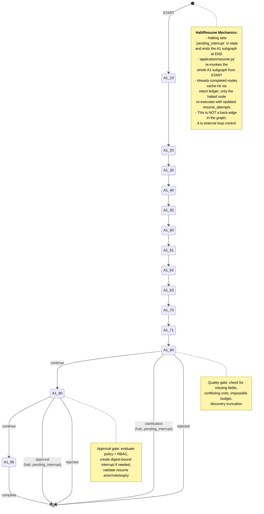
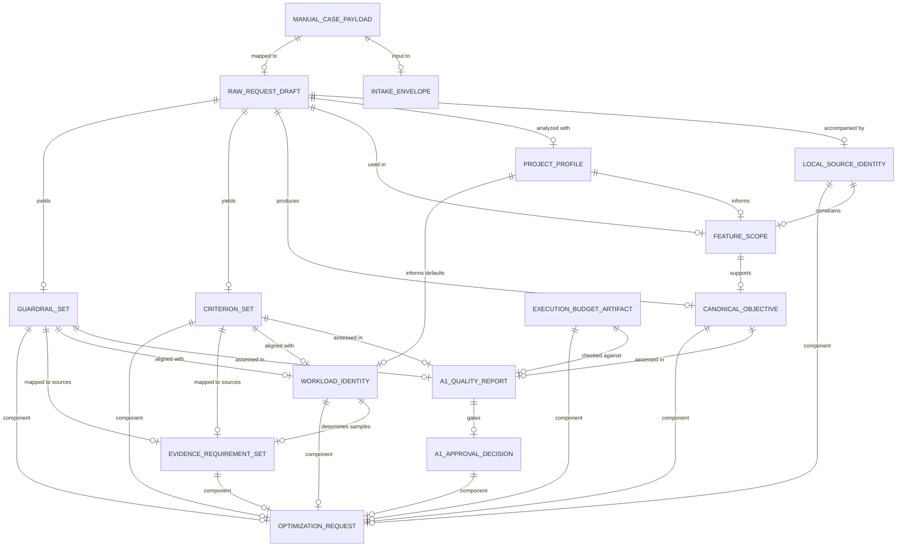
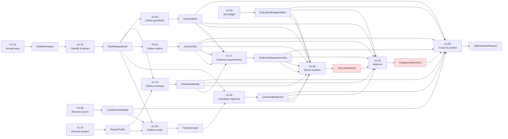

# A1: Manual Requirement Intake — Stage Overview

> Refactor specification: [A1-A2 Docker Compose Evaluation Refactor](../docker-compose-evaluation-refactor.md).
> It defines the proposed minimal Compose and evaluation-command handoff. This
> overview describes the current/previous contract until that specification is
> implemented.

## Purpose & Business Context

**A1 converts a raw, structured, or mixed optimization request into an immutable, approved contract (`OptimizationRequest@1.0`)** that downstream stages (A2, A3) can rely on without ambiguity. The current code accepts structured input only; raw/mixed extraction remains an implementation gap under `REQ-A1-001`, not a change to the target business requirement.

**What A1 does:**
- Accepts raw, structured, or mixed intake at the product boundary; structured input carries feature, metric, direction, target, unit, workload, and command identity directly, while raw/mixed input must pass bounded extraction and clarification before approval.
- Resolves and validates the local source repository (git revision, dirty state, allowed paths).
- Discovers project context (languages, manifests, test roots, vendor/generated paths).
- Resolves feature scope to include/exclude paths, with confidence rationale.
- Normalizes the optimization objective and success criteria.
- Defines guardrails (correctness, security, cost, quality constraints).
- Specifies workload identity (dataset, environment, repetitions, warmup, concurrency).
- Maps criteria and guardrails to evidence requirements (acceptable source types, minimum samples).
- Validates for omissions, conflicts, and impossible combinations.
- Routes to clarification (if gaps detected) or approval (if policy requires human review).
- Freezes and publishes the sealed `OptimizationRequest@1.0` when all validation and approval gates pass.

**What A1 does NOT do:**
- Does not scan source code for bottlenecks or performance anomalies.
- Does not propose solutions or optimizations.
- Does not send raw source code to any model or external service (structured metadata only).
- Does not treat model-extracted values as approved facts: raw/mixed extraction is bounded and uncertain values remain unknown until deterministic validation or requester clarification. This target path is not yet implemented in the current structured-only contract.

---

## Actors

| Actor | Role | Interactions |
|-------|------|--------------|
| **Requester** | Supplies raw, structured, or mixed optimization intent and source context. | Submits the intake payload at A1.10; may be asked to clarify missing/conflicting information at A1.80 via interrupt. |
| **Platform** | Deterministic business handlers that normalize, validate, and route the request. | Orchestrates all 14 A1 nodes; produces intermediate and final artifacts; enforces policy gates. |
| **Approver** | Authorizes the frozen request when policy requires human review (e.g., high-risk scope, restricted feature). | Reviews the halting interrupt at A1.90; approves or rejects via `ResumeInterruptCommand`. Must hold `owner` or `approver` role. |
| **Policy Owner** | Defines approval rules, allowed source paths, cost/time budgets, and risk thresholds. | Enforces gates at A1.80 (clarification) and A1.90 (approval); determines which actor role can self-approve. |

---

## Node Catalogue

All 14 A1 nodes in execution order:

| ID | Name | Produces | Side Effect | Purpose |
|----|----|----------|-------------|---------|
| [A1.10](A1.10.md) | Accept input | `IntakeEnvelope` | `IDEMPOTENT_WRITE` | Validate intake identity/mode and preserve the original input by digest. |
| [A1.20](A1.20.md) | Classify and extract | `RawRequestDraft` | `PURE` or bounded model call | Map structured fields or extract raw/mixed input while preserving uncertainty. |
| [A1.30](A1.30.md) | Resolve local source | `LocalSourceIdentity` | `READ_ONLY` | Canonicalize path, detect git revision, dirty state. |
| [A1.40](A1.40.md) | Discover project context | `ProjectProfile` | `READ_ONLY` | Scan for languages, manifests, tests, vendor paths. |
| [A1.50](A1.50.md) | Resolve feature scope | `FeatureScope` | `PURE` | Map feature to include/exclude paths with confidence. |
| [A1.60](A1.60.md) | Normalize objective | `CanonicalObjective` | `PURE` | Separate desired outcome from requester hypothesis. |
| [A1.61](A1.61.md) | Define criteria | `CriterionSet` | `PURE` | Convert metric + direction + target + unit into `Criterion` records. |
| [A1.62](A1.62.md) | Define guardrails | `GuardrailSet` | `PURE` | Capture correctness, security, cost, quality constraints. |
| [A1.63](A1.63.md) | Set budget | `ExecutionBudgetArtifact` | `PURE` | Apply tenant quota and policy limits. |
| [A1.70](A1.70.md) | Define workload | `WorkloadIdentity` | `PURE` | Identify dataset, environment, repetitions, warmup, concurrency. |
| [A1.71](A1.71.md) | Build evidence requirements | `EvidenceRequirementSet` | `PURE` | Map criteria/guardrails to evidence types and samples needed. |
| [A1.80](A1.80.md) | Detect ambiguity and conflict | `A1QualityReport` | `PURE` | Check for missing fields, unit mismatches, impossible combinations; halt for clarification if needed. |
| [A1.90](A1.90.md) | Evaluate policy and approval | `A1ApprovalDecision` | `IDEMPOTENT_WRITE` | Determine auto-accept vs. human approval; halt for approval if required. |
| [A1.95](A1.95.md) | Freeze and publish | `OptimizationRequest` | `IDEMPOTENT_WRITE` | Canonicalize, compute digest, seal immutable artifact. |

---

## Overall Use Case Diagram

```mermaid
flowchart LR
    subgraph Requester["👤 Requester"]
        SUB["Submit structured request"]
    end

    subgraph Platform["🤖 Platform (A1 handlers)"]
        RESOLVE["Resolve source repo"]
        DISCOVER["Discover project context"]
        FEATURE["Resolve feature scope"]
        CRITERIA["Define success criteria"]
        WORKLOAD["Specify workload"]
        VALIDATE["Validate contract"]
    end

    subgraph Gates["🚦 Quality & Approval Gates"]
        CLARIFY["Request clarification?"]
        APPROVE["Require approval?"]
    end

    subgraph Approver["👤 Approver (if needed)"]
        REVIEW["Review & approve"]
    end

    subgraph Output["✅ Output"]
        SEALED["Sealed OptimizationRequest@1.0"]
    end

    SUB --> RESOLVE
    RESOLVE --> DISCOVER
    DISCOVER --> FEATURE
    FEATURE --> CRITERIA
    CRITERIA --> WORKLOAD
    WORKLOAD --> VALIDATE
    VALIDATE --> CLARIFY

    CLARIFY -->|gaps found| SUB
    CLARIFY -->|no gaps| APPROVE

    APPROVE -->|policy requires| REVIEW
    APPROVE -->|auto-approved| SEALED
    REVIEW -->|approved| SEALED
    REVIEW -->|rejected| SUB
```

**Note**: This is a logical use-case diagram using flowchart shapes to represent actors and use cases (Mermaid has no native UML use-case symbols). It shows the business workflow, not the node-by-node topology.

---

## Overall State Diagram

---

## Data Model (Entity Relationship Diagram)

**Legend:**
- Entities in `CAPS_SNAKE_CASE` are artifacts or internal models.
- `||--o|` indicates a 1:1 or M:1 relationship (artifact linkage via digest, not nesting).
- Key attributes shown are the business-significant fields; envelope fields are shared by all and omitted for brevity.

---

## Artifact Lineage & Data Flow

---

## Interrupt & Resume Mechanics

A1 has two halting points:

| Aspect | A1.80 (Clarification) | A1.90 (Approval) |
|--------|----------------------|------------------|
| **Trigger** | Quality gate fails | Policy requires authorization |
| **Allowed Decisions** | `["revise", "reject"]` | `["approve", "reject"]` |
| **Required Actor Role** | From `ManualCasePayload.actor_role` | Hardcoded as `"owner"` |
| **Interrupt ID Pattern** | `{case_id}-A1-CLARIFICATION` | `{case_id}-A1-APPROVAL` |
| **Expiry** | 24 hours | 24 hours |

Resume re-invokes the whole A1 graph from START; already-completed nodes cache-hit via the intent ledger. Only the halted node re-executes with the approved decision.

---

## Business Rules & Constraints

1. **At least one supported intake mode is required**: raw, structured, or mixed. The current `ManualCasePayload` is structured-only and is an implementation subset.
2. **One primary criterion, one correctness guardrail, non-empty workload and evidence are mandatory** for quality to pass.
3. **Actor without `owner`/`approver`/`platform_owner` role cannot self-approve** — A1.90 halts for authorization.
4. **Approval fingerprint = SHA256(sorted([objective, criteria, guardrails, workload, evidence, budget digests]))** — mismatch at A1.95 raises.
5. **Feature scope excludes always include `[".git/**", "__pycache__/**"]` plus discovered vendor markers or fallback `["node_modules/**", "vendor/**", ".venv/**"]`**.
6. **Workload defaults are language-based:**
   - Python: 1 rep, 0 warmup
   - Go/Rust/Java/C#: 2 reps, 1 warmup
   - TypeScript/JavaScript: 3 reps, 1 warmup
   - Unknown: 1 rep, 0 warmup
7. **Evidence: minimum_samples = workload.repetitions for criteria; 1 for guardrails.**
8. **Structured input bypasses model extraction**; raw/mixed input uses bounded structured extraction, and unresolved values remain unknown. The current code implements only the structured branch.
9. **Discovery capped at 500 files** — `discovery_truncated = True` triggers clarification halt.
10. **Approval expires in 24 hours** — resumption rejected if expired.

---

## Target Contract Versus Current Implementation

The accepted requirement `REQ-A1-001` and the Lane 1 blueprint define raw,
structured, and mixed intake. The current Python contract requires explicit
`feature_id`, `metric_id`, `direction`, `target`, `unit`, workload, environment,
and command fields and therefore implements only the structured path. This
difference is tracked as an implementation gap; it does not supersede the
approved product requirement without formal change control.

---

## References

- **Blueprint**: [docs/project-blueprint/lane-a-local-codebase/01-a1-requirement-intake.md](../../../project-blueprint/lane-a-local-codebase/01-a1-requirement-intake.md)
- **Implementation**: [docs/implementation/05-lane-1-detailed-implementation-playbook.md §6](../../../implementation/05-lane-1-detailed-implementation-playbook.md)
- **Contracts**: [docs/project-blueprint/06-data-contracts.md](../../../project-blueprint/06-data-contracts.md)
- **Orchestration**: [docs/project-blueprint/04-langgraph-architecture.md](../../../project-blueprint/04-langgraph-architecture.md)
