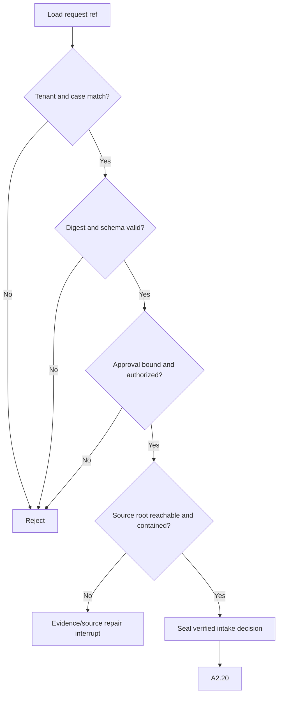

# A2.10 — Verify A1 Handoff

## Business Purpose

Prevent collection from starting against an unapproved, altered, inaccessible,
or cross-tenant request. This node establishes the trust boundary between A1
and A2; it does not rely on A1 having validated itself correctly.

## Actors and Systems

- LangGraph owns the transition and terminal route.
- Artifact store supplies the immutable `OptimizationRequest` bytes.
- Schema registry validates the declared contract version.
- Policy and identity services validate approval authority and policy version.
- A1/request owner receives rejection or repair instructions.

## Input

| Input | Required validation |
|---|---|
| `request_ref` | Type `OptimizationRequest`, supported schema major, tenant-scoped URI, digest verified. |
| `OptimizationRequest` | Tenant/case match, canonical digest, request fingerprint, source, criteria, workload, evidence requirements, budget. |
| Approval binding | Decision is approve; digest equals request fingerprint; actor role and policy version remain valid. |
| Graph identity | `case_id`, `thread_id`, `tenant_id`, `lane=manual`, `baseline_mode=active_collection`. |

## Output

`A2IntakeDecision@1.0` containing `verified`, structured mismatch codes,
source reachability, verified policy version, request digest, and verification
time. Graph state appends only its `ArtifactRef` and the A2.10 route.

## Processing Flow

## Business Rules

1. Validation is fail-closed; `verified=false` can never route to A2.20.
2. Artifact-store digest verification is required, not merely Pydantic parsing.
3. An approval is valid only for the exact request fingerprint and policy
   version under which it was issued.
4. Path containment uses canonical paths and rejects symlink/junction escape.
5. Git reachability is not proven here; exact repository identity is owned by
   A2.20.
6. Invalid input is not retryable. Temporary store/source unavailability may
   receive a bounded technical retry.

## State Transition

| Condition | Route | State effect |
|---|---|---|
| All validations pass | `continue` | Append decision ref; continue to A2.20. |
| Schema/digest/identity/approval mismatch | `rejected` | Append decision/error refs; terminate A2 and return ownership to A1. |
| Temporarily unreachable authorized source | `clarification` or `missing` | Persist typed interrupt; resume same node after repair. |

## Acceptance Criteria

- Modifying one approved request field invalidates the old approval.
- A request from another tenant or case is rejected.
- Unsupported schema major is rejected before source access.
- `verified=false` has no graph edge to A2.20.
- A restart replays the same decision without duplicating artifacts.

## Current Implementation Gap

The current handler creates `verified=false` correctly, but the compiled graph
still continues linearly to A2.20. Add an explicit A2.10 conditional edge and
structured mismatch codes before treating this node as complete.

