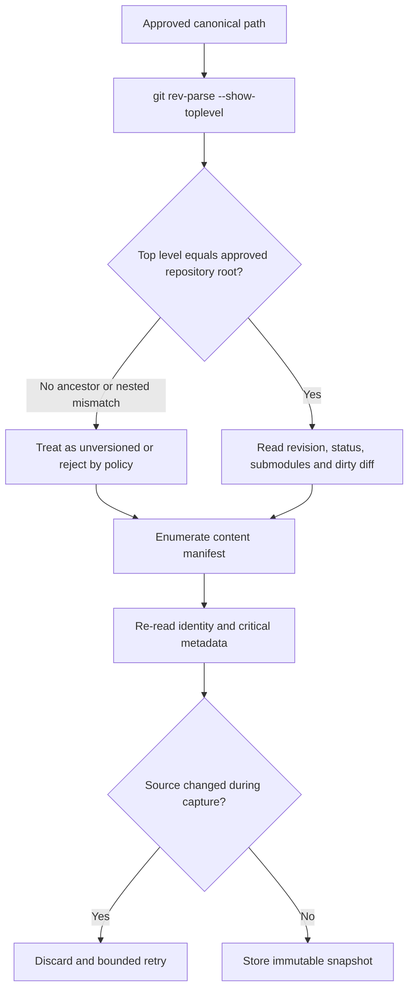

# A2.20 — Create Immutable Source Snapshot

## Business Purpose

Freeze the exact pre-change source state that every A2 collector and every A3
analyzer must use. A Git commit alone is insufficient because the approved
working tree may contain dirty or untracked content.

## Input

- Passed `A2IntakeDecision`.
- Approved source reference and requested revision from `OptimizationRequest`.
- Snapshot policy: exclusions, maximum bytes/files, symlink policy, submodule
  policy, secret handling, and timeout.
- Artifact store and source-access capability.

## Output

`SourceSnapshot@1.0` and its content-addressed payload, including repository
identity, canonical root, Git revision when applicable, dirty patch identity,
file paths/digests/modes, submodule revisions, exclusions, total size, and
snapshot manifest digest.

## Repository Boundary Rule

## Business Rules

1. All later execution uses a materialized snapshot/worktree identified by the
   snapshot digest, never the mutable requester directory.
2. Repository discovery may not inherit `.git` from an ancestor directory.
3. Regular files, executable mode, symlinks, submodules, dirty changes, and
   untracked files follow explicit policy.
4. Secret files may be excluded from analyzer exposure, but protected-store
   integrity policy must explicitly define whether their digests remain in the
   manifest.
5. Snapshot enumeration has file-count, byte-count, time, and path-length
   bounds. Truncation is not a successful snapshot.
6. Source mutation during capture invalidates the attempt.
7. `SourceSnapshot.content_digest` covers every material snapshot field.

## State Transition

| Condition | Route | Result |
|---|---|---|
| Stable snapshot stored | `continue` | Append `SourceSnapshot` ref; continue to A2.30. |
| Concurrent source mutation | `retry` | Discard partial snapshot and retry within budget. |
| Path escape, forbidden link, size violation | `rejected` | Record policy failure; stop A2. |
| Source temporarily unavailable | `missing` | Evidence/source interrupt with owner and expiry. |

## Acceptance Criteria

- Clean, dirty, untracked, submodule, and unversioned fixtures reconstruct
  byte-for-byte from the stored snapshot.
- A child directory inside a different Git repository never inherits the
  ancestor revision.
- Editing the original working tree after A2.20 does not affect collectors.
- A source change during enumeration cannot produce a sealed snapshot.
- Excluded paths and reasons are visible and policy-versioned.

## Current Implementation Gap

The current implementation builds a file digest manifest but later nodes still
read and execute the original path. Git commands can also resolve an ancestor
repository. A materialized immutable workspace and strict Git-root equality are
required.

