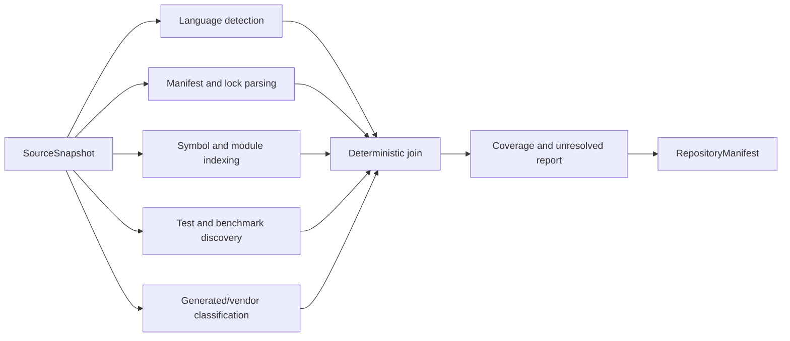

# A2.30 — Build Repository Manifest

## Business Purpose

Describe what exists in the immutable snapshot so the platform can select
applicable commands, collectors, analyzers, and evidence paths without guessing.

## Input

- `SourceSnapshot` and materialized read-only snapshot location.
- Versioned language, manifest, dependency, generated-file, and parser
  registries.
- Feature scope from the approved request.
- Parser/analyzer budget and applicability policy.

## Output

`RepositoryManifest@1.0` containing detected languages and confidence,
modules/packages/services, manifest and lock files, dependency graph refs,
symbol index ref, test roots, generated/vendor classification, candidate tools,
coverage per parser, exclusions, and unresolved items.

## Processing Flow

## Business Rules

1. Only snapshot content is parsed.
2. Detection records positive evidence, confidence, parser version, and
   unsupported coverage; file suffix alone is not sufficient for high trust.
3. Dependencies include version/lock identity where available.
4. Symbols and entry points are stored outside graph state and referenced by
   digest.
5. Generated and vendor code cannot silently inflate language or coverage
   metrics.
6. Parser failure is an explicit partial result, never an empty success.
7. Framework dispatch is capability-based: Tree-sitter or native parsers for
   syntax; Semgrep/CodeQL/Joern only when registered and applicable.

## State Transition

| Condition | Route | Result |
|---|---|---|
| Required discovery coverage met | `continue` | Publish manifest and continue to A2.31. |
| Optional parser unsupported | `continue` with degraded coverage | Record unresolved paths and policy decision. |
| Required language/manifest cannot be parsed | `missing` | Request a supported parser or explicit limitation decision. |
| Snapshot digest mismatch | `rejected` | Return to A2.20/producer. |

## Acceptance Criteria

- Python, TypeScript/JavaScript, Go, Rust, Java, and .NET fixtures report
  accurate language and manifest coverage.
- Generated/vendor files are separated from owned source.
- Symbol and dependency refs verify against stored bytes.
- Unsupported files remain visible in coverage.
- Reordering filesystem enumeration does not change the manifest digest.

## Current Implementation Gap

Current discovery is primarily suffix-based and Python-oriented. It does not
yet publish dependency and symbol artifacts or full multi-language coverage.

