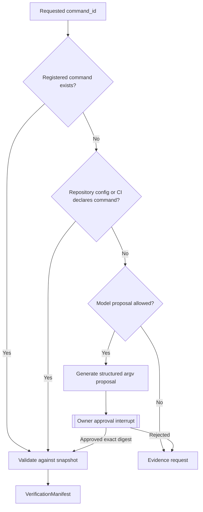

# A2.31 — Discover Executable Verification Commands

## Business Purpose

Resolve the repository-owned build, test, benchmark, lint, type, and security
commands that may produce baseline evidence. This node discovers commands; it
does not authorize or execute them.

## Input

- `RepositoryManifest`, immutable snapshot, and A1 `WorkloadContract.command_id`.
- Versioned command registry and repository configuration/CI definitions.
- Policy allowlist for command shape and working-directory scope.
- Optional model provider for a bounded proposal when deterministic discovery
  is insufficient.

## Output

`VerificationManifest@1.0` with command ID, exact argv array, resolved executable
identity, working directory relative to snapshot, kind, provenance, required
services/secrets, timeout, and rejection reasons. An LLM-suggested command also
produces a digest-bound approval interrupt.

## Command Resolution Priority

## Business Rules

1. `WorkloadContract.command_id` must be resolved explicitly or reported
   missing; it cannot be ignored in favor of an unrelated detected command.
2. Commands are argv arrays, never shell strings.
3. Working directories resolve inside the immutable snapshot.
4. Repository config and CI are evidence of ownership, not automatic safety
   authorization.
5. Model-proposed commands cannot execute without human approval bound to the
   exact proposal digest.
6. Each command records its origin, tool version constraint, required services,
   and supported evidence/metric types.
7. Discovery must support registered language ecosystems rather than hardcode
   one language.

## State Transition

| Condition | Route | Result |
|---|---|---|
| Requested and mandatory commands resolved | `continue` | Publish manifest; continue to A2.40. |
| Safe model proposal requires review | `approval` | Persist interrupt and proposal; resume A2.31. |
| Required command unavailable | `missing` | Typed evidence/configuration request. |
| Proposal rejected or command escapes scope | `rejected` | Stop collection or return to workload owner. |

## Acceptance Criteria

- Commands are discovered for each supported repository fixture without shell
  interpolation.
- The requested `command_id` maps to exactly one command or produces an
  explicit ambiguity/missing result.
- Model output cannot bypass approval or executable policy.
- Resume uses the approved proposal bytes without calling the model again.
- CI command discovery is deterministic and does not execute CI during this
  node.

## Current Implementation Gap

The current implementation resolves Python tools and one GitHub Actions job,
with an approved LLM fallback. It does not consistently bind the A1
`command_id`, is not broadly multi-language, and uses `act -l` during discovery.

