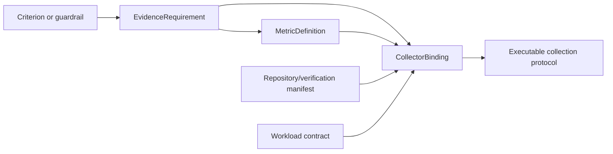

# A2.40 — Plan Evidence Collection

## Business Purpose

Translate every A1 evidence requirement into an executable, metric-aware
collection protocol. This node prevents a generic collector result from being
mistaken for evidence of a different criterion.

## Input

- Approved criteria, guardrails, workload, and `EvidenceRequirement` entries.
- `RepositoryManifest` and `VerificationManifest`.
- Versioned metric, collector, query, workload, and policy registries.
- Collection budget and `baseline_mode=active_collection`.

## Output

`CollectorPlan@1.0` with one or more `CollectorBinding` records per requirement.
Each binding must include requirement ID, criterion/guardrail ID, metric ID,
canonical unit, collector and version, command/query ID, aggregation, warmups,
minimum samples, time window, expected dimensions, and mandatory status.

## Evidence Binding Model

## Business Rules

1. Matching is by requirement, metric, unit, and workload compatibility, not
   broad source type alone.
2. A correctness test may satisfy a correctness guardrail but cannot satisfy a
   latency, throughput, memory, token, cost, or gas criterion without an
   explicitly registered metric extractor.
3. Every mandatory requirement receives `planned`, `unavailable`, or `invalid`
   status and an owner.
4. Collector selection is resolved through a tenant-scoped, effective-dated
   registry with a pinned version.
5. Aggregation is copied from the metric/request definition; defaulting every
   metric to mean is prohibited.
6. Minimum samples, warmups, repetitions, time windows, and cache policy remain
   consistent with A1.
7. Missing mandatory configuration creates a typed interrupt; it does not throw
   an unstructured workflow exception.

## State Transition

| Condition | Route | Result |
|---|---|---|
| All mandatory bindings executable | `continue` | Store plan and continue to A2.41. |
| Mandatory registry/command/query missing | `missing` | Emit evidence request; resume A2.40 after configuration. |
| Binding conflicts with approved request | `rejected` | Return to A1/request owner; do not weaken requirement. |
| Optional collector unavailable | `continue` if policy permits | Record explicit coverage gap. |

## Acceptance Criteria

- Every A1 requirement appears exactly once in the coverage matrix.
- Each planned sample can later be traced to one binding and metric.
- A pytest exit code cannot be planned as `p95_latency_ms` without a registered
  latency extractor.
- Unknown metric units or aggregations block the affected mandatory binding.
- Registry version and policy decision are persisted.

## Current Implementation Gap

The current code uses a static source-type-to-collector dictionary and a fixed
one-hour/mean plan. Unresolved requirements raise `ValueError`; metric identity
and criterion identity are not carried into the binding strongly enough.

