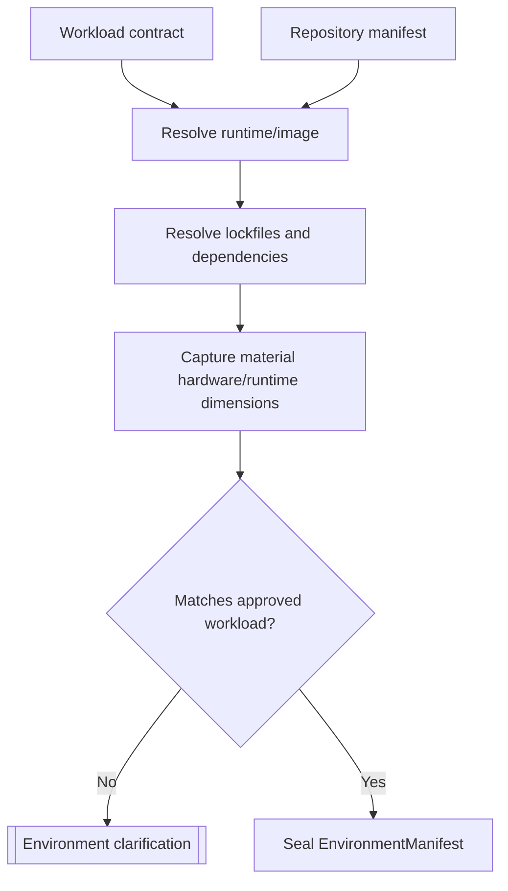

# A2.41 — Resolve Execution Environment

## Business Purpose

Materialize and record the environment in which baseline observations will be
produced, so later treatment measurements can be compared under equivalent
conditions.

## Input

- A1 workload: environment, dataset, concurrency, cache state, repetitions,
  warmups, and command.
- Repository manifest and lockfiles.
- Collector plan and environment registry.
- Worker/runtime image registry and allowed environment-variable names.

## Output

`EnvironmentManifest@1.0` including runtime and tool versions, dependency-lock
digests, container/image digest, OS and architecture, CPU/memory class,
effective concurrency, cache state, dataset version/digest, locale/timezone,
allowed environment variable names, service identities, and capture timestamp.

## Processing Flow

## Business Rules

1. Record effective execution concurrency, not host CPU count.
2. Store secret and environment variable names or secret references only;
   values never enter state or artifacts intended for model access.
3. Image tags must resolve to immutable image digests in production.
4. Dataset identity is material whenever the request declares a dataset.
5. Dependency lock and runtime versions are material comparison dimensions.
6. Unknown material dimensions prevent comparability unless an explicit
   versioned policy classifies them non-material for the metric.
7. Environment capture describes the isolated worker environment, not the
   control-plane process.

## State Transition

| Condition | Route | Result |
|---|---|---|
| Environment fully resolved | `continue` | Store manifest; continue to A2.50. |
| Required dataset/runtime/image unavailable | `missing` | Typed environment request. |
| Effective dimensions contradict A1 | `rejected` | Return to workload owner. |

## Acceptance Criteria

- Repeated resolution of the same immutable environment produces the same
  material identity.
- Requested and effective concurrency are separately represented and equal
  unless policy-approved.
- Dataset, lockfile, runtime, and image digests are present when applicable.
- No secret value appears in graph state, logs, or the manifest.
- A2.91 can compare every material field emitted here.

## Current Implementation Gap

Current code captures control-plane Python/Git versions, host platform, CPU
count, and request cache state. It does not describe an isolated worker image,
dataset/lockfile identity, or the effective requested concurrency.

