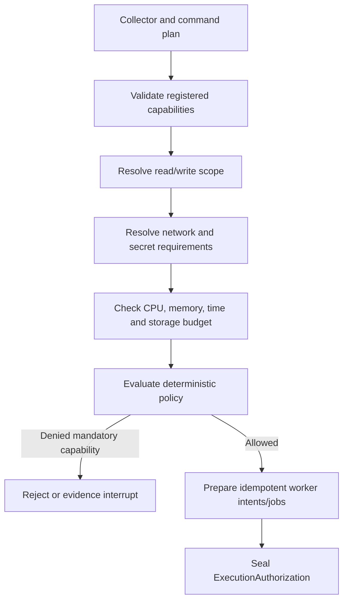

# A2.50 — Safety Preflight and Execution Authorization

## Business Purpose

Authorize each planned collection side effect under least privilege before any
worker, analyzer, query, network connection, or secret lease is created.

## Input

- `SourceSnapshot`, `RepositoryManifest`, `VerificationManifest`,
  `CollectorPlan`, and `EnvironmentManifest`.
- Approved budget and policy version.
- Actor/tenant identity, command/analyzer registries, secret references, and
  worker capability inventory.

## Output

`ExecutionAuthorization@1.0`, plus idempotent worker job receipts where policy
allows pre-submission. Authorization records each capability decision, argv,
read/write roots, egress destinations, secret lease refs, resource/time limits,
worker runtime class, input digests, policy version, and expiry.

## Authorization Flow

## Business Rules

1. Default authorization is deny.
2. Source snapshot is mounted read-only. Writable output and temporary paths
   are separate and disposable.
3. Argv must exactly match a resolved command or registered analyzer template.
4. Egress is denied unless an explicit destination and purpose are registered.
5. Secret access uses short-lived references scoped to one job; raw values do
   not cross the control plane.
6. Intent is persisted before submission. Retry reconciles by idempotency key
   before submitting another job.
7. Denial of a mandatory binding blocks fan-out or marks only that mandatory
   branch unavailable; it cannot be hidden by another successful collector.
8. Policy controls permission; sandbox/runtime controls containment.

## State Transition

| Condition | Route | Result |
|---|---|---|
| All mandatory capabilities authorized | `continue` | Begin A2.60-A2.64 fan-out. |
| Optional capability denied | `continue` if policy permits | Persist denial and reduced coverage. |
| Mandatory capability denied | `rejected` or `missing` | Stop before collection; assign repair owner. |
| Approval needed for elevated capability | `approval` | Digest-bound interrupt; resume A2.50. |

## Acceptance Criteria

- A worker cannot write to the requester source tree.
- Undeclared executable, argv, egress, secret, or mount is denied.
- Duplicate invocation returns/reconciles the existing job receipt.
- Every job input is bound to request, snapshot, plan, and environment digests.
- Mandatory denial cannot reach A2.95.
- Timeout and cancellation behavior are tested against the production worker.

## Current Implementation Gap

Current code evaluates policy and submits detected command jobs, but permits the
repository root as a write root and does not enforce full mount, egress, secret,
resource, and isolated-runtime policy. `authorized=false` is not itself a graph
gate.

