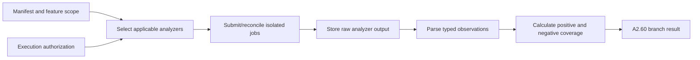

# A2.60 — Collect Static and Dependency Evidence

## Business Purpose

Produce source-based observations that describe syntax, dependencies, patterns,
security findings, complexity, and structural risks. Static evidence supports
source localization and hypotheses; it cannot by itself prove runtime
performance degradation.

## Input

- Immutable source snapshot and repository manifest.
- Authorized analyzer jobs and pinned analyzer registry entries.
- Feature scope, allowed analyzers, budget, and output/redaction policy.

## Output

One branch result for `A2.60` containing raw artifact refs, typed static
observations, analyzer coverage, tool/version/command identity, locations,
confidence, failures, and explicit unsupported reasons.

## Processing Flow

## Business Rules

1. Analyzer selection is language-, scope-, risk-, registry-, and
   budget-aware.
2. Raw output is stored before parsing.
3. Every observation cites a file/symbol/range that exists in the snapshot or
   is rejected.
4. Negative findings count only inside declared analyzer coverage.
5. Unsupported analyzers and parse failures remain visible.
6. Findings are observations, not causal conclusions.
7. Static evidence cannot satisfy runtime metric requirements unless the
   metric definition explicitly permits a static measure such as complexity or
   binary size.

## State Transition

| Condition | Branch status | Result |
|---|---|---|
| Applicable analyzer succeeds | `collected` | Evidence refs and coverage join at A2.70. |
| Optional analyzer unavailable | `unavailable` | Record reason; fan-in continues. |
| Mandatory analyzer fails | `failed` | A2.90 must block the associated requirement. |
| Integrity/scope violation | `rejected` | Cancel branch and record security error. |

## Acceptance Criteria

- Analyzer raw output digest verifies in the artifact store.
- Locations resolve only within the immutable snapshot.
- Multi-language fixtures dispatch only registered applicable analyzers.
- A clean analyzer result never implies full-repository coverage unless proven.
- Analyzer failure cannot be represented as zero findings with success.

## Current Implementation Gap

Current A2.60 primarily wraps lint and type-check command exit codes. It does
not yet implement the documented syntax, dependency, security, complexity, or
multi-language analyzer portfolio.

