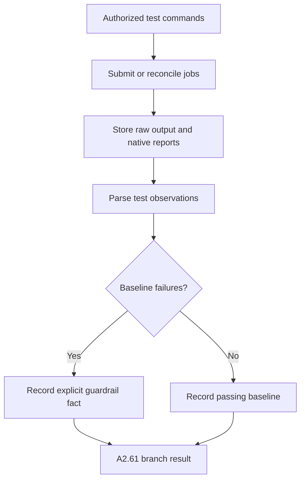

# A2.61 — Execute Correctness Baseline

## Business Purpose

Record the pre-change correctness state using approved repository-owned tests.
A failing baseline is valid evidence and must remain visible; missing tests are
not equivalent to passing tests.

## Input

- Immutable source snapshot workspace.
- Approved unit/integration/invariant commands from `VerificationManifest`.
- `ExecutionAuthorization`, environment manifest, workload/dataset identity,
  test policy, and worker broker.

## Output

The `A2.61` branch result containing raw stdout/stderr/report refs and typed test
observations: command ID, suite/case identity when available, exit status,
pass/fail/error/skip counts, duration, retry/flake history, environment, and
coverage status.

## Processing Flow

## Business Rules

1. Execute against the snapshot workspace, not the original working tree.
2. A non-zero exit code is evidence, not collector failure, when the test tool
   ran and produced a valid result.
3. Infrastructure/tool startup failure is a collector failure and is distinct
   from a failing test.
4. Retried runs and flakes remain individually observable.
5. Correctness evidence binds only to correctness/quality requirements unless a
   registered metric extractor explicitly derives another metric.
6. Test commands cannot install arbitrary dependencies or access network unless
   separately authorized.
7. Raw outputs are redacted for downstream model use while protected originals
   remain integrity-verifiable.

## State Transition

| Condition | Branch status | Result |
|---|---|---|
| Test runner executes | `collected` | Publish pass/fail observations. |
| No approved test command | `unavailable` | Mandatory correctness requirement later fails quality. |
| Worker/tool infrastructure fails | `failed` | Bounded retry or evidence request. |
| Scope/security violation | `rejected` | Cancel job and stop affected collection. |

## Acceptance Criteria

- Passing, failing, skipped, flaky, timeout, and missing-test fixtures are
  distinguishable.
- Exit code alone is not the only retained information when a native report is
  available.
- A failing baseline cannot be reported as collector unavailable or passing.
- Raw output, parsed result, and requirement binding are traceable.
- Rerun/reconciliation does not duplicate a test side effect.

## Current Implementation Gap

Current A2.61 executes an approved unit command and retains worker output, but
normally exposes a single exit-code observation rather than full suite/case,
flake, duration, and native-report semantics.

