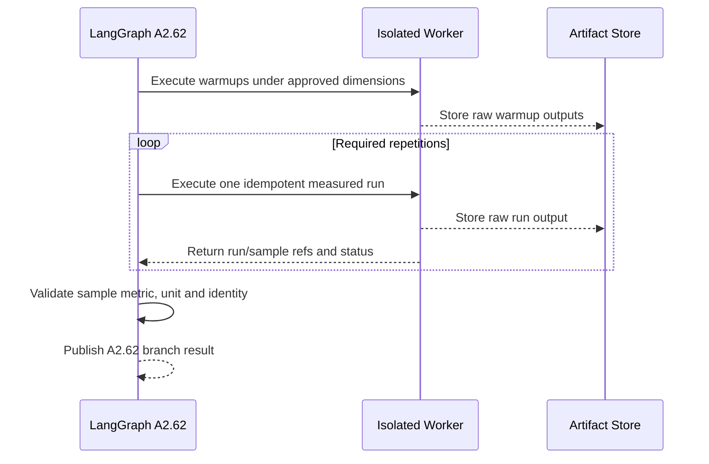

# A2.62 — Execute Performance Workload

## Business Purpose

Measure the approved primary performance or resource metric under the exact A1
workload protocol. This node produces individual observations, not a synthetic
or prematurely aggregated baseline.

## Input

- Approved metric-aware collector binding and workload command/query.
- Immutable source snapshot workspace and `EnvironmentManifest`.
- Dataset, warmups, repetitions, concurrency, cache state, timeout, and
  resource limits from A1.
- `ExecutionAuthorization`, metric registry, worker broker, and artifact store.

## Output

The `A2.62` branch result containing one typed `EvidenceSample` per valid
measurement, raw benchmark/load-test refs, sample and run-group identities,
metric ID, raw/canonical unit, collector version, timestamps, warmup status,
coverage, partial-failure details, and outlier flags without silent deletion.

## Measurement Sequence

## Business Rules

1. The collected `metric_id` must equal the requirement metric or use an
   explicitly registered transformation.
2. Warmups are stored and labeled but excluded from measured aggregates unless
   the metric protocol says otherwise.
3. Each repetition has a stable run/sample ID and separate status.
4. Concurrency, cache state, dataset, environment, source digest, and command
   are constant across one run group.
5. A command exit code is not a latency/throughput/memory/cost sample.
6. Partial samples are retained; policy decides eligibility after visibility.
7. The worker timeout must kill/cancel and reconcile the real process/job.
8. Aggregation does not happen in this node.

## State Transition

| Condition | Branch status | Result |
|---|---|---|
| Required samples collected | `collected` | Join raw and sample refs at A2.70. |
| No applicable workload/collector | `unavailable` | Mandatory performance requirement blocks A2.90. |
| Some runs fail | `partial` | Preserve all results; quality policy evaluates sufficiency. |
| Metric/unit/dimension mismatch | `invalid` | Samples remain raw but are ineligible. |

## Acceptance Criteria

- A p95 latency request produces latency samples with the registered canonical
  unit and never an exit-code substitute.
- Exactly the requested measured repetitions are attempted after warmups.
- Every sample traces to raw output and one collector binding.
- Changing dataset, source, environment, concurrency, or cache splits or
  invalidates the run group.
- Timeouts terminate work and are safely reconciled after restart.

## Current Implementation Gap

Current code can parse pytest-benchmark rounds when that command is detected.
It does not yet support general k6, Bencher, process resource, cost/token,
Foundry gas, or registered custom metric collectors, and does not strongly bind
samples to the A1 metric.

