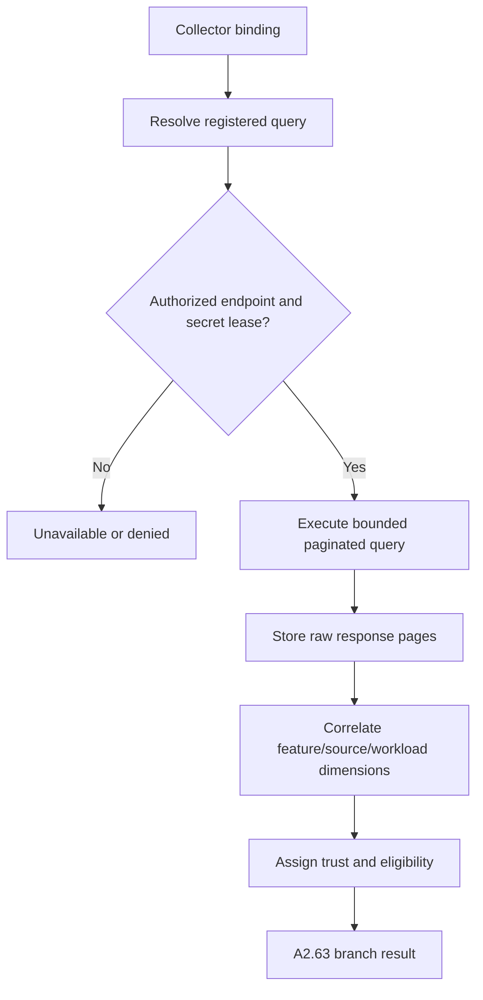

# A2.63 — Import Historical Telemetry

## Business Purpose

Import eligible existing logs, metrics, traces, profiles, evaluation runs, or
LLM traces that describe the approved feature and source. This node queries
declared sources only; it does not launch a special discovery workload.

## Input

- Telemetry collector bindings and bounded registered queries.
- Feature, metric, source revision/snapshot, workload, dataset, environment,
  and time-window identity.
- Secret references and authorized egress from A2.50.
- Query/metric registries and telemetry adapters.

## Output

The `A2.63` branch result containing immutable raw query-response refs, typed
telemetry samples, query ID/version, source system, observation window,
pagination/completeness, correlation fields, trust level, coverage, and
unavailable/invalid reasons.

## Processing Flow

## Business Rules

1. Queries are registry-defined templates with typed parameters; the model may
   not generate executable query text for unattended use.
2. Window, tenant, feature, and result-size bounds are mandatory.
3. Missing source revision, feature, workload, or environment correlation lowers
   trust and may make evidence ineligible.
4. Raw pages are stored before parsing/aggregation.
5. Pagination and dropped-series/span/profile coverage are explicit.
6. Observability access uses short-lived secrets and allowlisted endpoints.
7. Telemetry samples must carry the requested metric ID and canonical unit or a
   versioned conversion path.

## State Transition

| Condition | Branch status | Result |
|---|---|---|
| Query succeeds with eligible samples | `collected` | Join evidence at A2.70. |
| No binding/adapter/data | `unavailable` | Preserve reason and coverage. |
| Partial pages or weak correlation | `partial` | Preserve data with reduced trust. |
| Cross-tenant, integrity, or authorization failure | `rejected` | Stop and audit security event. |

## Acceptance Criteria

- Prometheus/Loki/Tempo/Pyroscope/MLflow or equivalent adapters pass common
  conformance tests.
- Query identity and parameters can reconstruct the observation set.
- Cross-tenant results are impossible.
- Weak correlation cannot become high-trust evidence.
- Missing telemetry is explicit and cannot be silently replaced.

## Current Implementation Gap

No telemetry query port or adapter is wired. The current node always produces
an explicit `unavailable_reason`, which is honest but not feature-complete.

