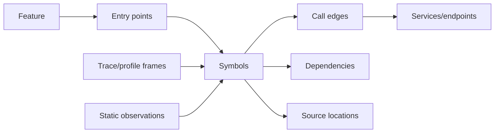

# A2.64 — Build Source and Knowledge Map

## Business Purpose

Connect feature scope, files, symbols, calls, services, dependencies, traces,
profiles, and evidence locations so A3 can make source-grounded claims.

## Input

- Immutable source snapshot, repository manifest, feature scope, and symbol
  index.
- Static observations and available runtime trace/profile correlations.
- Registered language indexers and graph analyzers.
- Analyzer authorization and budget.

## Output

Source-map and optional code-graph artifacts plus the `A2.64` branch result.
Nodes and edges carry stable IDs, type, source location, supporting evidence,
confidence, analyzer/version, coverage, and unresolved reason.

## Graph Model

## Business Rules

1. Every positive source location resolves to a file digest in the snapshot.
2. Static call edges, dynamic runtime edges, and inferred edges are distinct.
3. Dynamic dispatch and unresolved cross-service edges remain unknown, not
   narrative guesses.
4. Unsupported languages and parse failures reduce explicit coverage.
5. Feature mapping records evidence and confidence; directory-name similarity
   alone is low trust.
6. Graph artifacts are stored outside checkpoints and referenced by digest.
7. The source map supports source claims; it does not independently establish a
   measured bottleneck.

## State Transition

| Condition | Branch status | Result |
|---|---|---|
| Required feature/source coverage met | `collected` | Join graph refs at A2.70. |
| Optional indexer unavailable | `partial` | Publish supported map and unresolved coverage. |
| No supported mapping path | `unavailable` | Mandatory source-grounding policy may block A2/A3. |
| Location escapes/mismatches snapshot | `invalid` | Reject affected observations. |

## Acceptance Criteria

- File/symbol IDs remain stable for the same snapshot.
- Every location verifies against snapshot content.
- Static, dynamic, and inferred edges are queryable separately.
- Python, JavaScript/TypeScript, Go, Rust, Java, and .NET follow registered
  parser coverage policy.
- Unsupported language files appear in unresolved coverage.

## Current Implementation Gap

Current code creates a basic Python AST file/import/function map. It does not
produce cross-language symbols, call graphs, service mappings, runtime
correlation, or robust feature-scope linkage.

