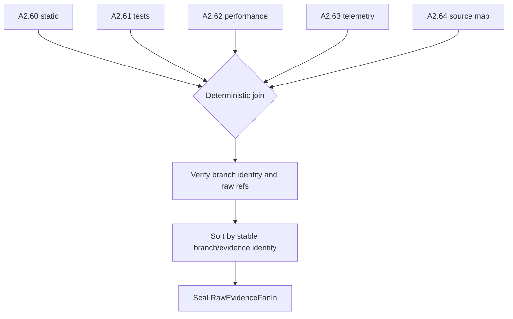

# A2.70 — Preserve Raw Evidence and Join Collector Branches

## Business Purpose

Complete the deterministic fan-in of A2.60-A2.64 while proving that every
reported observation has immutable raw backing. Collector completion order
must not affect the resulting identity.

## Input

- Exactly one branch result from each of A2.60, A2.61, A2.62, A2.63, and
  A2.64.
- Raw artifact refs and branch intents/job receipts.
- Artifact-store integrity, retention, media-type, and tenant policy.

## Output

`RawEvidenceFanIn@1.0` containing deterministic branch status, raw artifact
inventory, evidence IDs, collector failures, media types, byte sizes, capture
times, and parent digests. Raw bytes remain in immutable object storage.

## Fan-In Flow

## Business Rules

1. Branch IDs are fixed and unique; all five must report a terminal status.
2. Missing branch completion is not equivalent to unavailable evidence.
3. Raw bytes must already be stored before evidence parsing is accepted.
4. Every raw ref is tenant-bound and digest-verifiable.
5. Two different digests for the same branch/evidence/artifact identity are a
   hard conflict.
6. Fan-in order is canonical and independent of worker completion order.
7. Raw retention, encryption, legal hold, and deletion policy are persisted or
   resolvable by policy version.
8. This node does not normalize or aggregate measurements.

## State Transition

| Condition | Route | Result |
|---|---|---|
| All branch statuses and refs consistent | `continue` | Publish fan-in and continue to A2.71. |
| Branch still running/unknown | `retry/reconcile` | Wait within deadline; never assume failure or success. |
| Digest or identity conflict | `rejected` | Stop A2 and record integrity failure. |
| Mandatory branch absent | `missing` | Evidence request or recollection route. |

## Acceptance Criteria

- Permuting branch completion order produces the same fan-in digest.
- Duplicate identical branch results merge safely; conflicting duplicates fail.
- Every evidence ID resolves to exactly one branch item and raw ref.
- A crashed worker is reconciled before retry.
- Raw artifacts can be read and verified independently of normalized evidence.

## Current Implementation Gap

Current fan-in deterministically collects five branch envelopes and evidence
IDs, but its contract contains limited raw metadata and does not itself prove
that branch intents/jobs have reached a durable terminal state.

