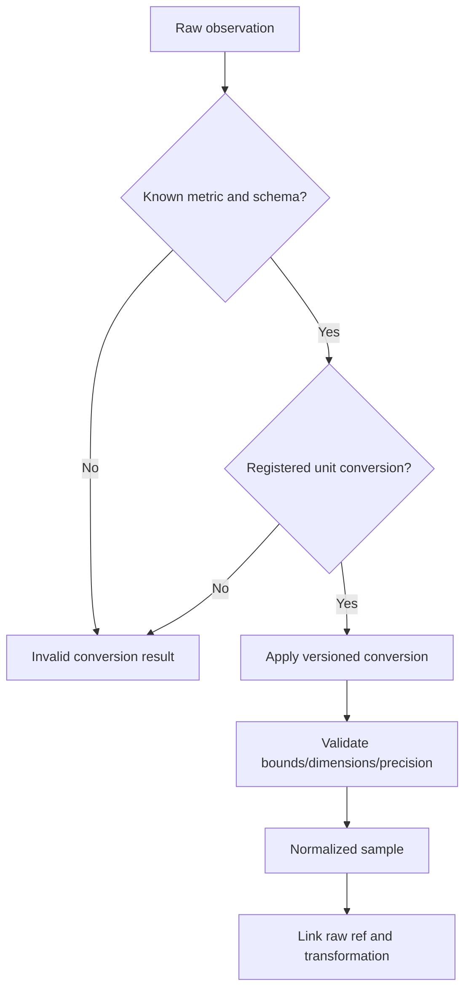

# A2.71 — Normalize Evidence

## Business Purpose

Convert raw observations into canonical metric samples without losing original
values, precision, dimensions, or provenance. Normalization enables valid
comparison; it cannot repair semantically wrong evidence.

## Input

- Verified `RawEvidenceFanIn` and branch evidence records.
- Metric registry definitions, canonical units, schemas, and transformation
  versions.
- Collector parser versions and requirement/metric bindings.

## Output

`NormalizedEvidenceSet@1.0` containing eligible normalized samples and explicit
conversion failures. Each sample retains raw value/unit, normalized value/unit,
metric and requirement identity, transformation ID/version, precision, and raw
artifact ref.

## Normalization Flow

## Business Rules

1. Metric identity is explicit and cannot be inferred from branch name alone.
2. Conversion uses a registered, versioned, deterministic transformation.
3. Raw value and unit are never overwritten.
4. Unknown unit, schema, dimension, NaN/infinity, or invalid domain produces an
   ineligible sample and visible failure.
5. Aggregation occurs only after sample-level normalization.
6. Rounding and precision rules are metric-specific and versioned.
7. Boolean/verdict evidence is not treated as a sampled numeric distribution.
8. Re-normalization with another registry version creates a new artifact and
   lineage, never mutates the old result.

## State Transition

| Condition | Route | Result |
|---|---|---|
| Mandatory samples normalize | `continue` | Publish set and continue to A2.80. |
| Optional sample conversion fails | `continue` if policy permits | Preserve failure and reduce coverage. |
| Mandatory metric cannot normalize | `missing` or `rejected` | Return to metric/collector owner. |
| Raw integrity fails | `rejected` | Stop immediately. |

## Acceptance Criteria

- Reference fixtures verify ms/s, bytes/KB/MB, rates, percentages, currency,
  tokens, gas, and registered domain conversions where applicable.
- A test exit code cannot normalize into latency.
- Every normalized sample points to raw bytes and transformation version.
- Conversion is deterministic across process restart.
- Unknown conversions never pass through as canonical values.

## Current Implementation Gap

Current normalization recognizes only a small set of already-canonical units
and sets `normalized_ref` to the raw ref. It lacks metric-registry conversions,
raw-versus-normalized value fields, and strong requirement/metric linkage.

