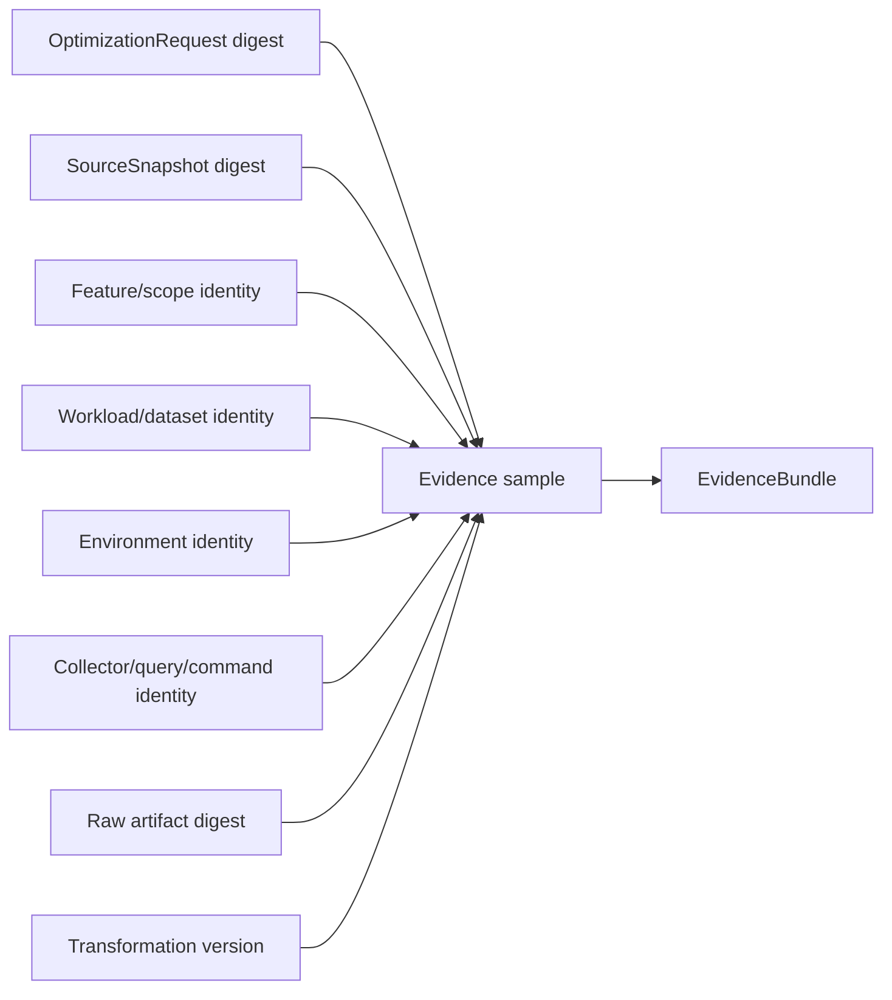

# A2.80 — Bind Evidence Provenance

## Business Purpose

Assemble normalized samples into one audit-ready evidence bundle and prove how
each sample relates to the approved request, immutable source, feature,
workload, environment, collector, and raw observation.

## Input

- `OptimizationRequest`, `SourceSnapshot`, `RepositoryManifest`,
  `CollectorPlan`, `EnvironmentManifest`, `ExecutionAuthorization`, and
  `NormalizedEvidenceSet`.
- Registry and policy versions used by discovery, collection, and
  normalization.

## Output

`EvidenceBundle@1.0` containing eligible and ineligible sample inventories,
requirement coverage, collector versions, provenance links, transformation
versions, raw refs, source locations/trace IDs where available, and all parent
digests.

## Provenance Chain

## Business Rules

1. Every sample binds to exactly one evidence requirement and metric.
2. Tenant, case, request, and source identities must agree across all parents.
3. Missing material provenance lowers trust or makes the sample ineligible; it
   is never backfilled by narrative.
4. Trust is deterministic from evidence type, provenance completeness,
   collector class, and policy version.
5. `baseline_digest` cannot refer to the source snapshot as if it were already
   a measured baseline; use an explicit collection/run-group identity until
   A2.95 creates the baseline.
6. Coverage represents satisfied requirement semantics, not raw evidence count.
7. Model-facing derivatives reference redacted artifacts; protected raw refs
   remain in the audit chain.

## State Transition

| Condition | Route | Result |
|---|---|---|
| At least one valid sample and consistent provenance | `continue` | Publish bundle; continue to A2.90. |
| No valid normalized evidence | `missing` | Evidence request/recollection. |
| Cross-tenant/digest/identity conflict | `rejected` | Security/integrity failure. |
| Partial optional provenance | `continue` if policy permits | Persist lower trust and coverage gap. |

## Acceptance Criteria

- Starting from any aggregate/sample, the complete chain to raw bytes and A1
  requirement is reconstructable.
- Cross-request or cross-snapshot sample injection fails.
- Missing dataset/source/collector identity cannot receive high trust.
- Coverage is calculated per requirement and metric.
- Bundle digest changes when any material provenance link changes.

## Current Implementation Gap

Current code creates a real bundle and parent digest chain, but coverage is
counted by broad source type and samples lack direct requirement/metric IDs.
The `baseline_digest` currently uses the source snapshot digest before a
baseline exists.

