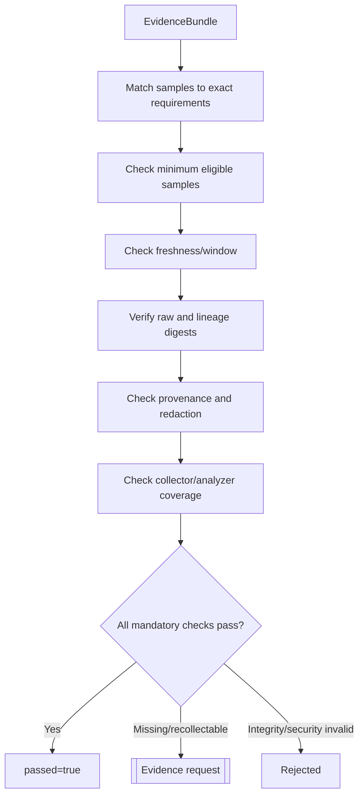

# A2.90 — Validate Evidence Quality

## Business Purpose

Decide deterministically whether collected evidence is sufficient, fresh,
intact, safe, and policy-compliant for every mandatory A1 criterion and
guardrail. A successful collector is not automatically sufficient evidence.

## Input

- `EvidenceBundle`, collector branch reports, raw artifact refs, collector plan,
  approved request, budget, and quality policy.
- Artifact integrity service and redaction/classification results.

## Output

`EvidenceQualityReport@1.0` with overall result and per-requirement verdicts for
coverage, applicable metric/unit, sample count, freshness, integrity,
provenance, redaction, analyzer coverage, collector failure, and policy waiver.

## Quality Decision

## Business Rules

1. Samples match by requirement ID, criterion/guardrail ID, metric ID, unit,
   and material identities.
2. One evidence sample cannot satisfy unrelated requirements merely because
   both accept the same source type.
3. Minimum sample count uses eligible measured samples. Deterministic verdicts
   may use a separately registered cardinality rule.
4. Collector unavailable, collector failed, and workload produced a negative
   business result are different states.
5. Freshness uses the approved observation window/policy, not worker timeout or
   overall request deadline as a substitute.
6. Integrity verification covers raw bytes, normalized artifact, parent chain,
   and tenant ownership.
7. Redaction scanning is defense in depth; structured secret detection and data
   classification policy own the hard decision.
8. Optional gaps pass only under an explicit policy decision recorded in the
   report.

## State Transition

| Condition | Route | Result |
|---|---|---|
| All mandatory quality checks pass | `continue` | Continue to A2.91. |
| Required evidence absent/insufficient/stale but repairable | `missing` | Typed evidence interrupt and owning node. |
| Integrity, tenant, redaction, or policy hard failure | `rejected` | Terminate A2; never publish baseline. |
| Transient collector state unknown | `retry/reconcile` | Bounded retry without duplicate job. |

## Acceptance Criteria

- A latency criterion is not satisfied by a test exit code.
- Two criteria sharing a source type receive independent metric-aware verdicts.
- Missing mandatory evidence cannot reach A2.95.
- Raw tampering, stale data, and cross-tenant refs fail.
- Every failed verdict identifies repair owner and earliest restart node.
- Policy waivers are digest- and version-bound.

## Current Implementation Gap

Current checks cover sample count, age, raw-ref verification, simple keyword
redaction, and branch unavailability. Matching is only by broad source type;
freshness uses the request deadline; authorization, metric/unit compatibility,
provenance completeness, and structured redaction are incomplete.

