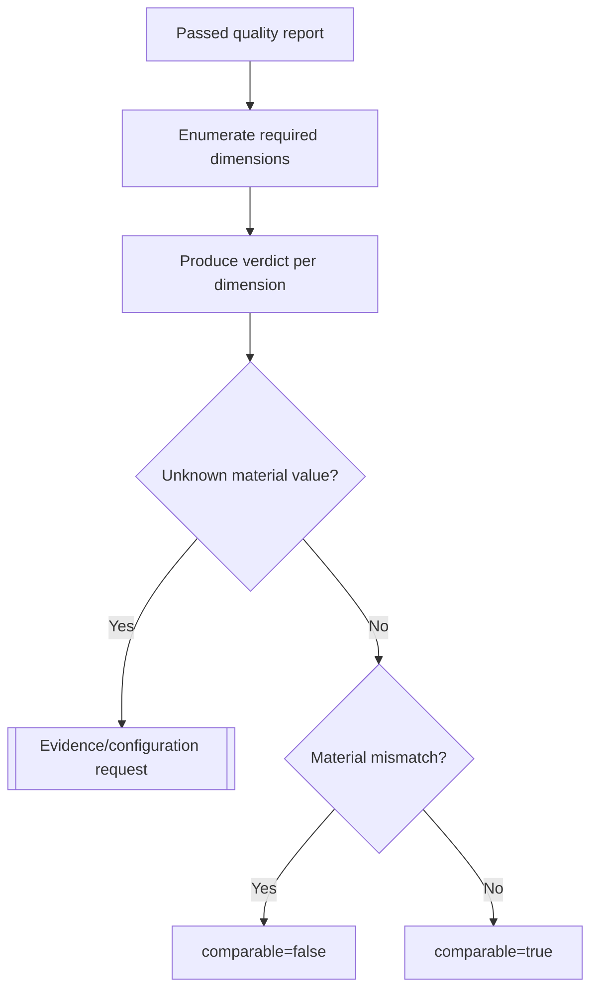

# A2.91 — Validate Comparability

## Business Purpose

Prove that the baseline observations form one internally consistent comparison
frame that can later be reproduced for treatment measurement. Quality answers
“is this evidence usable?”; comparability answers “can before and after be
compared without confounding material differences?”

## Input

- Passed `EvidenceQualityReport`, `EvidenceBundle`, `SourceSnapshot`,
  `EnvironmentManifest`, workload/dataset contract, metric definitions, and
  comparison policy.

## Output

`ComparabilityReport@1.0` with one `DimensionVerdict` per material dimension,
overall `comparable`, expected/observed values or digests, materiality,
tolerance, reason, policy version, and repair owner.

## Material Dimensions

| Dimension | Expected comparison |
|---|---|
| Source | Every sample binds to the same immutable source snapshot. |
| Feature | Same feature/scope and correlation identity. |
| Metric | Same metric definition, canonical unit, aggregation, and transformation. |
| Workload | Same workload and command/query protocol version. |
| Dataset | Same dataset ID/version/digest where material. |
| Environment | Same runtime/image, dependency lock, service configuration, locale/timezone. |
| Hardware | Same class or within registered tolerance. |
| Execution | Same concurrency, cache state, warmups, repetitions, and resource limits. |
| Collector | Compatible collector and parser versions. |
| Model workload | Same model/prompt/evaluator identity where applicable. |

## Decision Flow

## Business Rules

1. Every policy-defined material dimension receives a verdict; omission is not
   a pass.
2. `unknown` differs from `mismatch`: unknown requests evidence, mismatch marks
   incomparable or creates a new comparison cohort.
3. Tolerances are metric- and policy-specific and versioned.
4. Baseline samples with incompatible dimensions are split into separate run
   groups rather than averaged together.
5. Expected and observed values come from independent approved/captured
   artifacts; copying the same value into both fields does not prove equality.
6. `comparable=true` requires passed evidence quality.

## State Transition

| Condition | Route | Result |
|---|---|---|
| All material dimensions match/tolerate | `continue` | Continue to A2.95. |
| Material dimension unknown | `missing` | Request evidence/configuration and resume owning node. |
| Material dimension mismatches | `incomparable` | Stop baseline publication or create separate cohort. |
| Quality report not passed | `rejected` | Defensive stop. |

## Acceptance Criteria

- Dataset, runtime, lockfile, image, hardware, concurrency, cache, source,
  workload, metric, and collector fixtures produce explicit verdicts.
- Unknown values never become comparable by omission.
- Mixed run groups are not aggregated together.
- Expected and observed fields are derived from distinct sources.
- Report identifies the node responsible for repair.

## Current Implementation Gap

Current A2.91 checks cache state and workload/environment IDs only. It omits
most material dimensions and populates the workload expected/observed display
from the same request value, limiting its evidentiary value.

