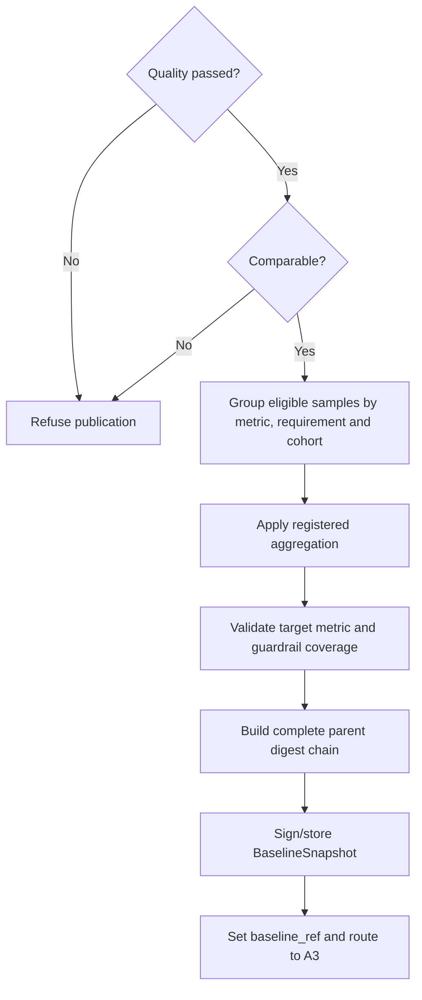

# A2.95 — Seal and Publish Baseline

## Business Purpose

Publish the canonical A2 handoff to A3 only after evidence quality and
comparability pass. The baseline is an aggregate view with complete sample and
raw lineage, not a replacement for the evidence bundle.

## Input

- Approved `OptimizationRequest`.
- Immutable `SourceSnapshot`.
- `EvidenceBundle` containing eligible normalized samples.
- Passed `EvidenceQualityReport` and comparable `ComparabilityReport`.
- Metric registry aggregation definitions and signing/publishing policy.

## Output

`BaselineSnapshot@1.0`, `baseline_ref`, and retained refs to
`EvidenceBundle`, `EvidenceQualityReport`, and `ComparabilityReport`.
Each `MetricAggregate` includes metric/requirement identity, canonical unit,
aggregation method/version, sample IDs, count, observation window, statistics,
and raw lineage through the evidence bundle.

## Publication Flow

## Business Rules

1. Direct invocation is fail-closed if either final report does not pass.
2. Aggregation groups by metric ID, requirement ID, canonical unit, and
   comparison cohort—not evidence type alone.
3. Aggregation operator and percentile method come from the metric/request
   definition and are versioned.
4. Only eligible measured samples participate; rejected/outlier samples remain
   visible in lineage.
5. Every aggregate retains sample IDs that resolve through normalized evidence
   to immutable raw artifacts.
6. All mandatory criteria and guardrails must have an aggregate or applicable
   deterministic verdict.
7. Publication is create-only and idempotent. A conflicting digest for the same
   baseline identity is a hard error.
8. A3 receives refs only after the artifact store confirms durable persistence.

## State Transition

| Condition | Route | Result |
|---|---|---|
| Gates pass and baseline stores durably | `continue` | Set `baseline_ref`; mark A2.95 complete; route to A3. |
| Either gate fails/missing | `rejected` | Refuse baseline publication. |
| Aggregate lacks metric/lineage | `rejected` | Return to normalization/provenance owner. |
| Durable store outcome unknown | `reconcile` | Resolve intent before any retry. |

## Acceptance Criteria

- A `p95_latency_ms` request produces a `p95_latency_ms` aggregate in the
  canonical requested unit.
- A correctness exit code cannot appear as the primary latency aggregate.
- Every aggregate reconstructs exactly from its referenced samples.
- Aggregation is deterministic for the same ordered sample set and version.
- Failed quality/comparability cannot create `baseline_ref`.
- Crash before/after artifact write resumes without duplicate publication.

## Current Implementation Gap

Current A2.95 correctly refuses failed quality/comparability reports and creates
a typed baseline. It groups samples by `evidence_type`, uses one built-in
statistics algorithm, and does not yet preserve direct requirement/metric
binding. A schema-valid baseline can therefore still be semantically unrelated
to the A1 criterion.

