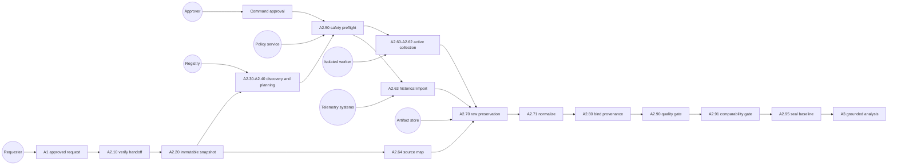
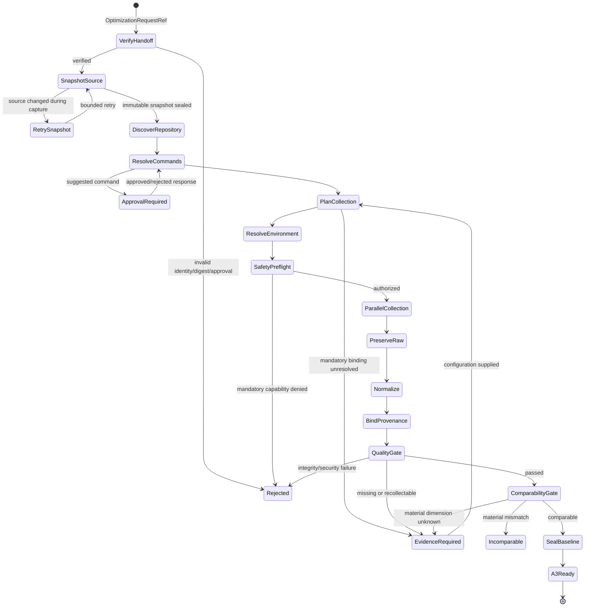
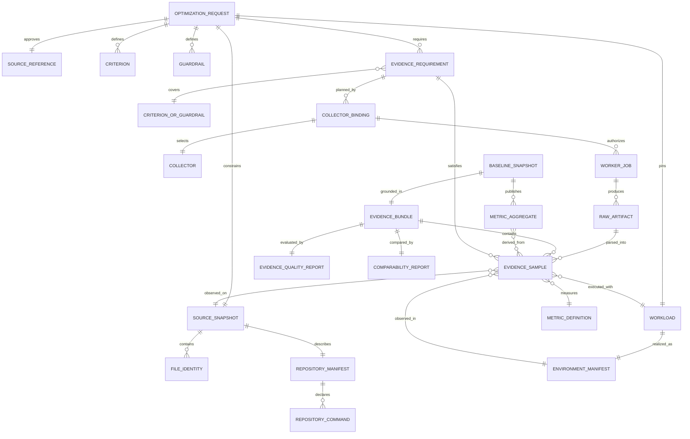
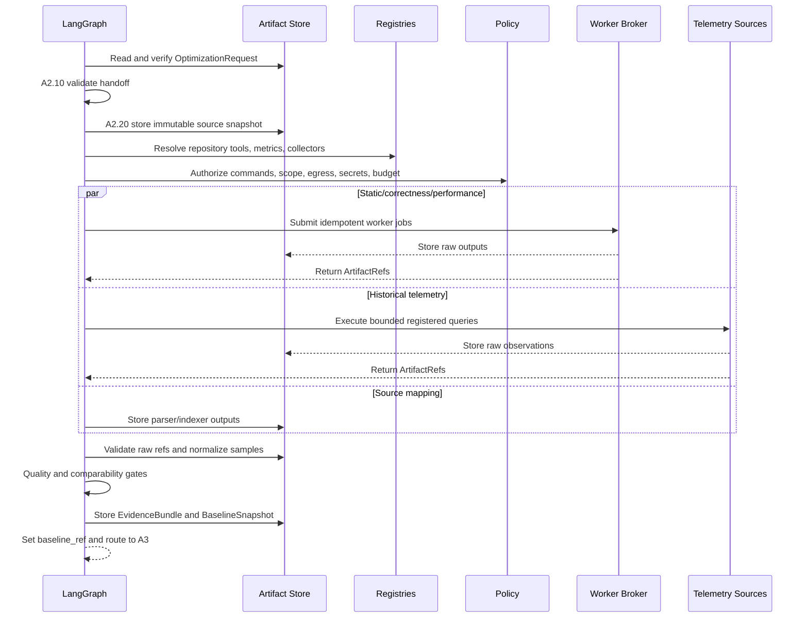

# A2 Real Baseline — Business and Technical Analysis

## 1. Purpose and Scope

A2 proves the pre-change behavior of the exact source state approved by A1.
It creates an evidence-backed baseline that A3 can use without knowing how the
evidence was collected. A2 is successful only when every mandatory A1
criterion and guardrail has applicable evidence, raw observations are
preserved, provenance is complete, and the evidence is comparable.

A2 never invents values, substitutes one metric for another, modifies the
approved source, or relaxes the A1 contract.

## 2. Primary Use Case

**Use case ID:** UC-A2-001  
**Name:** Establish a real, comparable baseline  
**Primary actor:** Optimization requester  
**System actor:** LangGraph control plane  
**Supporting actors:** Policy service, artifact store, registry, worker broker,
collector/analyzer adapters, telemetry systems, approver

### Preconditions

1. A1.95 produced an approved `OptimizationRequest@1.0`.
2. The artifact and request digest can be independently verified.
3. The source root is authorized and readable.
4. Required registries and policies have pinned versions.
5. Production execution has a durable checkpoint, artifact store, intent
   ledger, and isolated worker implementation.

### Success Outcome

A2.95 publishes a `BaselineSnapshot@1.0` whose aggregates trace to eligible
normalized samples, immutable raw observations, one source snapshot, one
approved request, and passed quality and comparability reports.

### Minimum Failure Outcome

The graph stops at the owning node with a typed rejection, evidence request,
approval interrupt, or incomparable decision. It must not publish a baseline.

## 3. Overall Use-Case Diagram

## 4. Use-Case Catalogue

| Use case | Nodes | Business result |
|---|---|---|
| UC-A2-010 Verify handoff | A2.10 | Invalid A1 identity, approval, schema, signature, or digest cannot enter collection. |
| UC-A2-020 Freeze source | A2.20 | One immutable source snapshot is created and addressable by digest. |
| UC-A2-030 Understand repository | A2.30-A2.31 | Supported languages, dependencies, symbols, test roots, and repository-owned commands are known with coverage. |
| UC-A2-040 Plan evidence | A2.40-A2.41 | Every requirement is bound to a metric-aware collector protocol and reproducible environment. |
| UC-A2-050 Authorize execution | A2.50 | Each side effect has least-privilege policy, resource, network, secret, and write-scope authorization. |
| UC-A2-060 Collect evidence | A2.60-A2.64 | Static, correctness, performance, telemetry, and source-map branches return typed evidence or explicit unavailability. |
| UC-A2-070 Preserve and normalize | A2.70-A2.71 | Raw bytes remain immutable; normalized samples retain source identity and transformation version. |
| UC-A2-080 Bind provenance | A2.80 | Evidence is traceable to request, source, feature, workload, environment, collector, and sample. |
| UC-A2-090 Gate and publish | A2.90-A2.95 | Only sufficient, intact, fresh, safe, and comparable evidence becomes a baseline. |

### Detailed Node Specifications

| Node | Specification |
|---|---|
| A2.10 | [Verify A1 handoff](A2.10.md) |
| A2.20 | [Create immutable source snapshot](A2.20.md) |
| A2.30 | [Build repository manifest](A2.30.md) |
| A2.31 | [Discover executable verification commands](A2.31.md) |
| A2.40 | [Plan evidence collection](A2.40.md) |
| A2.41 | [Resolve execution environment](A2.41.md) |
| A2.50 | [Safety preflight and execution authorization](A2.50.md) |
| A2.60 | [Collect static and dependency evidence](A2.60.md) |
| A2.61 | [Execute correctness baseline](A2.61.md) |
| A2.62 | [Execute performance workload](A2.62.md) |
| A2.63 | [Import historical telemetry](A2.63.md) |
| A2.64 | [Build source and knowledge map](A2.64.md) |
| A2.70 | [Preserve raw evidence and join branches](A2.70.md) |
| A2.71 | [Normalize evidence](A2.71.md) |
| A2.80 | [Bind evidence provenance](A2.80.md) |
| A2.90 | [Validate evidence quality](A2.90.md) |
| A2.91 | [Validate comparability](A2.91.md) |
| A2.95 | [Seal and publish baseline](A2.95.md) |

## 5. LangGraph State Model

### Compact Graph State

Graph state contains identity, routes, interrupts, counters, and artifact
references only. Source bytes, command output, telemetry payloads, profiles,
and secrets remain outside checkpoints.

| State field | Owner | Rule |
|---|---|---|
| `case_id`, `thread_id`, `tenant_id` | Root graph | Immutable across all A2 nodes. |
| `baseline_mode` | Root/Lane | `active_collection` for Lane 1; immutable in A2. |
| `request_ref` | A1.95 | Read-only in A2. |
| `artifact_refs` | All A2 nodes | Deterministic reducer keyed by artifact type and ID; digest conflicts fail. |
| `pending_interrupt` | A2.31/A2.40/A2.90/A2.91 | Must be typed, digest-bound, expiring, and resumable on the same thread. |
| `completed_nodes` | Runtime | Append/merge deterministically. |
| `node_routes` | Runtime | One stable route per node attempt. |
| `baseline_ref` | A2.95 | Written only after both final gates pass. |

## 6. Evidence ERD

### Required Relationship Keys

Every `EvidenceSample` must carry `requirement_id`, `criterion_id` or
`guardrail_id`, `metric_id`, canonical unit, raw reference, transformation
version, source snapshot digest, workload/dataset/environment identity, sample
ID, collector identity/version, and observation time. Matching only by broad
source type is prohibited.

## 7. End-to-End Sequence

## 8. Node and Artifact Matrix

| Node | Primary input | Primary output | Success route | Failure owner |
|---|---|---|---|---|
| A2.10 | `OptimizationRequest` | `A2IntakeDecision` | A2.20 | A1/request owner |
| A2.20 | Verified request/source | `SourceSnapshot` | A2.30 | Snapshot service |
| A2.30 | Source snapshot | `RepositoryManifest` | A2.31 | Registry/indexer owner |
| A2.31 | Manifest and workload | `VerificationManifest` | A2.40 | Requester/approver |
| A2.40 | Requirements and registries | `CollectorPlan` | A2.41 | Collector/metric registry owner |
| A2.41 | Workload and toolchain | `EnvironmentManifest` | A2.50 | Environment owner |
| A2.50 | Plan, commands, environment | `ExecutionAuthorization` | Fan-out | Policy/platform owner |
| A2.60 | Authorized analyzer jobs | Static evidence refs | A2.70 join | Analyzer owner |
| A2.61 | Authorized test jobs | Test evidence refs | A2.70 join | Repository owner |
| A2.62 | Authorized workload jobs | Metric sample refs | A2.70 join | Workload owner |
| A2.63 | Registered historical queries | Telemetry evidence refs | A2.70 join | Observability owner |
| A2.64 | Snapshot and observations | Source map refs | A2.70 join | Indexer owner |
| A2.70 | Five branch results | `RawEvidenceFanIn` | A2.71 | Artifact/platform owner |
| A2.71 | Raw refs and metric registry | `NormalizedEvidenceSet` | A2.80 | Metric registry owner |
| A2.80 | Normalized samples | `EvidenceBundle` | A2.90 | Evidence platform owner |
| A2.90 | Evidence bundle | `EvidenceQualityReport` | A2.91 | Evidence/workload owner |
| A2.91 | Evidence and dimensions | `ComparabilityReport` | A2.95 | Workload/environment owner |
| A2.95 | Passed reports | `BaselineSnapshot` | A3 | A2 product owner |

## 9. Global Business Rules

1. One A2 run measures exactly one approved request and one immutable source
   snapshot.
2. Every mandatory requirement has an explicit coverage status.
3. Evidence satisfies a requirement only when requirement, metric, unit,
   workload, source, environment, and policy bindings match.
4. Raw bytes are stored before parsing, redaction, normalization, or
   aggregation.
5. Every transformation is versioned and reversible to raw samples.
6. Optional collection failure may degrade coverage only under explicit policy;
   mandatory failure blocks A2.95.
7. Static evidence may support a source claim but cannot replace runtime metric
   evidence.
8. Repository commands execute in an isolated snapshot workspace, never the
   requester working tree.
9. External adapters return typed results; LangGraph alone chooses routes.
10. All loops and retries are bounded, idempotent, checkpointed, and observable.

## 10. Non-Functional Requirements

| Area | Requirement |
|---|---|
| Security | Least privilege, no raw secrets in state, read-only source mount, denied-by-default egress, sandboxed workers. |
| Reliability | Durable checkpoints, prepared intent before side effect, reconciliation before retry, no duplicate job execution. |
| Integrity | Canonical SHA-256 digests, create-only artifact writes, tenant isolation, parent digest chain. |
| Performance | Fan-out independent collectors; enforce request deadline, worker timeout, storage budget, and cancellation. |
| Observability | Node spans, route, duration, attempt, job ID, collector status, bytes and sample counts; never log raw evidence. |
| Compatibility | Schema and registry versions are persisted; breaking schema changes require a new major version. |

## 11. Current Implementation Gaps Against This Specification

- A2.10 records invalid handoffs but does not yet route them away from A2.20.
- A2.20 can resolve an ancestor Git repository and does not execute collectors
  against a materialized immutable snapshot.
- A2.30/A2.31 are primarily Python-oriented and do not yet provide the full
  multi-language parser and command registry described here.
- A2.40 uses a static collector table and raises an exception rather than a
  typed evidence interrupt for unresolved mandatory bindings.
- A2.50 does not yet enforce complete sandbox, secret-lease, egress, and
  read-only-source controls.
- A2.63 has no telemetry query adapter.
- Evidence items do not yet carry a direct requirement/criterion/metric
  binding; broad source-type matching can accept semantically unrelated data.
- A2.71 implements only a small pass-through unit set, not registry-driven
  conversions.
- A2.91 checks only a subset of material comparison dimensions.

These gaps are implementation backlog. They do not weaken the target business
rules in this document or the node specifications in this directory.

## 12. Definition of Done

A2 is complete when all node-level acceptance criteria pass, a real latency
request produces latency samples and a latency aggregate in the requested
canonical unit, a correctness result cannot satisfy that latency requirement,
the source can be reconstructed byte-for-byte, a missing mandatory collector
cannot reach A2.95, and the entire graph can resume after process failure
without duplicate side effects.
