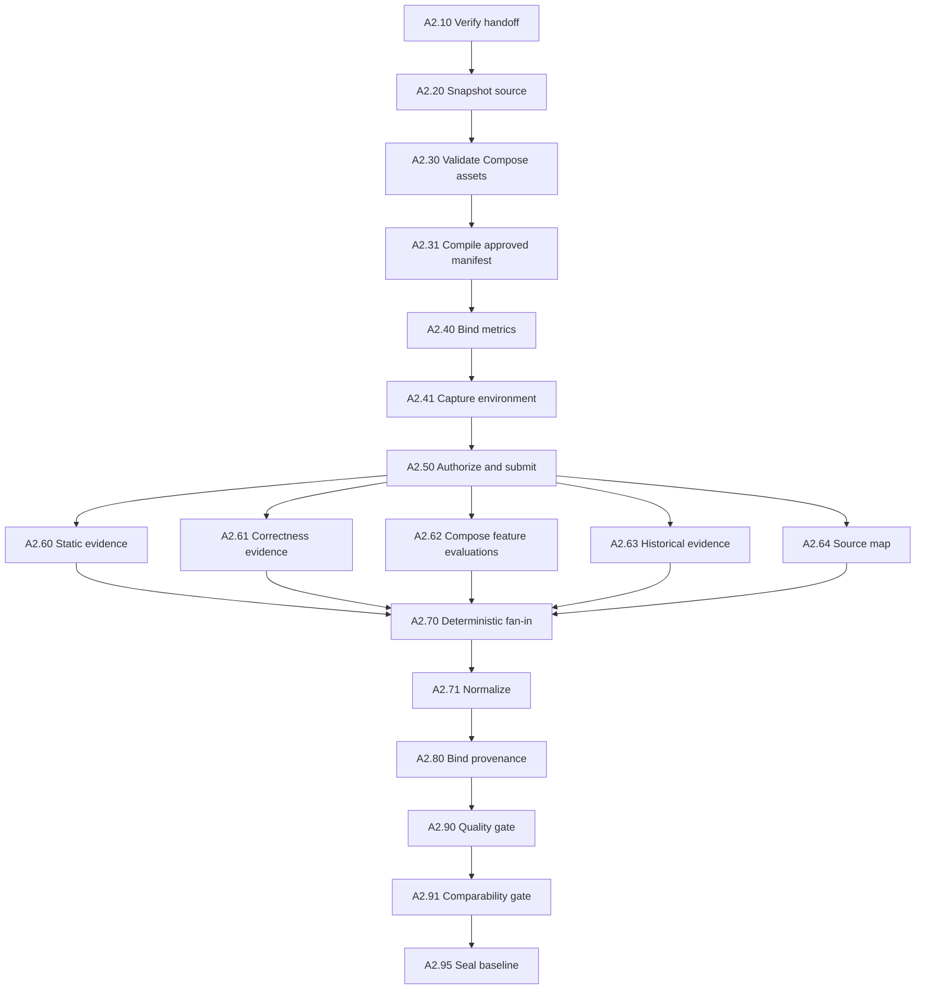
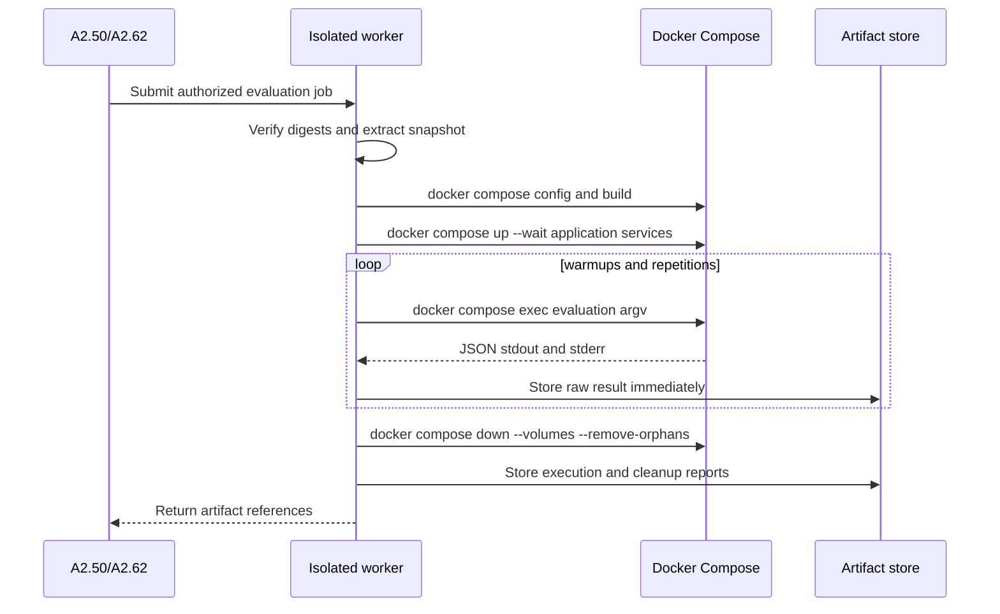

# A1-A2 Docker Compose Evaluation Refactor

## 1. Status and Authority

| Field | Value |
|---|---|
| Status | Proposed implementation specification |
| Scope | Lane 1, A1 and A2 |
| Product profile | Docker-capable codebases |
| Implementation state | Documentation only; no code is authorized by this document alone |
| Workflow authority | LangGraph remains the sole workflow and routing owner |

This document refines, but does not replace, the project blueprint. It must be
read with:

- [LangGraph control-plane architecture](../../project-blueprint/04-langgraph-architecture.md);
- [framework matrix](../../project-blueprint/05-framework-matrix.md);
- [A1 requirement intake](../../project-blueprint/lane-a-local-codebase/01-a1-requirement-intake.md);
- [A2 real baseline](../../project-blueprint/lane-a-local-codebase/02-a2-real-baseline.md); and
- [Lane 1 implementation playbook](../../implementation/05-lane-1-detailed-implementation-playbook.md).

## 2. Decision

For the first supported product profile, a repository must provide:

1. one Docker Compose file that creates the evaluation environment; and
2. at least one existing evaluation command or script that exercises the
   requested feature and writes machine-readable metrics to stdout.

The requester supplies the feature, criteria, guardrails and locations of
those assets. A1 validates and freezes the declaration. A2 executes exactly the
approved declaration against an immutable source snapshot.

Docker Compose provides environment isolation and repeatability. It does not
define what is being optimized. Evaluation scripts define how a feature is
exercised; criteria and guardrails define how returned metrics are judged.

This profile does not claim support for projects that cannot run under Docker
Compose. Future execution providers may implement the same worker protocol.

## 3. Problem

The existing handoff contains `WorkloadContract.command_id`, but an identifier
is not an executable definition. A2 currently discovers repository tools or
requests approval for a model-proposed command. Neither proves that the command
exercises the requested feature or returns the requested business metrics.

The target path is:

```text
requester declaration
  -> A1 validates repository-owned Compose/evaluation assets
  -> A1 freezes paths, argv and digests
  -> A2 snapshots the source
  -> A2 authorizes one evaluation run plan
  -> isolated worker runs Compose and evaluations
  -> A2 validates real observations and publishes the baseline
```

## 4. Minimal Product Input

### Repository shape

```text
repository/
|-- compose.yaml
|-- source-code...
`-- scripts/
    `-- evaluate-feature.sh
```

The script language is unrestricted. It may invoke Bash, PowerShell, Node.js,
Python, a compiled binary, `npm`, `make`, Gradle or another executable present
in the declared Compose service.

### Requester input

```json
{
  "source_path": "D:/projects/checkout",
  "feature_id": "checkout",
  "compose_file": "compose.yaml",
  "application_services": ["app"],
  "evaluations": [
    {
      "evaluation_id": "checkout-feature",
      "service": "app",
      "command": ["sh", "scripts/evaluate-checkout.sh"],
      "repetitions": 5
    }
  ],
  "criteria": [
    {
      "criterion_id": "latency",
      "metric_id": "p95_latency_ms",
      "direction": "minimize",
      "unit": "ms",
      "aggregation": "p95",
      "priority": 1,
      "target": 150
    }
  ],
  "guardrails": [
    {
      "guardrail_id": "correctness",
      "metric_id": "correctness",
      "operator": "eq",
      "threshold": 1,
      "unit": "verdict"
    }
  ]
}
```

`application_services` may be empty when the evaluation command is the whole
workload. `evaluations` is a list from schema version 1, although the common
case contains one entry. The platform, not the requester, derives artifact
digests, worker jobs, policy records and cleanup leases.

## 5. Business Concepts

An **evaluation** is a repository-owned procedure that exercises the named
feature, produces criterion or guardrail metrics, exits with zero only after a
completed execution, and writes one JSON document to stdout.

One evaluation may return many metrics. Multiple evaluations are needed only
when metrics require different commands, permissions, services, datasets or
repetition policies.

A **criterion** is a value to improve or move toward a target. It is not
restricted to time: tokens, cost, memory, throughput, accuracy, quality,
output size and custom business scores are equally valid.

A **guardrail** is a condition that must remain acceptable. Improvement in one
criterion cannot override a mandatory correctness, safety or quality failure.

The **evaluation environment** is a case-scoped Compose project created from
the immutable snapshot. It never reuses the repository owner's running project.

## 6. Proposed Contracts

The following are target Pydantic contracts. Implementation must generate JSON
Schemas from the final models.

```python
class ContainerCommandSpec:
    service: str
    argv: list[str]
    working_directory: str | None
    timeout_seconds: int


class EvaluationSpec:
    evaluation_id: str
    command: ContainerCommandSpec
    repetitions: int
    warmup_runs: int
    expected_metric_ids: set[str]


class ComposeExecutionContract:
    compose_file: str
    application_services: list[str]
    evaluations: list[EvaluationSpec]
    startup_timeout_seconds: int
    cleanup_timeout_seconds: int
```

Rules:

- command `argv` is a non-empty token list; shell strings are rejected;
- the service exists in normalized Compose configuration;
- repository paths cannot escape the source root;
- timeouts and repetitions fit the approved budget;
- no interpreter is inferred from a file extension; and
- A2 owns lifecycle command templates rather than accepting arbitrary Docker
  `up` or `down` commands from the requester.

`OptimizationRequest` gains:

```python
execution: ComposeExecutionContract
```

`WorkloadContract` continues to own dataset, environment, concurrency, cache,
seed and workload identity. Its singular `command_id` becomes deprecated after
migration because executable definitions live in `execution.evaluations`.

## 7. Evaluation Output Protocol

Minimum stdout:

```json
{
  "schema_version": "1.0",
  "feature_id": "checkout",
  "metrics": {
    "p95_latency_ms": 143.2,
    "correctness": 1
  }
}
```

Optional extensions:

```json
{
  "schema_version": "1.0",
  "feature_id": "checkout",
  "metrics": {},
  "samples": {"latency_ms": [120.1, 125.2, 118.9]},
  "artifacts": {"profile": "results/profile.json"},
  "metadata": {"scenario": "warm-cache"}
}
```

Rules:

- stdout contains exactly one JSON document; logs go to stderr;
- `feature_id` equals the approved feature;
- every required `metric_id` is present and has an allowed scalar value;
- referenced artifact paths remain within the worker output directory;
- raw stdout, stderr and referenced files are stored before decoding; and
- A2 never substitutes one metric for another or estimates a missing metric.

## 8. A1 Target Behaviour

| Node | Refactored responsibility |
|---|---|
| A1.10 | Accept Compose/evaluation declarations and preserve the original payload. |
| A1.20 | Extract the same fields from raw input; uncertain commands remain unresolved. |
| A1.30 | Resolve source root and enforce path containment. |
| A1.40 | Discover Compose files and script candidates as facts only. |
| A1.50 | Bind the requested feature to repository scope. |
| A1.60 | Normalize the objective. |
| A1.61 | Normalize metric, direction, target, unit, aggregation and priority. |
| A1.62 | Normalize mandatory guardrails. |
| A1.63 | Set execution budgets. |
| A1.70 | Build `ComposeExecutionContract` and workload identity. |
| A1.71 | Bind every criterion and guardrail metric to an evaluation. |
| A1.80 | Validate completeness and conflicts deterministically. |
| A1.90 | Apply policy and human approval where required. |
| A1.95 | Freeze paths, argv, file digests, criteria and execution contract. |

### A1 business rules

| Rule | Requirement | Route on failure |
|---|---|---|
| A1-EVAL-001 | Compose file is a regular file inside the source root. | `clarification` |
| A1-EVAL-002 | At least one evaluation exists. | `clarification` |
| A1-EVAL-003 | Every evaluation uses non-empty argv. | `rejected` |
| A1-EVAL-004 | Referenced repository files exist inside the source root. | `clarification` |
| A1-EVAL-005 | Every criterion and guardrail metric has a producing evaluation. | `clarification` |
| A1-EVAL-006 | Repetitions and timeouts fit the budget. | `rejected` |
| A1-EVAL-007 | Compose and script digests enter the request fingerprint. | `rejected` |
| A1-EVAL-008 | At least one mandatory correctness/quality guardrail exists. | `clarification` |
| A1-EVAL-009 | Model-proposed commands require digest-bound human approval. | `approval` |

A1 may call `docker compose config` as a read-only validator. It must not build,
start services or execute an evaluation.

## 9. A2 Target Behaviour and LangGraph Ownership

The existing topology remains authoritative:



| Node | Refactored responsibility |
|---|---|
| A2.10 | Verify request, digest, approval and execution-contract presence. |
| A2.20 | Snapshot Compose, scripts and source together. |
| A2.30 | Normalize Compose and validate services, paths and prohibited settings without starting containers. |
| A2.31 | Compile A1-approved commands; discovery is compatibility-only. |
| A2.40 | Bind every expected metric to its evaluation and decoder. |
| A2.41 | Capture Docker/Compose versions and material host dimensions. |
| A2.50 | Authorize configuration, images, network, mounts, resources, commands and timeouts; persist intent and submit jobs. |
| A2.60 | Collect optional static evidence. |
| A2.61 | Collect separately declared repository correctness evidence. |
| A2.62 | Reconcile the Compose evaluation worker and emit feature metric evidence. |
| A2.63 | Import eligible historical evidence when declared. |
| A2.64 | Build source mappings or run registered mapping recipes. |
| A2.70-A2.95 | Preserve, normalize, bind, validate, compare and seal evidence. |

Docker lifecycle is not a replacement for LangGraph nodes. A2.62 owns a typed
worker job; its adapter performs a bounded internal lifecycle and returns
artifacts. Only A2.62 validates that result and commits graph state or a route.

## 10. Compose Worker Protocol

Worker input contains case/attempt IDs, source snapshot, execution contract,
environment manifest, authorization, resource limits and an idempotency key.



The worker uses a deterministic case-scoped project name such as
`optimizer_<tenant-hash>_<case-hash>_<attempt>`.

Cleanup executes in a `finally` path. A durable environment lease is recorded
before startup, and a janitor reconciles expired leases after worker or host
failure. Unconfirmed cleanup is a typed failure, even if metrics were produced.

## 11. Minimum Policy Controls

Requester simplicity must not remove these internal controls:

- run only from the immutable snapshot;
- unique Compose project name per attempt;
- reject privileged containers, Docker socket mounts and arbitrary host paths;
- reject host PID, IPC and network modes;
- reject device mounts and external volumes by default;
- restrict egress and inject secrets by reference only;
- apply CPU, memory, process and timeout limits; and
- retain image identities and normalized Compose configuration in provenance.

Docker Compose is an environment mechanism, not a complete hostile-code
sandbox. Production workers must not share the control-plane Docker daemon.

## 12. State and Artifacts

LangGraph state stores references only: request, source snapshot, execution
contract, verification manifest, authorization, branch evidence and baseline.

The artifact store holds normalized Compose configuration, source archive,
stdout/stderr per attempt, evaluation JSON, profiles/reports, worker execution
report and cleanup report. Raw samples never live directly in checkpoints.

## 13. Error and Route Model

| Condition | Owner | Route/action |
|---|---|---|
| Missing Compose/evaluation declaration | A1.80 | `clarification` |
| Model-inferred command | A1.90 | `approval` |
| Compose/script changed after approval | A2.10/A2.20 | `rejected` |
| Invalid Compose file | A2.30 | `rejected` |
| Declared service absent | A2.30 | `missing` |
| Prohibited mount/network/privilege | A2.50 | `rejected` |
| Transient image/daemon failure | Worker/A2.62 | bounded idempotent retry |
| Application never ready | Worker/A2.62 | fail and always clean up |
| Evaluation non-zero or invalid JSON | A2.62/A2.71 | invalid evidence |
| Declared metric absent | A2.90 | `missing` |
| Raw digest invalid | A2.90 | `rejected` |
| Dimensions conflict | A2.91 | `incomparable` |
| Cleanup unconfirmed | A2.62 | `rejected`; janitor reconciliation |

HITL applies to missing declarations, model-proposed commands, elevated policy
or unresolved cleanup. It is not required on every run of an unchanged,
approved execution contract.

## 14. BA Acceptance Scenarios

1. One evaluation returns latency, tokens, quality and correctness; all bind to
   declared metrics without hard-coding in A2.
2. With no persistent application service, A2 runs the evaluation without a
   readiness phase.
3. When `quality_score` is requested but absent, A2.90 reports missing and no
   baseline is published.
4. When startup never becomes healthy, evaluation does not run, diagnostics
   are stored and cleanup executes.
5. When an approved script changes, A2 rejects before starting Compose.
6. With multiple evaluations, A2 starts the environment once, honors each
   repetition policy, preserves every attempt and cleans up once.
7. A Docker socket mount is denied before any build or startup.
8. After a worker crash, the same idempotency key is reconciled and an expired
   environment lease is cleaned by the janitor.

## 15. Implementation Order

After approval of this document:

1. Define Pydantic command, evaluation, Compose, worker and output contracts;
   generate JSON Schemas.
2. Write contract invariants and compatibility tests before handlers.
3. Extend structured A1 input with a migration path for `command_id`.
4. Implement A1.30/A1.40 read-only discovery and path validation.
5. Implement A1.61/A1.62 metric and guardrail normalization.
6. Implement A1.70 execution construction and A1.71 metric binding.
7. Implement A1.80 validation, A1.90 approval and A1.95 digest coverage.
8. Add a Compose execution port and typed worker protocol.
9. Implement isolated worker lifecycle, leases, idempotency and cleanup.
10. Refactor A2.30/A2.31 to validate and compile the frozen contract.
11. Refactor A2.40/A2.50 to bind metrics and authorize the run plan.
12. Refactor A2.62 to reconcile results without taking graph ownership away
    from the node.
13. Reuse and extend A2.70-A2.95 for evidence and baseline gates.
14. Add unit, contract, graph, failure, restart/resume and Compose E2E tests.
15. Remove legacy discovery only after compatibility migration is proven.

No later step may be implemented before its preceding contract and test step.

## 16. Definition of Done

- A1 cannot approve this profile without Compose, an evaluation and complete
  metric bindings.
- The fingerprint covers normalized paths, argv and content digests.
- A2 executes no guessed command on the primary path.
- A2 runs only the immutable snapshot in a case-scoped environment.
- Metrics are arbitrary declared values, not only timing values.
- Multiple commands work without unnecessary application restarts.
- Raw attempts are preserved before parsing.
- Missing or mismatched metrics cannot satisfy a requirement.
- Cleanup occurs on every path and is restart-reconcilable.
- Quality and comparability remain deterministic LangGraph nodes.
- A3 receives a baseline only after all mandatory evidence passes.
