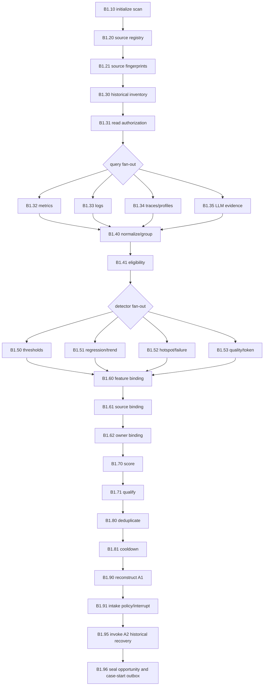

# 02. Two-Lane Product Implementation Architecture

Status: normative design; all 99 business nodes now have real production
handlers implementing this design (see `04-orchestration-frame-as-built.md`)  
Scope: Lane A, Lane B, and C0 convergence  
Prerequisite: [`00-bootstrap-and-build-order.md`](00-bootstrap-and-build-order.md)

## 1. Product Outcome

The product exposes one optimization control plane with two origins:

- **Lane A** starts from an authenticated manual requirement and builds an
  approved request, real baseline, grounded findings and solution portfolio.
- **Lane B** starts from scheduled historical observation, qualifies real
  opportunities, reconstructs the same request/baseline contracts, and invokes
  the same grounded-analysis implementation before owner routing.

Both lanes terminate at **C0**, which produces one lane-neutral
`ConvergedCase`. Neither lane edits source or selects a final solution. Shared
steps 01–08 remain downstream product milestones.

## 2. Non-Negotiable Architecture

```text
external API / MCP / scheduler / event
  -> authenticated command
  -> OptimizationRootGraph
       |-- manual origin    -> LaneASubgraph
       |-- scan origin      -> LaneBDiscoverySubgraph
       |-- qualified origin -> LaneBProposalSubgraph
       `-- lane handoff     -> C0ConvergenceSubgraph
  -> artifact references and auditable status
```

Rules:

1. LangGraph owns every business transition, conditional route, interrupt,
   retry boundary and subgraph invocation.
2. Every catalog task ID is a distinct node. Stage IDs are compiled subgraphs,
   never `run_a1`, `run_b1` or `execute_lane` service calls.
3. Adapters return typed capability results; they cannot mutate state, select
   an edge, approve output or recursively run another task.
4. A2 and A3 have one implementation each. Lane B supplies a policy-controlled
   execution mode and origin context; it never copies or weakens their gates.
5. Graph checkpoints contain compact references and decisions only. Raw
   telemetry, source snapshots, analyzer output and model transcripts remain in
   immutable object storage.
6. A scheduler may start a graph, but it does not own B1 progression. A
   dispatcher may deliver a case-start command, but it cannot alter the target
   route or payload.

## 3. Business Node Inventory

| Component | Native catalog nodes | Reused nested nodes | Responsibility |
|---|---:|---:|---|
| A1 | 14 | 0 | Manual requirement contract |
| A2 | 18 | 0 | Snapshot, real evidence, quality and comparability |
| A3 | 22 | 0 | Signals, findings, strategies and quality |
| B1 | 26 | A2's 18 through B1.95 | Historical discovery and qualification |
| B2 | 12 | A3's 22 through B2.22 | Automatic proposal and owner route |
| C0 | 7 | 0 | Lane equivalence and common handoff |

There are **99 unique business task definitions** across A1–A3, B1–B2 and C0.
A Lane A case can traverse 54 lane nodes before C0. A Lane B opportunity can
traverse 38 native Lane B nodes plus the same A2/A3 definitions through nested
subgraphs. Reused tasks are not duplicated in source or policy.

## 4. Root Execution Model

### 4.1 Commands

| Command | Producer | Required identity | Root route |
|---|---|---|---|
| `CreateManualCase` | API/MCP/CLI | Authenticated requester | Lane A at A1.10 |
| `StartDiscoveryScan` | Approved scheduler/event adapter | Service identity + tenant policy | Lane B at B1.10 |
| `StartQualifiedCase` | B1.96 outbox only | Signed internal service identity | Lane B at B2.10 |
| `ResumeInterrupt` | API/MCP/UI | Authenticated allowed actor | Exact checkpointed owner node |
| `CancelRun` | API/operator | Authorized actor | Root cancellation/reconciliation route |

Every command has `command_id`, tenant, command type, payload artifact digest,
actor/service identity, issued/expiry time and idempotency key. Root initialization
rejects unrecognized origin, duplicate-conflicting commands and cross-tenant
references.

### 4.2 Scan thread versus case thread

A discovery scan and an optimization case have different lifecycles:

```text
scan thread SCAN-...
  B1.10 -> ... -> B1.96
  -> zero or more QualifiedOpportunity artifacts
  -> zero or more CaseStartRequested outbox records
  -> scan completes after every candidate is qualified, merged, suppressed,
     quarantined or rejected

case thread OPT-... (one per qualified opportunity)
  B2.10 -> B2.22/A3 -> ... -> B2.60 -> C0
```

This prevents several opportunities from sharing one case state, budget,
approval or artifact chain. `B1.96` atomically seals the opportunity and writes
the outbox record. A dispatcher invokes the same root graph with that immutable
reference. Repeated delivery resolves to the same `case_id` and `thread_id`.

## 5. Lane A Runtime Topology

```text
LaneASubgraph
  A1RequirementSubgraph
    A1.10 -> A1.20 -> A1.30 -> A1.40 -> A1.50
    -> A1.60 -> A1.61 -> A1.62 -> A1.63 -> A1.70 -> A1.71
    -> A1.80 -> clarification interrupt / A1.90
    -> approval interrupt / A1.95
  A2BaselineSubgraph(mode=active_collection)
    A2.10 -> A2.20 -> A2.30 -> A2.31 -> A2.40 -> A2.41 -> A2.50
    -> fan-out A2.60/A2.61/A2.62/A2.63/A2.64
    -> deterministic fan-in A2.70 -> A2.71 -> A2.80
    -> A2.90 -> A2.91 -> A2.95
  A3SolutionSubgraph(origin=manual)
    A3.10 -> A3.11 -> A3.20 -> A3.21
    -> fan-out A3.30/A3.31/A3.32/A3.33
    -> A3.40 -> A3.41 -> A3.50 -> A3.51
    -> A3.60 -> A3.61 -> A3.62 -> A3.63 -> A3.64
    -> A3.70 -> A3.80 -> A3.81 -> A3.82 revision / A3.90
  -> C0.10
```

Exact conditional edges and node/framework ownership remain in
[`05-lane-1-detailed-implementation-playbook.md`](05-lane-1-detailed-implementation-playbook.md).

## 6. Lane B Runtime Topology

### 6.1 B1 discovery scan



Query and detector fan-ins use stable branch IDs and preserve optional failures.
No result wins because it completed first. Candidate processing uses LangGraph
`Send` with bounded concurrency and a deterministic candidate fingerprint.

### 6.2 A2 reuse modes

| A2 behavior | `active_collection` (Lane A) | `historical_recovery` (B1.95) |
|---|---|---|
| Source snapshot | Snapshot approved local working state | Reproduce exact historical source identity; quarantine if unavailable |
| A2.61 correctness | Execute only authorized repository checks | Import eligible historical correctness evidence; otherwise unavailable |
| A2.62 performance | Execute frozen workload in sandbox | Must not launch discovery benchmark; import only |
| A2.63 telemetry | Optional/declared live or imported data | Primary historical evidence input |
| Quality/provenance | Full A2 policy | Identical policy |
| Comparability | Full A2 policy | Identical policy |
| Missing mandatory evidence | Interrupt/recollect | Targeted evidence request or close; never silently execute discovery workload |

The mode is a typed, policy-approved subgraph input. It changes collector routes,
not evidence standards.

### 6.3 B2 proposal case

```text
B2.10 verify opportunity
-> B2.20 select analyzer strategy
-> B2.21 prepare bounded/redacted context
-> B2.22 invoke A3SolutionSubgraph(origin=automatic)
-> B2.30 validate discovery assumptions
-> B2.31 staleness decision
-> B2.40 consolidate complete proposal
-> B2.41 explain without changing gates/rank
-> B2.50 deterministic approval route
-> B2.51 digest-bound interrupt when required
-> B2.52 targeted revision/rejection route
-> B2.60 seal Lane B handoff
-> C0.10
```

B2.22 calls the compiled A3 subgraph directly. It does not call an A3 service,
copy prompts, or implement separate quality rules. A3.82 returns targeted
revision reasons to B2.52; accepted A3 artifacts are preserved.

## 7. C0 Convergence Topology

```text
C0.10 identify immutable origin
-> C0.20 validate schemas/versions
-> C0.30 verify digest and parent chain
-> C0.40 verify Lane B semantic equivalence to A1/A2/A3
-> C0.50 recheck source/evidence/approval/ownership freshness
-> C0.60 deterministic convergence policy
-> C0.70 publish ConvergedCase and handoff event
```

Failure routes return to the exact producer:

| Failure | Lane A route | Lane B route |
|---|---|---|
| Request/scope defect | A1.60–A1.80 | B1.90–B1.91 |
| Evidence/provenance/comparability | A2.40/A2.80–A2.91 | B1.95/A2 recovery |
| Finding/solution quality | A3.40–A3.82 | B2.22/A3 or B2.30 |
| Stale owner/proposal | Not applicable | B2.31 or new B1 case version |
| Digest mismatch | Artifact producer, no blind retry | Artifact producer, no blind retry |

## 8. State and Storage Ownership

### Root case state

```text
case/thread/tenant/origin/status/current node
request, baseline, evidence, finding, portfolio and convergence refs
pending interrupt
error/event refs
budget-usage ref
```

### Discovery scan state

```text
scan/thread/tenant/window/policy refs
registered-source and inventory refs
query-branch, run-group and signal refs
candidate/opportunity/suppression refs
candidate cursor and bounded concurrency
error/event/budget refs
```

### Reducer requirements

- branch results merge by `(branch_kind, branch_id, idempotency_key)`;
- conflicting digests for the same identity fail the fan-in;
- output order is stable and independent of completion order;
- mandatory failure remains visible even when optional branches succeed;
- candidate refs never overwrite another candidate's state; and
- raw result lists remain object-store artifacts, not checkpoint arrays.

## 9. Framework Ownership by Business Area

| Area/nodes | Framework/capability | Product-owned authority |
|---|---|---|
| All graph nodes | LangGraph + PostgreSQL checkpointer | Topology, route, checkpoint namespace, retry/interrupt contract |
| Contracts/artifacts | Pydantic + JSON Schema | Canonical vocabulary, migration, digest and signature rules |
| Policy gates | OPA or deterministic Python behind `PolicyPort` | Scope, trust, risk, approval, qualification, cooldown and convergence policy |
| A1/B1 source identity | Git CLI + content snapshotter | Allowed roots, repository/feature/owner registry and historical binding |
| A2/B1 evidence | OTel, Prometheus, Loki, Tempo, Pyroscope, MLflow | Query registry, provenance, trust, freshness and comparability |
| A2/A3 source analysis | Tree-sitter, Semgrep; conditional CodeQL/Joern/Slither/Foundry | Applicability, coverage, budget and claim maturity |
| B1 detection | Deterministic statistics, Prometheus rules, Bencher concepts | Practical significance, thresholds, scoring, dedup and cooldown |
| A3/B2 generation | Approved LLM providers | Context disclosure, schema, citation, budget and provider fallback |
| A3/B2 judging | Independent judge plus deterministic resolver | Citation truth, cause maturity and eligibility veto |
| Raw artifacts | S3/MinIO-compatible immutable store + KMS | Tenant path, retention, digest chain and access audit |
| External jobs | Kubernetes Jobs + gVisor/equivalent | Intent ledger, leases, network/secrets/resource policy and reconciliation |

Framework presence never proves product correctness. Every adapter must pass its
conformance suite and adoption ADR before its nodes can be enabled.

## 10. Product Surfaces

| Surface | Minimum operation | Constraint |
|---|---|---|
| Manual API/MCP/CLI | Create, inspect, follow, resume, cancel Lane A case | One command creates one durable thread |
| Discovery administration | Register sources/features/owners/queries; schedule/pause scans | Scheduler cannot bypass B1.10 |
| Opportunity review | Inspect evidence, suppression, quarantine and ownership | Raw artifacts require separate authorization |
| Proposal review | Compare findings, eligible/ineligible strategies and gate reasons | Narrative cannot hide structured facts |
| Operations | Queue/worker health, stale interrupts, budgets, failures, replay/reconcile | No manual DB/artifact mutation as normal operation |

## 11. Product Completion Boundary

Two-lane implementation is complete only when Lane A and Lane B both reach C0
using real artifacts; B1 no-data is a successful audited outcome; one scan can
produce multiple isolated cases without duplication; B1.95 and B2.22 prove
shared A2/A3 implementation identity; all interrupts resume the same owning
thread; all loops and fan-outs are bounded; C0 rejects any weaker Lane B
contract; and failures can be reconstructed from immutable artifacts.

This is a suggest-only product boundary. It does not implement shared selection,
planning, patching, verification, measurement, decision, reporting or rollout.

