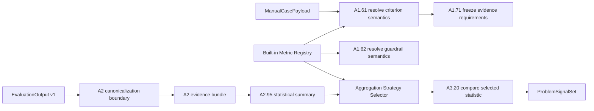

# Multi-Metric Framework Implementation Plan

## 1. Status and scope

This document is the implementation authority for making Lane 1 metric-neutral.
It refines the A1, A2 and A3 playbooks without changing LangGraph ownership or
topology. The implementation must preserve the current artifact schemas and the
`EvaluationOutput` v1 compatibility boundary.

In scope:

- versioned, typed metric definitions;
- deterministic resolution of built-in and custom metrics;
- boolean-verdict canonicalization;
- metric-specific aggregation selection;
- metric-specific A3 threshold comparison; and
- tests covering latency, throughput, resources, cost, tokens, quality,
  correctness and a custom business metric.

Out of scope for this increment:

- new OpenTelemetry, profiler, billing or LLM-judge collectors;
- candidate remeasurement in S05;
- registry persistence in PostgreSQL; and
- graph-node or graph-edge changes.

## 2. Problem statement

The contracts already accept several aggregation names and arbitrary evaluator
metrics, but the runtime is not yet metric-neutral:

1. A1 infers semantics from substrings in `metric_id`.
2. A2.95 calculates a common statistical summary but does not expose a single
   strategy-selected value.
3. A3.20 compares every criterion and guardrail using `MetricAggregate.mean`.
4. A boolean correctness verdict is numerically `1` in Python while the frozen
   exit-code guardrail defines success as `0`.

This creates a false impression of broad support. Transport is generic, but
interpretation is still latency/mean-centric.

## 3. Target architecture

LangGraph continues to manage all node ordering and routing. The metric
framework is deterministic domain logic called by existing nodes; it is not a
parallel orchestrator.

## 4. Domain contracts

`MetricDefinition` is immutable and contains:

| Field | Purpose |
|---|---|
| `metric_id` | Stable exact registry key |
| `schema_version` | Version of metric semantics |
| `value_kind` | `number`, `boolean` or `distribution` |
| `canonical_unit` | Unit required after normalization |
| `default_direction` | Expected optimization direction |
| `aggregation` | Statistic used for decisions |
| `comparison` | Threshold, relative, statistical or guardrail |
| `accepted_source_types` | Eligible evidence sources |
| `minimum_samples` | Evidence-quality minimum |

Built-ins in the first production slice:

| Metric | Unit | Aggregation | Direction |
|---|---|---|---|
| `p50_latency_ms` | `ms` | `p50` | minimize |
| `p95_latency_ms` | `ms` | `p95` | minimize |
| `p99_latency_ms` | `ms` | `p99` | minimize |
| `throughput_rps` | `requests_per_second` | `rate` | maximize |
| `peak_memory_mb` | `MiB` | `maximum` | minimize |
| `cpu_utilization_percent` | `percent` | `p95` | minimize |
| `input_tokens` | `tokens` | `sum` | minimize |
| `output_tokens` | `tokens` | `sum` | minimize |
| `total_tokens` | `tokens` | `sum` | minimize |
| `cost_usd` | `USD` | `sum` | minimize |
| `quality_score` | `score` | `mean` | maximize |
| `correctness` | `exit_code` | `verdict` | target |

Exact registry keys are authoritative. Unknown metrics receive a generic
definition built only from requester-declared unit and direction. The runtime
must never guess custom metric semantics from its name.

## 5. Strategy rules

Given the common summary stored by A2.95, decision values are selected as:

| Strategy | Decision value |
|---|---|
| mean/rate | `mean` |
| p50 | `percentile_50` |
| p95 | `percentile_95` |
| p99 | `maximum` until A2 stores p99 explicitly |
| maximum/verdict | `maximum` |
| sum | `mean * count` |

`verdict=maximum` is fail-closed for exit codes: any failed sample makes the
aggregate fail. It prevents several passing repetitions from averaging away a
single correctness failure.

## 6. Compatibility and migration

1. Do not change the field shape of `OptimizationRequest`, `EvidenceItem`,
   `MetricAggregate` or `BaselineSnapshot`. The aggregation enum receives the
   additive `maximum` value required by resource metrics; existing documents
   remain valid.
2. Preserve numeric evaluator values unchanged.
3. Convert boolean values only when the frozen evidence requirement has
   `canonical_unit=exit_code`: `true -> 0`, `false -> 1`.
4. Retain `_metric_profile` as a compatibility facade, backed by the registry.
5. Unknown metrics keep the current generic benchmark/telemetry path.
6. Existing artifact readers therefore remain compatible.

## 7. Ordered implementation

### M1 — contracts and registry

1. Add `contracts/metrics.py` with typed enums and `MetricDefinition`.
2. Add `application/metrics/registry.py` with immutable built-ins.
3. Implement exact lookup and explicit generic fallback.
4. Unit-test uniqueness and every built-in definition.

Exit condition: no substring-based semantic inference remains in A1.

### M2 — aggregation strategies

1. Add `application/metrics/aggregation.py`.
2. Select a decision value from `MetricAggregate` by strategy.
3. Fail when the requested statistic is absent rather than silently using an
   unrelated statistic.
4. Unit-test every supported aggregation.

Exit condition: verdict, sum and percentile metrics produce different decision
values from the same raw summary where appropriate.

### M3 — A1 integration

1. Replace `_metric_profile` substring rules with registry resolution.
2. Pass requester unit/direction for custom metrics in A1.61.
3. Freeze registry aggregation and source types in A1.61/A1.71.
4. Resolve the correctness guardrail through its definition.
5. Keep A1.80 compatibility validation deterministic.

Exit condition: the `OptimizationRequest` contains correct semantics for all
built-ins and deterministic generic semantics for custom metrics.

### M4 — A2 integration

1. Retain the boolean-to-exit-code compatibility conversion at A2.62.
2. Keep A2.95's common statistical summary so old consumers remain valid.
3. Ensure boolean values are not accidentally treated as ordinary integers
   outside an explicitly compatible canonical unit.

Exit condition: evidence entering the baseline has one canonical meaning.

### M5 — A3 integration

1. Resolve each criterion's frozen aggregation.
2. Select p50/p95/p99/sum/rate/verdict values through the strategy module.
3. Compare guardrails using registry aggregation semantics.
4. Include the selected aggregation name and value in signal descriptions.

Exit condition: A3 no longer uses `mean` unconditionally.

### M6 — verification

Run:

1. Ruff on contracts, metric framework and A1-A3 handlers.
2. Pyright on the same scope.
3. Unit tests for registry, aggregation and canonicalization.
4. A1, A2 and A3 production-handler contract suites.
5. Root graph contract suite to prove topology is unchanged.

## 8. Acceptance matrix

| Scenario | Expected result |
|---|---|
| latency distribution | A3 uses requested percentile |
| throughput | A3 uses rate/mean and maximize comparison |
| peak memory | A3 uses maximum |
| tokens/cost | A3 uses sum |
| quality score | A3 uses mean and maximize comparison |
| boolean correctness true | canonical exit code is zero |
| one failed correctness repetition | verdict uses maximum and fails |
| custom business metric | explicit unit/direction, generic mean strategy |
| missing required statistic | fail closed with a clear error |

## 9. Risks and mitigations

| Risk | Mitigation |
|---|---|
| Registry definition changes invalidate comparisons | version each definition; freeze version in criteria |
| Custom metric ambiguity | require explicit unit/direction; use generic mean only |
| p99 not persisted | use maximum as a documented v1 approximation; add p99 in schema v2 |
| Rate input lacks elapsed-time denominator | v1 treats evaluator-emitted rate as scalar; v2 observations will carry interval |
| LLM quality is nondeterministic | collector work remains out of scope until rubric/version/repetition contracts exist |
| Backward compatibility | do not alter stored artifact schemas in this increment |

## 10. Completion definition

The increment is complete only when all acceptance scenarios are automated,
A1-A3 and root-graph regression suites pass, static checks pass, and no
LangGraph node or edge is changed.
