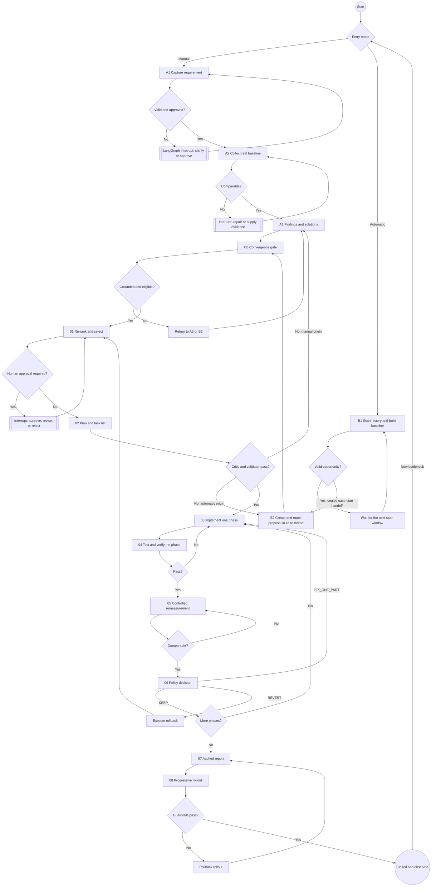
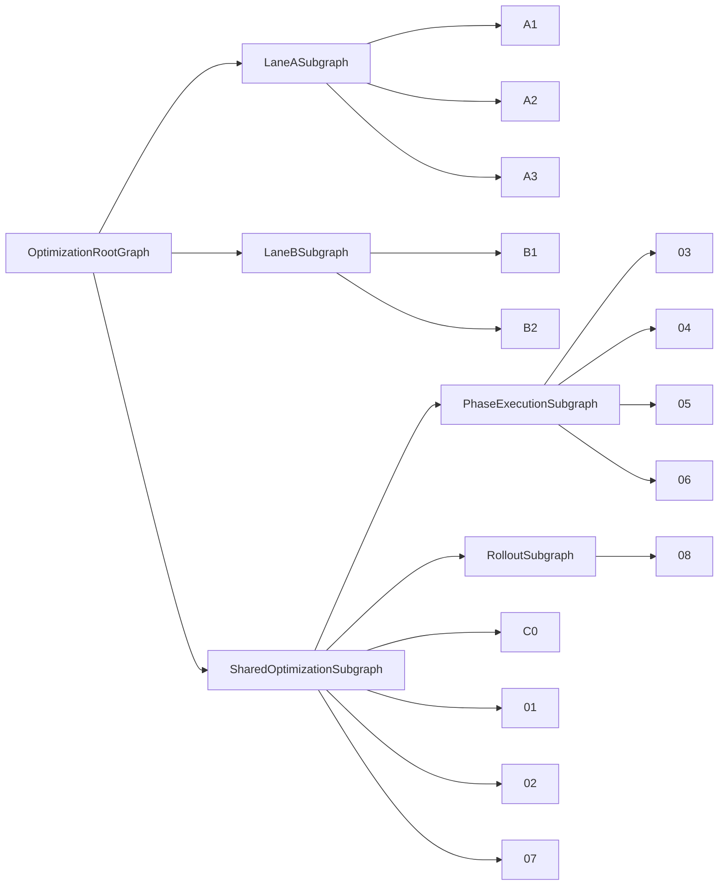

# 02. End-to-End Workflow

## Node Inventory

```text
A1  Manual requirement intake
A2  Real baseline and evidence
A3  Grounded findings and solutions
B1  Automatic bottleneck discovery and baseline
B2  Automatic grounded proposal
C0  Lane convergence gate
01  Re-rank and select a solution
02  Create the plan and task list
03  Implement one phase
04  Verify one phase
05  Perform controlled remeasurement
06  Decide KEEP / FIX_ONE_PART / REVERT
07  Produce an audited report
08  Perform progressive rollout
```

## Main Flow



## LangGraph Hierarchy



Every transition must pass through a LangGraph conditional edge. An external
adapter returns a typed result to its node; it never chooses the next node or
mutates graph state directly.

For Lane B, the direct B1-to-B2 arrow is a logical product transition. One B1
scan can qualify multiple opportunities; B1.96 publishes an idempotent outbox
command and the same root graph creates one isolated B2 case/thread per sealed
opportunity under DEC-ARCH-003.

## Mandatory Interrupt Points

| Location | Pause condition | Resume payload |
|---|---|---|
| A1 | Ambiguous request, policy conflict, production approval | Decision, actor, clarification, request digest |
| A2 | Missing, stale, or incomparable evidence | Evidence references or revised request |
| B2 | Owner review of an automatically generated proposal | Approve, revise, or reject with rationale |
| 01 | Security, migration, code, architecture, or broad-radius risk | Selected solution, actor, rationale |
| 02 | Plan commands or permissions exceed policy | Approved phases or revision |
| 03 | Agent requests a tool or permission outside the allowlist | Approved tool-call digest |
| 06 | Policy requires a business-owner decision | KEEP, FIX_ONE_PART, or REVERT |
| 08 | Canary, gradual, or full promotion | Cohort, actor, observation window |

A LangGraph interrupt persists a checkpoint and resumes with the same
`thread_id`. Code before an interrupt may run again, so side effects must be
idempotent [SRC-LG-INTERRUPT].
