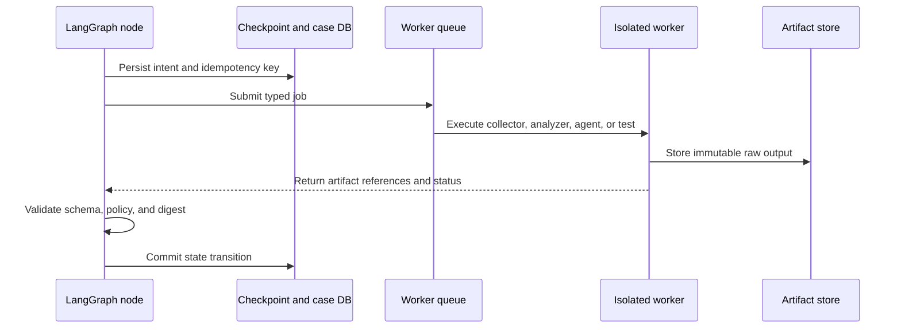

# 04. LangGraph Control-Plane Architecture

## Decision

One root `StateGraph` manages the complete business workflow. Each business
domain is a subgraph with its own state contract. LangGraph is suitable because
it supports deterministic and LLM-driven nodes, durable execution, persistence,
and human-in-the-loop control [SRC-LG-OVERVIEW] [SRC-LG-PERSIST]
[SRC-LG-INTERRUPT].

LangGraph does not replace collectors, analyzers, sandboxes, test runners, or
rollout controllers. It orchestrates those adapters and records transitions.

## Proposed Graph

```text
OptimizationRootGraph
|-- initialize_case
|-- route_intake
|   |-- LaneASubgraph: A1 -> A2 -> A3
|   `-- LaneB: B1 scan -> sealed case-start handoff -> B2 case
|-- SharedSubgraph: C0 -> 01 -> 02
|-- PhaseLoopSubgraph: 03 -> 04 -> 05 -> 06
|-- reporting: 07
`-- RolloutSubgraph: 08 -> close/rollback
```

The identifiers in the proposed graph are two levels, not coarse executable
nodes:

- `A1`, `A2`, `A3`, `B1`, `B2`, and each shared numbered stage are compiled
  subgraphs; and
- every task identifier in the corresponding business task catalogue (for
  example `A1.10`, `A2.62`, or `A3.81`) is a registered LangGraph node.

Every capability remains an independent node even when it invokes an adapter or
internal worker subgraph. A1-A3 must not be collapsed into an
`execute_everything`, `run_stage`, or synchronous service node because that
removes checkpoint, logging, retry, approval, fan-out, and targeted-revision
boundaries. The exhaustive Lane A topology and node/framework ownership matrix
are defined in
[`../implementation/05-lane-1-detailed-implementation-playbook.md`](../implementation/05-lane-1-detailed-implementation-playbook.md).
The required repository, toolchain, infrastructure and root-frame setup that
must precede those nodes is defined in
[`../implementation/00-bootstrap-and-build-order.md`](../implementation/00-bootstrap-and-build-order.md).

`B1 -> B2` is a logical lane transition, not a requirement to put every
opportunity found by one scan into one checkpoint thread. Under DEC-ARCH-003,
B1.96 atomically seals each `QualifiedOpportunity` and writes a digest-bound
case-start outbox record. The dispatcher invokes this same root graph for one
new case/thread per opportunity at B2.10. Redelivery resolves to the same case;
the dispatcher transports the command and never selects the route. The complete
two-lane runtime is specified in
[`../implementation/02-two-lane-product-architecture.md`](../implementation/02-two-lane-product-architecture.md).

## Root State

```python
class OptimizationState(TypedDict, total=False):
    case_id: str
    thread_id: str
    lane: Literal["manual", "automatic"]
    status: str
    current_node: str
    request_ref: ArtifactRef
    baseline_ref: ArtifactRef
    solution_portfolio_ref: ArtifactRef
    selected_solution_ref: ArtifactRef
    plan_ref: ArtifactRef
    active_phase_id: str
    patch_ref: ArtifactRef
    verification_ref: ArtifactRef
    measurement_ref: ArtifactRef
    decision_ref: ArtifactRef
    report_ref: ArtifactRef
    rollout_ref: ArtifactRef
    pending_approval: ApprovalRequest | None
    errors: Annotated[list[NodeError], operator.add]
    events: Annotated[list[EventRef], operator.add]
```

Graph state stores only compact metadata and artifact references. Raw logs,
source snapshots, model transcripts, test output, and binaries belong in object
storage rather than checkpoints.

## Common Node Contract

Every node defines:

```text
NodeInput schema
NodeOutput schema
preconditions
idempotency_key
timeout
retry policy
side-effect policy
artifact writer
audit event
error taxonomy
conditional route
```

The graph node owns this contract and is the only component allowed to emit its
route key. A capability adapter returns a typed result to the node. It cannot
call another node, mutate checkpoint state, approve its own output, or implement
an undisclosed retry loop. Nodes that submit external work persist intent and
reconcile completion using the same idempotency key before committing a route.

Deterministic nodes must not call an LLM: validation, comparability, integrity,
risk and scope gates, statistical gates, policy decisions, and rollout
guardrails.

LLM-capable nodes include requirement normalization, finding and solution
generation, evidence judging, plan drafting and criticism, coding agents, and
report narratives. Their output always passes typed validation and deterministic
gates.

## Conditional Edges

| From | Route key | To |
|---|---|---|
| initialize | lane | A1 or B1 |
| A1 | approved/clarification/rejected | A2, interrupt, or end |
| A2 | comparable/missing/incomparable | A3, interrupt, or A1/end |
| A3/B2 | quality | C0 or revision |
| C0 | accepted/rejected | 01 or A3/B2 |
| 01 | selected/approval/revise/reject | 02, interrupt, A3/B2, or end |
| 02 | approved/revise | 03 or A3/B2 |
| 04 | pass/fail | 05 or 03 |
| 05 | comparable/incomparable | 06 or 05/A2 |
| 06 | KEEP/FIX_ONE_PART/REVERT | 03/07, 03, or rollback then 01 |
| 08 | promote/rollback/complete | 08, 07, or end |

## Persistence and Resume

- Local development: SQLite checkpointer.
- Production: PostgreSQL checkpointer with a short case UUID or hash as
  `thread_id`.
- Object storage: S3 or MinIO with versioning and retention.
- Relational storage: searchable case index, approvals, leases, and policy
  versions.
- Event bus: optional transport for schedulers, worker callbacks, and UI streams.

Checkpoint at every node boundary. Side effects use this sequence:

```text
prepare intent -> persist idempotency key -> execute -> persist artifact
-> commit node output
```

If a worker crashes after execution but before checkpoint commit, retry must find
the existing artifact through the idempotency key rather than repeat the effect.

## Interrupt and Approval

An `interrupt()` payload contains only JSON-serializable data:

```json
{
  "approval_id": "APR-...",
  "case_id": "OPT-...",
  "stage": "SOLUTION_SELECTION",
  "artifact_digest": "sha256:...",
  "allowed_decisions": ["approve", "revise", "reject"],
  "expires_at": "..."
}
```

Resume uses the same `thread_id`, an authenticated actor, and a signed decision.
Approval is not a bare Boolean; it binds a digest, policy version, actor, and
expiration.

## Worker and Adapter Boundary



## Parallelism

LangGraph may fan out:

- A2 collectors by source and query.
- A3 analyzers by language.
- A3 candidate generators by risk tier.
- Step 04 independent test suites.
- Step 05 benchmark repetitions or trials when permitted by the protocol.
- Step 08 guardrail observers.

The fan-in node requires a deterministic reducer, artifact deduplication, and a
partial-failure policy. The first result to arrive must not win automatically.

## Error Taxonomy

```text
INPUT_INVALID
POLICY_DENIED
APPROVAL_REQUIRED
SOURCE_UNAVAILABLE
NO_DATA
INCOMPARABLE
ANALYZER_FAILED
MODEL_OUTPUT_INVALID
SANDBOX_FAILED
VERIFICATION_FAILED
MEASUREMENT_INVALID
ROLLBACK_FAILED
ROLLOUT_ABORTED
INTERNAL_ERROR
```

Retry applies only to transient failures. Validation, policy denial, and
incomparability route to an interrupt or revision rather than blind retry.
