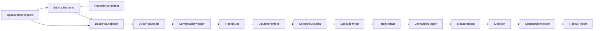

# 06. Canonical Data Contracts and Artifacts

## Authority

This file is the canonical artifact vocabulary under `DEC-DATA-001` and
`DEC-DATA-002`. Other documents may use package or envelope names for transport,
but they must not redefine the contained artifact types.

## Identity and Version Convention

Every persisted object contains:

```json
{
  "artifact_type": "OptimizationRequest",
  "schema_version": "1.0",
  "artifact_id": "ART-...",
  "case_id": "OPT-...",
  "created_at": "RFC3339 timestamp",
  "producer": {"name": "a1-service", "version": "locked version"},
  "policy_versions": {},
  "content_digest": "sha256:...",
  "parent_digests": []
}
```

`artifact_type` is stable and has no `/v1` suffix. `schema_version` is semantic
`MAJOR.MINOR`. Existing source models using `"1.0"` therefore remain compatible.
Docs may render `OptimizationRequest@1.0` for readability.

## Canonical Artifact Chain



## Canonical Vocabulary

| Artifact | Owner | Required content |
|---|---|---|
| `OptimizationRequest` | A1 or B1 reconstruction | Origin, scope profile, source reference, feature, objective, criteria, guardrails, workload/evidence contracts, budget, approval and fingerprint |
| `SourceSnapshot` | A2 | Canonical local path reference, Git identity, dirty/untracked manifest, content digests and snapshot policy |
| `RepositoryManifest` | A2 | Languages, modules, symbols, manifests, tests, commands, tool coverage and exclusions |
| `BaselineSnapshot` | A2 | Request/snapshot binding, dimensions, metric aggregates, sample IDs, windows and raw references |
| `EvidenceBundle` | A2 | Raw and normalized evidence refs, provenance, queries/commands, tools, coverage and trust levels |
| `EvidenceQualityReport` | A2 | Mandatory-source coverage, sample, freshness, integrity, redaction and collector failures |
| `ComparabilityReport` | A2 and 05 | Dimension-by-dimension verdict, mismatches, materiality and final Boolean |
| `FindingSet` | A3/B2 | Signals, observations, hypotheses, verified causes, citations, counterevidence and judge verdicts |
| `SolutionPortfolio` | A3/B2 | Materially different `SolutionStrategy` objects, eligibility and quality report reference |
| `SelectedSolution` | 01 | Strategy ID/digest, score breakdown, alternatives, policy and approval |
| `ExecutionPlan` | 02 | Ordered `ExperimentPhase` objects, task DAG, commands, acceptance and rollback |
| `PatchArtifact` | 03 | Base snapshot, active treatment, diff, changed scope, executor and tool provenance |
| `VerificationReport` | 04 | Commands, raw outputs, build/test/static/security results, failure attribution and verdict |
| `Measurement` | 05 | Baseline/treatment samples, protocol, effects, uncertainty and comparability reference |
| `Decision` | 06 | KEEP/FIX_ONE_PART/REVERT, criterion results, reasons, policy and rollback requirement |
| `RollbackReport` | 06/08 | Target, action, restored identity, verification and completion status |
| `OptimizationReport` | 07 | Timeline, completed/simplified/reverted/missing outcomes, impact, cost and artifact chain |
| `RolloutReport` | 08 | Deployment identity, stages, observations, promotions, holds and rollback events |

Supporting artifacts use the same identity/version envelope:

| Artifact | Owner | Purpose |
|---|---|---|
| `ApprovalArtifact` | A1/01/02/06/08 | Digest-bound human or policy approval |
| `DetectionReport` | B1 | Scan window, signals, exclusions, suppression and qualification outcomes |
| `A3QualityReport` | A3/B2 | Finding, strategy, cause-maturity and portfolio gate results |
| `ConvergenceDecision` | C0 | Schema, digest, equivalence and freshness gate verdict |
| `RankingResult` | 01 | Eligible strategies, score factors, sensitivity and ordering |
| `TaskList` | 02 | Task DAG and lifecycle state for an execution plan |
| `PlanQualityReport` | 02 | Scope, command, criteria, phase and rollback validation |
| `ExecutionProvenance` | 03 | Workspace, executor, command, model, tool, cost and transcript references |
| `StatisticalReport` | 05 | Effect size, uncertainty, noise and practical-significance results |
| `IsolationReport` | 05 | Proof that the approved treatment is the only material experiment difference |

## Envelope Vocabulary

An envelope groups canonical artifacts without replacing them:

| Envelope | Contents |
|---|---|
| `LaneAHandoff` | OptimizationRequest + SourceSnapshot + BaselineSnapshot + EvidenceBundle + FindingSet + SolutionPortfolio |
| `QualifiedOpportunity` | Detection report + owner/source binding + OptimizationRequest + A2 artifacts |
| `ProposalEnvelope` | QualifiedOpportunity reference + FindingSet + SolutionPortfolio + routing/approval state |
| `ConvergedCase` | Origin plus validated references to the canonical request, baseline, evidence and solution portfolio |

Names such as `BaselinePackage` and `GroundedSolutionPackage` are deprecated.
They must be migrated to these envelopes and canonical artifacts.

## Solution, Phase and Treatment Model

Under `DEC-EXP-001`:

```text
SolutionPortfolio
  `-- SolutionStrategy[]
        |-- strategy goal, findings, global tradeoffs and risk ceiling
        `-- proposed_phase_templates[]

ExecutionPlan
  `-- ExperimentPhase[]
        |-- exactly one Treatment
        |-- zero or more implementation tasks for that treatment
        |-- verification and measurement protocol
        `-- rollback
```

`Treatment` is the independent logical variable measured in one experiment.
It may require coordinated edits to multiple files. A strategy can contain
multiple sequential treatments, but each treatment must be independently
approved, implemented, verified, measured and decided before the next begins.

## Evidence Identity

Every sample is attributable to:

```text
tenant_id and case_id
feature_id
source_snapshot_digest and repository_id
workload_id, dataset_id and environment_id
model_id and prompt_version for LLM workloads
hardware_profile, concurrency and cache_state
metric_schema_version
timestamp, sample_id and trace_id where applicable
collector, query/command and tool versions
```

A missing material dimension makes the sample ineligible for before/after
comparison unless a versioned policy explicitly proves it immaterial.

## Trust Levels

| Level | Meaning | Promotion authority |
|---|---|---|
| T0 | Untrusted input or model output | None |
| T1 | Parsed and schema-valid | Deterministic schema validator |
| T2 | Provenance-valid and source/version-pinned | Integrity and provenance gate |
| T3 | Comparable and corroborated evidence | A2/05 comparability policy |
| T4 | Verified cause or successful diagnostic result | A3 evidence policy, never the generating LLM |

## Persistence and Retention

| Data | Production storage | Minimum controls |
|---|---|---|
| LangGraph checkpoints | PostgreSQL | HA/backup, tenant isolation, lifecycle retention |
| Searchable case index | PostgreSQL | RBAC, audit and schema migration |
| Raw evidence, snapshots, patches | S3/MinIO-compatible storage | Encryption, versioning, digest and object lock where required |
| Telemetry | Approved observability systems | Retention, query audit and feature/source dimensions |
| Secrets | Vault/KMS/secret manager | Short lease; references only in state/artifacts |

## Schema Evolution

- Compatible additions increment MINOR; incompatible changes increment MAJOR.
- Existing artifacts remain immutable; migration creates a derived artifact with
  parent digest and migration producer/version.
- Readers declare supported major versions and fail closed otherwise.
- CI generates and compares JSON Schemas from Pydantic models.
- Contract fixtures cover forward/backward compatibility and canonical JSON
  digest stability.

## Required Contract Work Before Production

Every vocabulary row above needs a Pydantic model, generated JSON Schema,
example fixture, redaction classification, owner, migration reader, digest test
and adapter contract test. Until those exist, the artifact is a target contract,
not an implemented production interface.
