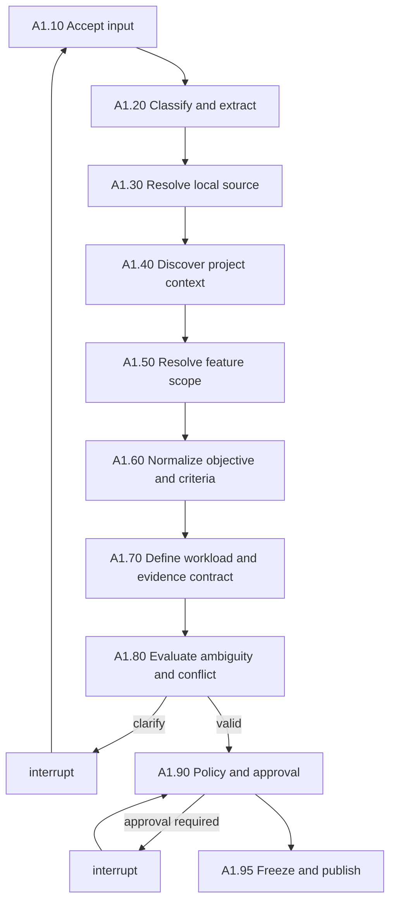

# A1. Manual Requirement Intake

## Business Objective

A1 converts a human or coding-agent request into an unambiguous contract for
what must be optimized, where it is located in a local codebase, how success
will be measured, what must not regress, and what evidence A2 must collect.
A1 does not scan for bottlenecks and does not produce solutions.

## Actors

| Actor | Responsibility |
|---|---|
| Requester | Supplies intent, local path, known feature context, and desired outcome |
| Platform | Resolves scope, normalizes criteria, detects omissions and conflicts, and creates artifacts |
| LLM extractor | Converts natural language into a draft contract; has no approval authority |
| Approver | Confirms the frozen request when policy requires human review |
| Policy owner | Defines allowed paths, limits, risk classes, and approval rules |

For use as a Codex or Claude tool, `requester` and `approver` are authenticated
execution identities supplied by the host. They are not mandatory CLI strings.

## Preconditions

- The submitted path exists and is readable by a least-privilege worker.
- The platform has a tenant/workspace identity and policy version.
- At least one input mode is present: raw text or structured request.
- No source file is sent to A1 as prompt context. A1 receives a path and scope;
  bounded source inspection is performed only to resolve repository metadata.

## A1 Subgraph



## Task Catalogue

| ID | Business task | Processing and rules | Inputs | Outputs | Framework fit | Gap and complement |
|---|---|---|---|---|---|---|
| A1.10 | Accept and register input | Create `case_id`, preserve original input, record caller identity and input mode; reject empty or oversized requests | Raw text or JSON, local path, host identity | `IntakeEnvelope` | LangGraph state/checkpoint [SRC-LG-OVERVIEW] [SRC-LG-PERSIST] | LangGraph does not authenticate users; integrate the host identity provider |
| A1.20 | Classify and extract | Structured data bypasses extraction; raw text goes to an LLM; extracted text is a draft and must preserve uncertain values as unknown | `IntakeEnvelope` | `RawRequestDraft`, extraction confidence and unresolved fields | LLM structured output plus Pydantic [SRC-PYDANTIC] | LLMs may omit or infer facts; use deterministic validation and clarification |
| A1.30 | Resolve local source | Canonicalize path, prevent traversal outside allowed roots, detect Git, resolve HEAD, dirty state, submodules and repository identity | Local path, allowed roots | `LocalSourceIdentity` | Git CLI for revision identity [SRC-GIT]; Pydantic contract [SRC-PYDANTIC] | Git does not make a dirty tree immutable; A2 must create a content-addressed snapshot |
| A1.40 | Discover project context | Detect languages, manifests, build/test tools, repository size, generated/vendor paths and likely service boundaries; do not diagnose performance | Source identity, bounded file listing | `ProjectProfile` | Tree-sitter [SRC-TREE], Semgrep project awareness [SRC-SEMGREP] | Syntax tools do not know business features; retain confidence and source locations |
| A1.50 | Resolve feature and scope | Map the requested feature to include/exclude paths, modules, entry points or symbols; require evidence for inferred mappings | Draft request, project profile, optional registry | `FeatureScope` with confidence and rationale | Tree-sitter [SRC-TREE], optional Joern/CodeQL [SRC-JOERN] [SRC-CODEQL] | Cross-language and runtime dispatch may be unresolved; ask for clarification or defer mapping to A2 traces |
| A1.60 | Normalize objective | Separate desired outcome from proposed implementation; prevent a requested fix from being treated as proven cause | Draft request | Canonical objective and optional requester hypothesis | Pydantic and JSON Schema [SRC-PYDANTIC] [SRC-JSON-SCHEMA] | Schemas validate shape, not intent; use policy rules and an LLM critic |
| A1.61 | Define primary criteria | Convert generic tags into metric name, direction, target, unit, aggregation, tolerance and priority weight; reject ambiguous targets | Objective, known metrics | One or more `Criterion` records | Pydantic [SRC-PYDANTIC] | A metric name does not prove collectability; A1.70 creates the evidence contract |
| A1.62 | Define guardrails | Capture correctness, security, memory, cost, quality and compatibility constraints with executable operators | Request and repository profile | `GuardrailSet` | JSON Schema [SRC-JSON-SCHEMA], OPA [SRC-OPA] | Generic guards cannot replace repository tests; A2 must discover executable checks |
| A1.63 | Set priority and budget | Record priority, maximum runtime, LLM spend, storage, allowed analyzers and deadline | Host policy and request | `ExecutionBudget` | OPA [SRC-OPA] | OPA evaluates supplied facts; metering and quota enforcement require platform services |
| A1.70 | Define workload identity | Identify command/scenario, dataset, environment, repetitions, warmup, concurrency and cache state needed for a valid baseline | Criteria, project profile, requester input | `WorkloadContract` | k6 for load scenarios [SRC-K6], MLflow for LLM evaluations [SRC-MLFLOW-EVAL] | Tool choice is repository-dependent; missing workload must be explicit, never fabricated |
| A1.71 | Build evidence requirements | For every criterion and guardrail, define acceptable source types and minimum samples without embedding credentials or hard-coded query URLs | Criteria, guardrails, workload | `EvidenceRequirementSet` | OpenTelemetry conventions [SRC-OTEL], Prometheus/Loki/Tempo capabilities [SRC-PROM] [SRC-LOKI] [SRC-TEMPO] | A1 defines required evidence but does not collect it; A2 binds concrete collectors |
| A1.80 | Detect ambiguity and conflict | Check missing fields, incompatible units, contradictory targets, overlapping scopes and impossible budget/workload combinations | Complete draft | `A1QualityReport` | Deterministic Python/Pydantic plus optional LLM critic | The LLM may suggest clarification but cannot waive hard failures |
| A1.90 | Evaluate policy and approval | Determine auto-accept, human approval, or rejection based on risk, data access, scope and requester authority | Quality report, identity, policy | `ApprovalRequest` or policy decision | OPA [SRC-OPA], LangGraph interrupt [SRC-LG-INTERRUPT] | Interrupt is workflow control, not authentication; bind approval to identity, digest and expiry |
| A1.95 | Freeze request | Canonicalize JSON, compute SHA-256, sign metadata, persist immutable artifact and emit the handoff event | Approved draft and policy version | `OptimizationRequest@1.0`, fingerprint, audit event | Pydantic [SRC-PYDANTIC], object versioning [SRC-MINIO-VERSIONING] | Hashing detects changes but does not establish signer identity; use KMS-backed signatures in production |

## Core Business Rules

| Rule | Requirement |
|---|---|
| BR-A1-001 | A1 accepts raw text, structured JSON, or both; structured values win only when the conflict policy explicitly permits it |
| BR-A1-002 | A request must contain one objective and at least one primary measurable criterion |
| BR-A1-003 | Every criterion contains metric, direction, target, unit, aggregation and acceptance operator |
| BR-A1-004 | Every optimization includes at least one correctness guardrail |
| BR-A1-005 | Local source identity includes canonical path, content snapshot policy and Git metadata when available |
| BR-A1-006 | A dirty Git worktree cannot be represented by the HEAD SHA alone |
| BR-A1-007 | Inferred feature scope is accepted only above the configured confidence threshold; otherwise interrupt |
| BR-A1-008 | Proposed remedies in the user request are recorded as hypotheses, never verified causes |
| BR-A1-009 | Missing workload/evidence details produce a typed clarification request, not placeholder baseline data |
| BR-A1-010 | Approved content is immutable; any material change creates a new request version and approval decision |

## Canonical Output

```json
{
  "artifact_type": "OptimizationRequest",
  "schema_version": "1.0",
  "case_id": "OPT-...",
  "source": {
    "kind": "local",
    "canonical_path": "D:/work/repository",
    "git_commit": "optional-sha",
    "dirty": false,
    "snapshot_policy": "content_addressed"
  },
  "feature": {"id": "checkout", "scope": ["src/checkout/**"]},
  "objective": "Reduce checkout p95 latency while preserving correctness",
  "criteria": [],
  "guardrails": [],
  "workload_contract": {},
  "evidence_requirements": [],
  "budget": {},
  "approval": {},
  "request_fingerprint": "sha256:..."
}
```

## Exception Routes

| Condition | LangGraph route |
|---|---|
| Path missing or outside allowed roots | Reject with `SOURCE_INVALID` |
| Feature cannot be mapped confidently | Interrupt with candidate scopes and requested clarification |
| Criterion target or unit is ambiguous | Interrupt; do not guess |
| Required metric cannot be observed under any declared source | Return to criteria/workload definition |
| Dirty tree conflicts with policy | Interrupt to approve snapshot, or reject |
| Approval expires or digest changes | Re-enter A1.90 |

## Definition of Done

A1 is complete only when `OptimizationRequest@1.0` validates, the source and
feature scope are resolvable, success and guardrails are executable in
principle, A2 has a concrete evidence contract, ambiguity is below policy
threshold, and approval is bound to the exact request fingerprint.
