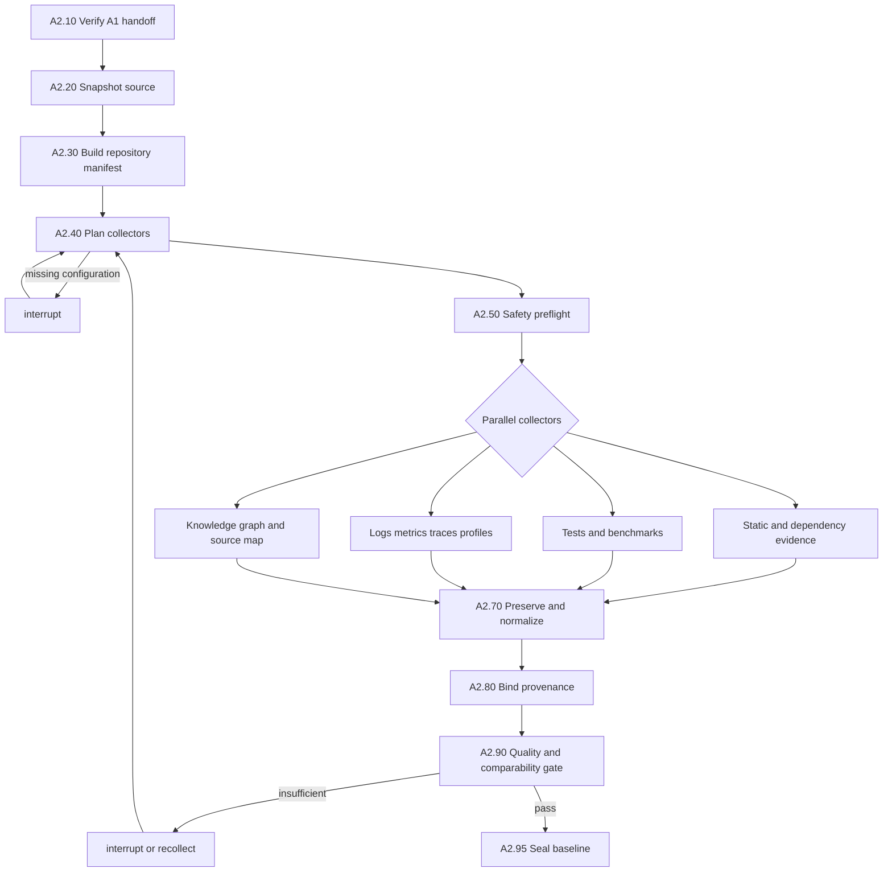

# A2. Real Baseline for a Local Codebase

## Business Objective

A2 proves the current behavior of the exact source state approved in A1. It
collects source, build, test, benchmark, runtime, telemetry, and optional
knowledge-graph evidence; preserves raw observations; and determines whether
the evidence is sufficient and comparable. It never invents measurements.

For a local codebase, “real” means either:

1. importing existing observations whose provenance binds them to the approved
   feature and source revision; or
2. executing a repository-owned workload in an isolated, reproducible local
   environment and recording the resulting observations.

An evidence template, README statement, or LLM estimate is not a baseline.

## Preconditions

- A1 produced an approved and digest-valid `OptimizationRequest@1.0`.
- The source directory is readable and can be snapshotted.
- Each criterion has an evidence requirement.
- Commands requiring execution are approved by sandbox policy.

## A2 Subgraph

## Task Catalogue

| ID | Business task | Processing and rules | Inputs | Outputs | Framework fit | Gap and complement |
|---|---|---|---|---|---|---|
| A2.10 | Verify handoff | Validate schema, approval, fingerprint, policy version and source accessibility; fail closed on mismatch | A1 artifacts | `A2IntakeDecision` | Pydantic [SRC-PYDANTIC], LangGraph persistence [SRC-LG-PERSIST] | Schema validity does not prove artifact authenticity; verify signature and digest chain |
| A2.20 | Snapshot local source | Capture file content, permissions relevant to builds, Git commit, dirty diff and submodule revisions; exclude secrets and disallowed paths by policy | Local source identity | `SourceSnapshot` with digest | Git CLI [SRC-GIT], immutable object storage [SRC-MINIO-VERSIONING] | Git ignores untracked/dirty content unless explicitly captured; use a content manifest |
| A2.30 | Build repository manifest | Enumerate languages, modules, manifests, dependencies, generated/vendor files, symbols, test roots and candidate commands | Snapshot | `RepositoryManifest` | Tree-sitter [SRC-TREE], Semgrep [SRC-SEMGREP] | Parsers may fail on generated or unsupported languages; retain raw files and partial-coverage report |
| A2.31 | Discover executable checks | Resolve repository-owned build, unit, integration, benchmark, lint, type and security commands without executing arbitrary guessed commands | Manifest and policy allowlist | `VerificationManifestDraft` | Native test tools; Testcontainers for dependencies [SRC-TESTCONTAINERS] | Discovery cannot prove commands are safe or representative; require policy and workload review |
| A2.40 | Plan evidence collection | Bind each A1 criterion/guardrail to one or more collectors, query/command, window, aggregation and minimum samples | Evidence requirements and manifest | `CollectorPlan` and coverage matrix | OTel, Prometheus, Loki, Tempo, Pyroscope, MLflow [SRC-OTEL] [SRC-PROM] [SRC-LOKI] [SRC-TEMPO] [SRC-PYROSCOPE] [SRC-MLFLOW] | Frameworks expose signals but do not define feature identity or valid comparisons; platform owns both |
| A2.41 | Resolve local execution environment | Pin runtime/tool versions, dependency lockfiles, environment variables by name, hardware profile, concurrency and cache state | Workload contract and manifest | `EnvironmentManifest` | Containers/Testcontainers [SRC-TESTCONTAINERS] | Containers do not guarantee identical hardware or timing; capture material host dimensions |
| A2.50 | Perform safety preflight | Check command allowlist, write scope, network policy, secret references, resource/time limits and repository size | Collector plan and environment | `ExecutionAuthorization` | OPA [SRC-OPA], isolated job model [SRC-K8S-JOB] [SRC-GVISOR] | Policy cannot contain runtime compromise by itself; use OS/container isolation and least privilege |
| A2.60 | Collect static source evidence | Run language-appropriate syntax, dependency, pattern, security and complexity analyzers; capture tool version, command and raw output | Snapshot and analyzer plan | `StaticEvidence[]` | Tree-sitter, Semgrep, CodeQL, Joern, Slither [SRC-TREE] [SRC-SEMGREP] [SRC-CODEQL] [SRC-JOERN] [SRC-SLITHER] | Static findings are observations, not measured bottlenecks or proven root causes |
| A2.61 | Execute correctness baseline | Run approved repository tests and record pass/fail, duration, flakes and environment; a failing baseline becomes an explicit guardrail fact | Snapshot and verification draft | `TestBaseline` | Testcontainers [SRC-TESTCONTAINERS] and repository-native runners | Missing tests cannot be treated as passing; route to clarification or record an accepted limitation |
| A2.62 | Execute performance workload | Run warmups and repeated benchmark/load scenarios exactly as specified; retain individual samples, not just averages | Workload contract and environment | `MetricSamples[]` | k6 thresholds [SRC-K6], Bencher history [SRC-BENCHER], Foundry for Solidity gas [SRC-FOUNDRY] | Benchmark tools do not prove representative workload; A1 workload identity and A2 comparability gate do |
| A2.63 | Import local historical telemetry | Query declared local/exported logs, metrics, traces, profiles or LLM traces; record source query and time window | Collector plan and credentials by reference | `TelemetryEvidence[]` | Loki, Prometheus, Tempo, Pyroscope, MLflow [SRC-LOKI] [SRC-PROM] [SRC-TEMPO] [SRC-PYROSCOPE] [SRC-MLFLOW] | Missing commit/feature tags weakens provenance; such samples cannot silently become T3 evidence |
| A2.64 | Build source and knowledge map | Connect files, symbols, calls, services and trace/profile frames to feature scope | Repository manifest and observations | `SourceMap`, optional `CodeGraph` | Tree-sitter, CodeQL or Joern [SRC-TREE] [SRC-CODEQL] [SRC-JOERN] | Dynamic dispatch and cross-service calls may remain unresolved; represent uncertainty explicitly |
| A2.70 | Preserve raw artifacts | Store bytes before parsing, calculate digest, attach MIME type, timestamp, tool and command identity | Collector outputs | `RawArtifactRef[]` | S3/MinIO versioning and lock [SRC-MINIO-VERSIONING] [SRC-MINIO-LOCK] | Storage immutability does not guarantee truthful collection; provenance and reproducibility remain required |
| A2.71 | Normalize observations | Convert units and dimensions without dropping raw values; apply registered aggregation only after sample preservation | Raw artifacts and metric registry | `NormalizedEvidence[]` | Pydantic and JSON Schema [SRC-PYDANTIC] [SRC-JSON-SCHEMA] | Normalization code can bias data; version transformations and test against reference fixtures |
| A2.80 | Bind provenance | Attach case, request fingerprint, feature, snapshot digest, workload, environment, sample, trace and source location identity | All normalized evidence | `EvidenceBundle` | OTel correlation fields [SRC-OTEL] | Correlation IDs require instrumentation discipline; downgrade trust when any material link is absent |
| A2.90 | Validate quality | Check source coverage, freshness, minimum sample size, failed collectors, analyzer coverage, redaction and integrity | Evidence bundle | `EvidenceQualityReport` | Deterministic policy/OPA [SRC-OPA] | Thresholds are business policy and require calibration using real cases |
| A2.91 | Validate comparability | Verify all dimensions required by A1 are internally consistent and suitable as a future treatment baseline | Samples and workload identity | `ComparabilityReport` | Platform-owned deterministic validator | No framework can infer omitted business dimensions; interrupt when material dimensions are unknown |
| A2.95 | Seal baseline | Compute aggregates, bind them to raw evidence and snapshot, sign the artifacts and publish the A3 handoff | Passed reports | `BaselineSnapshot@1.0`, `EvidenceBundle@1.0`, quality and comparability reports | LangGraph checkpoint [SRC-LG-PERSIST], immutable storage [SRC-MINIO-LOCK] | Aggregate values are never sufficient alone; preserve raw references and transformation versions |

## Evidence Coverage Matrix

| A1 concern | Minimum A2 evidence | Strong corroboration |
|---|---|---|
| Latency/throughput | Repeated benchmark or feature-tagged runtime metric | Trace plus profile linked to source snapshot |
| Token/cost | Model trace with model, prompt, input and usage identity | Holdout evaluation and cost records |
| Quality | Versioned dataset and scorer output | Human-reviewed holdout or domain oracle |
| Correctness | Existing repository tests and exit status | Integration/invariant tests on representative data |
| Memory/CPU | Repeated process measurements | Source-correlated profile |
| Solidity gas | Foundry gas/test output at pinned toolchain | Slither findings plus invariant tests |
| Source claim | Positive file/symbol/AST match | Runtime frame or semantic data-flow result |

## Core Business Rules

| Rule | Requirement |
|---|---|
| BR-A2-001 | A2 collects against exactly one content-addressed source snapshot |
| BR-A2-002 | Every aggregate retains references to its raw samples and transformation version |
| BR-A2-003 | Template or generated values are never accepted as observations |
| BR-A2-004 | Every A1 primary criterion and guardrail has coverage status: covered, unavailable, or invalid |
| BR-A2-005 | Collector partial failure is visible; successful collectors cannot hide missing mandatory evidence |
| BR-A2-006 | Static findings alone cannot establish runtime performance degradation |
| BR-A2-007 | Secrets and sensitive source content are redacted before LLM use, not before integrity hashing in the protected store |
| BR-A2-008 | If source, workload, dataset, environment or cache identity is materially unknown, `comparable=false` |
| BR-A2-009 | A2 may interrupt for configuration or evidence, but it may not weaken A1 acceptance criteria |
| BR-A2-010 | A3 starts only when mandatory evidence passes quality and comparability gates |

## Exception Routes

| Condition | LangGraph route |
|---|---|
| No executable workload and no valid historical evidence | Interrupt with an `EvidenceRequest`; block A3 |
| Build dependency unavailable | Retry only if transient; otherwise interrupt with captured diagnostics |
| Mandatory collector fails | Recollect or terminate; do not publish a successful baseline |
| Optional analyzer unsupported | Continue with reduced coverage only if policy permits and report the gap |
| Baseline tests already fail | Record the failures and require an explicit guardrail decision |
| Evidence dimensions conflict | Mark incomparable and return to collector/workload resolution |

## Definition of Done

A2 is complete only when real observations cover every mandatory A1 criterion,
the exact source snapshot and execution dimensions are known, raw evidence and
provenance are preserved, quality checks pass, and the comparability report is
true. “Collector executed” is not equivalent to “baseline complete.”
