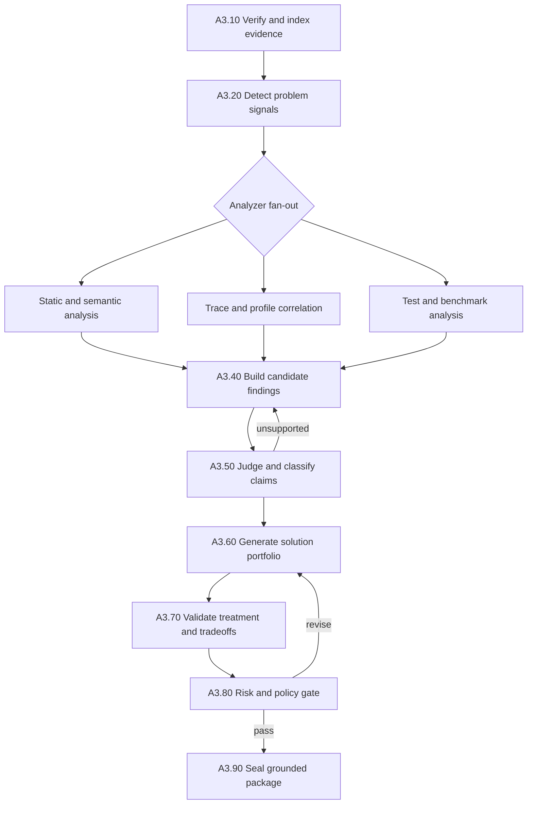

# A3. Grounded Findings and Solutions

## Business Objective

A3 turns A2 observations into a defensible set of problems, causal hypotheses,
verified causes, diagnostic experiments, and alternative solution strategies.
It must answer four separate questions:

1. What measurable problem exists?
2. Where in the approved scope is it manifested?
3. What evidence supports the cause rather than merely correlating with it?
4. Which reversible solutions could improve the A1 criteria, and what could
   each solution make worse?

A3 does not modify code and does not select the final strategy. Selection is
shared step 01 after lane convergence. A diagnostic experiment may be proposed
from a strong hypothesis, but it cannot be treated as a production change.

## Preconditions

- A1 request and A2 baseline packages have valid matching digests.
- A2 comparability and mandatory evidence coverage passed.
- Analyzer and LLM policies identify allowed tools, models, cost and source
  disclosure boundaries.

## A3 Subgraph



## Task Catalogue

| ID | Business task | Processing and rules | Inputs | Outputs | Framework fit | Gap and complement |
|---|---|---|---|---|---|---|
| A3.10 | Verify handoff | Validate A1/A2 schemas, signatures, fingerprints, source snapshot and evidence integrity before analysis | A1 and A2 packages | `A3IntakeDecision` | Pydantic [SRC-PYDANTIC], LangGraph persistence [SRC-LG-PERSIST] | Valid artifacts may still contain weak evidence; enforce A2 trust and coverage rules |
| A3.11 | Build evidence catalogue | Index evidence IDs, types, trust levels, feature locations, time windows and metrics so every later claim can cite exact records | Evidence bundle and manifest | `EvidenceCatalogue` | Tree-sitter source index [SRC-TREE], optional code graph [SRC-JOERN] | Indexing improves retrieval but cannot prove semantic relevance |
| A3.20 | Detect measurable problem signals | Compare baseline metrics to A1 targets and internal distributions; identify regressions, hotspots, failures and costly paths | Baseline and criteria | `ProblemSignal[]` | Deterministic statistics, Bencher/k6 outputs [SRC-BENCHER] [SRC-K6] | Threshold breach says what is wrong, not why |
| A3.21 | Prioritize signals | Score business impact, criterion weight, affected scope, frequency, severity and evidence trust; retain nonselected signals in the report | Problem signals and A1 priorities | `SignalPriorityReport` | OPA for hard policy [SRC-OPA] | Ranking weights are company policy and must be versioned and calibrated |
| A3.30 | Run syntax and pattern analysis | Find concrete code constructs near high-priority signals and emit positive file/symbol evidence | Snapshot and signals | `AnalyzerObservation[]` | Tree-sitter and Semgrep [SRC-TREE] [SRC-SEMGREP] | Pattern matches have false positives and no runtime causality |
| A3.31 | Run semantic and graph analysis | Trace calls, data flow, dependency paths or cross-file relationships where supported | Snapshot, source map, signals | `SemanticObservation[]` | CodeQL and Joern [SRC-CODEQL] [SRC-JOERN] | Extraction can be expensive and incomplete across languages; record coverage |
| A3.32 | Run domain analyzers | Use language-specific analyzers for applicable scope, such as Slither and Foundry for Solidity | Project profile and snapshot | `DomainObservation[]` | Slither and Foundry [SRC-SLITHER] [SRC-FOUNDRY] | Detector output and gas values still require workload and correctness context |
| A3.33 | Correlate runtime evidence | Map traces, profiles, logs and benchmark samples to files, symbols and call paths; distinguish correlation from cause | Telemetry, source map and signals | `RuntimeCorrelation[]` | Tempo, Pyroscope, OTel [SRC-TEMPO] [SRC-PYROSCOPE] [SRC-OTEL] | Missing instrumentation can create blind spots; never fill them with LLM assumptions |
| A3.40 | Draft candidate findings | LLM synthesizes concise claims using only catalogue evidence IDs and identifies counterevidence and unknowns | Signals and bounded evidence context | `FindingDraft[]` | LLM node controlled by LangGraph | Model output starts untrusted; use typed output, citation resolver and independent judge |
| A3.41 | Resolve citations | Verify each evidence ID exists, points to positive content, lies in feature scope and supports the exact statement | Finding drafts and catalogue | `CitationResolutionReport` | Deterministic resolver | Keyword overlap is insufficient; semantic claims may require analyzer or judge review |
| A3.50 | Judge claim support | Independently test symptom, location and causal wording; reject contradictions and negative-only evidence | Drafts, citations and counterevidence | `FindingJudgement[]` | Separate LLM judge plus deterministic gates | LLM judges share model bias; require objective checks and optionally provider/model diversity |
| A3.51 | Classify finding maturity | Assign `observation`, `hypothesis`, or `verified_cause`; a strong hypothesis may justify only a bounded diagnostic experiment | Judgements | `FindingSet` | Platform-owned policy/OPA [SRC-OPA] | Causal proof may require intervention; diagnostic results can promote or reject a hypothesis |
| A3.60 | Generate strategy portfolio | Produce materially different strategies. A verified cause may support implementation phases; a strong hypothesis may support diagnostic-only phases | Findings and A1 criteria | `SolutionStrategyDraft[]` | LLM generators as LangGraph fan-out; Optuna/DSPy/Codeflash capability metadata [SRC-OPTUNA] [SRC-DSPY] [SRC-CODEFLASH] | Framework suitability is not evidence that a strategy will work; A3 only proposes it |
| A3.61 | Define phase templates | For each strategy, describe ordered diagnostic or implementation phase templates; every phase names exactly one logical treatment | Strategy draft and manifest | `ExperimentPhaseTemplate[]` | Deterministic schema validation [SRC-PYDANTIC] | Multi-file edits may be one treatment; validate logical independence rather than file count |
| A3.62 | Analyze criteria impact | Estimate direction and confidence for every A1 primary criterion and guardrail; distinguish measured facts from forecasts | Treatment and A1 contract | `ImpactAssessment` | LLM analysis plus deterministic coverage check | Forecasts are uncertain; actual acceptance is deferred to controlled remeasurement |
| A3.63 | Document tradeoffs | Require concrete pros, cons, effort, prerequisites, uncertainty, operational effects and opportunity cost | Treatment and impact | `TradeoffAnalysis` | LLM critic and domain rules | Generic prose must fail the quality gate; require evidence citations or explicit assumptions |
| A3.64 | Define validation and rollback | Specify tests, benchmark protocol, expected metric movement, stop conditions and executable rollback mechanism | Treatment, A2 protocol and manifest | `ValidationPlan`, `RollbackPlan` | Native tools discovered in A2; OPA for required fields [SRC-OPA] | A command must resolve against the snapshot; an LLM cannot invent build scripts |
| A3.70 | Resolve implementation scope | Confirm every file, symbol, config key, prompt or dependency exists, or clearly label creation as proposed | Solution and manifest | `ScopeResolutionReport` | Tree-sitter/Semgrep/CodeQL [SRC-TREE] [SRC-SEMGREP] [SRC-CODEQL] | Dynamic/generated code can remain uncertain; ineligible until uncertainty is explicitly accepted |
| A3.80 | Assign risk tier | Classify experiment/config, prompt, code or architecture using blast radius, reversibility, uncertainty, migration and security impact | Complete solution | `RiskAssessment` | OPA [SRC-OPA] | Risk classification is organization-specific; external tools cannot own the policy |
| A3.81 | Apply portfolio quality gate | Enforce candidate diversity, cause-maturity routing, criteria coverage, complete tradeoffs, one treatment per phase and executable rollback | Findings and strategies | `A3QualityReport` | Deterministic policy/OPA [SRC-OPA] | A minimum count must not reward duplicate or artificial strategies; use semantic deduplication and applicability checks |
| A3.82 | Revise failed candidates | Return machine-readable rejection reasons to the relevant generator; cap retries and preserve all attempts | Quality report | Revised candidates and audit trail | LangGraph conditional edges and checkpointing [SRC-LG-OVERVIEW] [SRC-LG-PERSIST] | Blind retries waste cost; revise only failed dimensions and stop at budget limit |
| A3.90 | Seal output | Publish findings, eligible/ineligible strategies, phase templates, quality report, evidence bindings and model/analyzer provenance | Passed package | `FindingSet@1.0`, `SolutionPortfolio@1.0`, `A3QualityReport@1.0` | Immutable storage [SRC-MINIO-LOCK] | Sealing does not authorize implementation; shared step 01 ranks/selects and may interrupt |

## Required Finding Model

```text
finding_id
problem_signal_ids
claim_type: observation | hypothesis | verified_cause
symptom
scope: files, symbols, runtime path
causal_claim
supporting_evidence_ids
counterevidence_ids
analyzer_coverage
confidence
judge_verdict and reasons
unknowns
```

## Required Solution Strategy Model

```text
strategy_id
finding_ids
title, mechanism and strategy-level tradeoffs
phase_templates[]
  phase_kind: diagnostic | implementation
  exactly_one_treatment: variable, before, after
risk_ceiling and phase-level structured risk factors
predicted impact for every A1 criterion and guardrail
pros, cons, prerequisites, effort, uncertainty
exact affected scope
validation plan and expected observations
rollback plan and stop conditions
evidence IDs and explicit assumptions
eligibility and gate reasons
```

## Core Business Rules

| Rule | Requirement |
|---|---|
| BR-A3-001 | Every problem starts with a measured A2 signal, not an LLM impression |
| BR-A3-002 | Every factual claim cites resolvable evidence IDs |
| BR-A3-003 | “Code does not contain X” is negative evidence and cannot alone prove a cause |
| BR-A3-004 | A verified cause requires a measured symptom plus positive source/runtime corroboration and a passed judge verdict |
| BR-A3-005 | Implementation phases bind to a verified cause or a successful prior diagnostic; hypothesis-only strategies are diagnostic-only |
| BR-A3-006 | A strategy may contain multiple ordered phases, but every experiment phase contains exactly one logical treatment |
| BR-A3-007 | Risk follows applicability and verified need; the system must not invent config or prompt options merely to fill tiers |
| BR-A3-008 | Every solution evaluates every A1 primary criterion and guardrail |
| BR-A3-009 | Pros and cons must be treatment-specific; generic statements fail quality review |
| BR-A3-010 | At least the policy-required number of materially different eligible candidates must exist before handoff |
| BR-A3-011 | Ineligible candidates remain visible with exact gate reasons |
| BR-A3-012 | An LLM may recommend but cannot rank for final selection or approve implementation |

## Quality Scoring Dimensions

| Dimension | Hard gate or score | Meaning |
|---|---|---|
| Evidence integrity | Hard gate | IDs resolve and artifact digests match |
| Symptom proof | Hard gate | A2 measured the stated problem |
| Cause maturity | Route gate | Verified cause permits implementation; strong supported hypothesis permits diagnostic-only work |
| Scope resolution | Hard gate | Referenced paths/symbols/configs are real or explicitly proposed |
| Criteria coverage | Hard gate | Every A1 criterion and guardrail is addressed |
| Rollback feasibility | Hard gate | Treatment can be reversed within policy |
| Evidence confidence | Score | Strength and diversity of corroborating evidence |
| Predicted impact | Score | Expected benefit against weighted A1 criteria |
| Reversibility | Score | Cost and speed of restoration |
| Effort and risk | Score | Used later by step 01, not to erase hard failures |

## Exception Routes

| Condition | LangGraph route |
|---|---|
| A2 evidence digest mismatch | Reject handoff and return to A2 |
| No measured problem violates or threatens A1 criteria | End with `NO_ACTIONABLE_PROBLEM`, not fabricated findings |
| Problem exists but cause is unverified | Block implementation-eligible treatments; a strong supported hypothesis may produce a bounded diagnostic-only strategy, otherwise request targeted evidence from A2 |
| Analyzer partially fails | Retry transient failure; otherwise apply coverage policy and expose the gap |
| LLM emits invalid JSON or citations | Repair once with exact validation errors, then fail or switch approved provider |
| Solutions are duplicates or fake risk-tier variants | Revise only portfolio generation |
| No solution passes policy within budget | End with `NO_ELIGIBLE_SOLUTION` and preserve findings |

## Definition of Done

A3 is complete only when the measurable problem, source/runtime location and
cause maturity are explicit; all facts are evidence-bound; every eligible
strategy has ordered one-treatment phase templates, complete tradeoffs,
criteria coverage, validation, rollback and risk; diagnostic-only work is
clearly separated from implementation; and the deterministic quality report
permits handoff to shared step 01.
