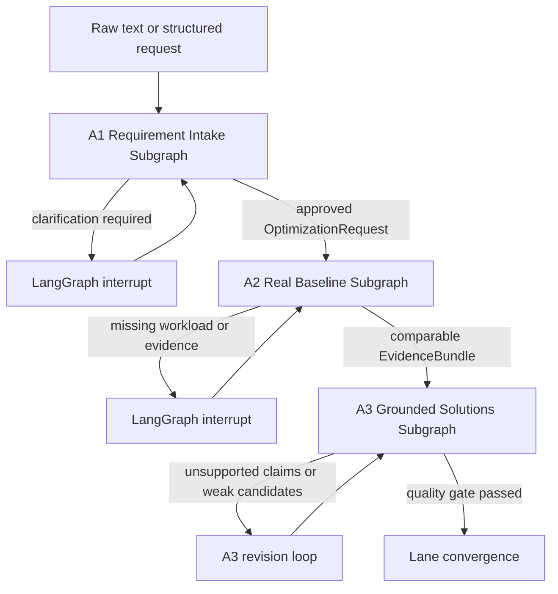

# A1-A3 Local Codebase Business Specification

## Scope

This package specifies the first three stages of Lane A for source code already
available on the machine running the platform. Git hosting, production rollout,
and code modification are outside this package. A local repository may be a Git
working tree or an unversioned directory, but the platform must create an
immutable source snapshot before collecting evidence.

The package is written as an implementation contract. It defines business
activities, task boundaries, inputs, outputs, rules, exception paths,
framework fit, and LangGraph ownership.

## Documents

| Document | Purpose |
|---|---|
| [01-a1-requirement-intake.md](01-a1-requirement-intake.md) | Turn free text or structured input into an approved, measurable optimization contract |
| [02-a2-real-baseline.md](02-a2-real-baseline.md) | Collect real code and execution evidence for the exact local snapshot |
| [03-a3-grounded-solutions.md](03-a3-grounded-solutions.md) | Verify problems and generate evidence-bound solutions with tradeoffs |
| [04-langgraph-and-traceability.md](04-langgraph-and-traceability.md) | Root graph, subgraphs, state, gates, handoffs, and requirement traceability |

## Business Flow

## Non-Negotiable Principles

1. LangGraph owns every transition, retry, interrupt, approval, and artifact
   reference from A1 through A3 [SRC-LG-OVERVIEW] [SRC-LG-PERSIST]
   [SRC-LG-INTERRUPT].
2. An LLM may extract, propose, correlate, or explain. It cannot validate its
   own output, invent evidence, approve a request, or declare a cause verified.
3. A2 uses an exact local source snapshot and real execution or historical
   observations. Generated evidence templates are contracts, not baseline data.
4. A3 may claim a verified cause only when positive source or runtime evidence
   corroborates the measured symptom.
5. All artifacts are schema-versioned, digest-bound, reproducible, and safe to
   resume after a worker or process failure.

## Stage Exit Criteria

| Stage | Exit artifact | Mandatory exit condition |
|---|---|---|
| A1 | `OptimizationRequest@1.0` | Scope, objective, primary criteria, guardrails, workload contract, source snapshot policy, and approval are complete |
| A2 | `BaselineSnapshot@1.0`, `EvidenceBundle@1.0`, and reports | Requested metrics have real samples, provenance, exact source identity, and a passed comparability report |
| A3 | `FindingSet@1.0`, `SolutionPortfolio@1.0`, and `A3QualityReport@1.0` | Findings are evidence-bound, applicable risks are considered, tradeoffs are complete, and at least one strategy or diagnostic experiment is eligible |

## Framework Interpretation

Framework references describe reusable capabilities, not proof that the
platform already implements them. Official references use IDs from
[../11-sources.md](../11-sources.md). Company-specific business policy,
feature identity, evidence trust, and approval still require custom code.
