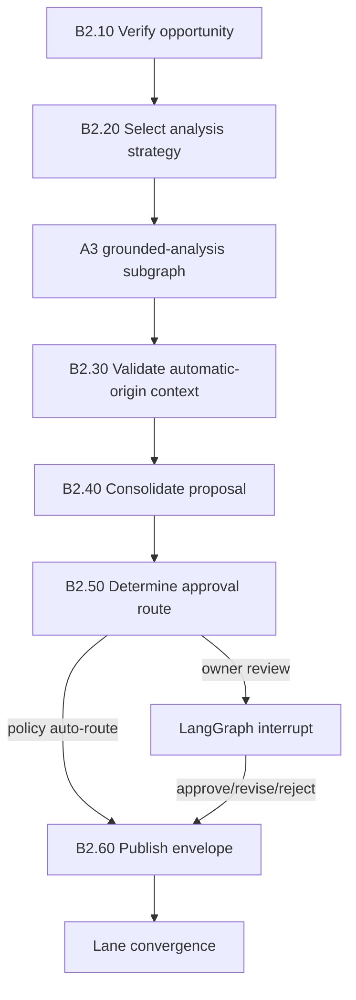

# B2. Automatic Grounded Proposal

## Business Objective

B2 analyzes a B1-qualified opportunity and proactively prepares a defensible
portfolio of solutions. The owner receives a proposal containing the measured
problem, verified or explicitly uncertain cause, evidence, tradeoffs, risk,
validation and rollback. The owner should not need to reconstruct why the case
was opened.

B2 reuses the A3 grounded-analysis subgraph. Automation changes who initiates
the work and how it is routed; it does not weaken evidence requirements.

## Preconditions

- `QualifiedOpportunity@1.0` passed B1 and its case-start command resolved to
  this unique case/thread.
- Its A1-equivalent request and A2 baseline are digest-valid and comparable.
- The local historical source snapshot is available for read-only analysis.
- Analyzer, LLM, data-disclosure and proposal budgets are authorized.

## B2 Subgraph



## Task Catalogue

| ID | Business task | Processing and rules | Inputs | Outputs | Framework fit | Gap and complement |
|---|---|---|---|---|---|---|
| B2.10 | Verify qualified opportunity | Validate package schema, digest chain, source availability, owner, age, baseline comparability and non-duplication at analysis time | B1 package | `B2IntakeDecision` | Pydantic and LangGraph persistence [SRC-PYDANTIC] [SRC-LG-PERSIST] | A case can become stale after B1; apply age/change policy before spending analyzer or model budget |
| B2.20 | Select analyzer strategy | Route by language, evidence type, feature topology, risk and available tools; skip inapplicable analyzers with explicit coverage | Manifest and evidence catalogue | `AnalysisStrategy` | Tree-sitter, Semgrep, CodeQL, Joern, Slither [SRC-TREE] [SRC-SEMGREP] [SRC-CODEQL] [SRC-JOERN] [SRC-SLITHER] | No analyzer covers every language or dynamic behavior; policy composes tools and records blind spots |
| B2.21 | Prepare bounded model context | Select only relevant evidence excerpts, source regions, counterevidence and A1 criteria; redact secrets; retain evidence IDs and truncation report | Strategy and evidence | `ModelContextPackage` | LangGraph nodes plus Pydantic [SRC-PYDANTIC] | Retrieval may omit critical context; enforce coverage limits and expose truncation rather than hiding it |
| B2.22 | Execute grounded A3 analysis | Reuse A3 signal, analyzers, finding draft, citation resolver, judge, cause maturity, strategy generation, risk and quality gates unchanged | Context and B1 artifacts | `FindingSet@1.0`, `SolutionPortfolio@1.0`, and `A3QualityReport@1.0` | A3 subgraph; runtime/source frameworks from A3 | Sharing code is mandatory to prevent Lane B from becoming a weaker prompt-only path |
| B2.30 | Validate discovery assumptions | Recheck B1 feature/source/owner bindings and separate detected facts from inferred discovery context in each finding | A3 package and B1 bindings | `DiscoveryAssumptionReport` | Deterministic resolver and optional independent LLM critic | The same LLM must not validate its own assumptions; use deterministic evidence first and separate judge model if needed |
| B2.31 | Assess proposal staleness | Compare current registry/source/evidence versions with B1; determine whether proposal remains valid, needs refresh or must be canceled | Current identities and package | `StalenessDecision` | Git [SRC-GIT], artifact digests | Current source changes do not rewrite historical evidence; they may make the proposal obsolete and require a new case version |
| B2.40 | Consolidate proposal envelope | Present problem, impact, evidence, verified cause/hypotheses, eligible and ineligible strategies, phase templates, pros/cons, risk, unknowns and quality report | Passed A3 artifacts | `ProposalEnvelope@1.0` | Structured templates and immutable artifacts [SRC-MINIO-VERSIONING] | Presentation must not suppress rejected candidates or evidence gaps |
| B2.41 | Explain recommendation | Generate a concise narrative grounded in deterministic scores and quality results; explanation cannot alter ranking or eligibility | Proposal facts | Human-readable summary | LLM explanation node | Persuasive language can distort confidence; show structured facts, uncertainty and gate reasons alongside narrative |
| B2.50 | Determine approval route | Use risk, confidence, ownership, impact, security and policy to choose auto-forward, owner review, security review or rejection | Proposal and policy | `ProposalRoutingDecision` | OPA [SRC-OPA] | OPA needs maintained ownership/risk policies; it cannot identify the correct approver from source alone |
| B2.51 | Request human decision | Pause with digest-bound proposal, allowed decisions, expiry and revision fields; authenticate resume actor | Routing decision | `ApprovalArtifact` | LangGraph interrupt [SRC-LG-INTERRUPT] | A bare yes/no is insufficient; bind actor, role, artifact digest and policy version |
| B2.52 | Handle revision or rejection | For revision, route only specified findings/solutions back to A3 within budget; for rejection, close or suppress recurrence by policy | Human/policy decision | Revised proposal or closure | LangGraph conditional edges/checkpoints [SRC-LG-OVERVIEW] [SRC-LG-PERSIST] | Re-running the whole graph wastes cost and may change accepted facts; preserve unaffected artifacts |
| B2.60 | Publish convergence handoff | Seal `ProposalEnvelope`, approval state, owner route and B1/A3 bindings; emit C0 handoff | Accepted proposal | Lane B handoff containing canonical artifact references | Immutable storage [SRC-MINIO-LOCK] | Acceptance authorizes selection workflow, not code modification |

## Proposal Content Required for Owner Review

```text
Why this case was opened
Measured criterion/guardrail impact
Historical windows and sample sizes
Local source snapshot and feature scope
Verified causes, hypotheses and unknowns
Evidence IDs and analyzer coverage
Each eligible and rejected solution
One treatment per solution
Pros, cons, risk tier and uncertainty
Expected impact across every criterion
Validation and rollback plan
Quality-gate and policy results
Required decision and expiry
```

## Core Business Rules

| Rule | Requirement |
|---|---|
| BR-B2-001 | B2 calls the same A3 subgraph and quality policies used by Lane A |
| BR-B2-002 | Every finding originates from a measured B1/A2 problem signal |
| BR-B2-003 | Discovery assumptions remain explicitly labeled and cannot become verified causes without evidence |
| BR-B2-004 | Automatic initiation does not imply automatic solution approval |
| BR-B2-005 | Every strategy has complete tradeoffs and ordered phases; each phase has one logical treatment, risk, validation and rollback |
| BR-B2-006 | Ineligible solutions and hard-failure reasons remain visible in the envelope |
| BR-B2-007 | Proposal staleness is checked immediately before routing and convergence |
| BR-B2-008 | A proposal may be revised only within the configured retry and model-cost budget |
| BR-B2-009 | Human approval is bound to proposal digest, actor, role, policy and expiry |
| BR-B2-010 | B2 cannot edit source, execute implementation or bypass shared step 01 |

## Exception Routes

| Condition | LangGraph route |
|---|---|
| Opportunity/source has become stale | Return to B1 refresh or close as obsolete |
| A3 cannot verify a cause | Block implementation-eligible treatments; allow only a strong evidence-bound diagnostic strategy, otherwise request targeted evidence |
| Analyzer coverage below required policy | Reconfigure strategy or reject with coverage report |
| LLM output invalid | One bounded schema repair, approved provider fallback, then fail visibly |
| No eligible solutions | Close as `NO_ELIGIBLE_SOLUTION` or request evidence; never fabricate alternatives |
| Owner rejects proposal | Close and apply dedup/cooldown policy with recorded reason |
| Owner requests revision | Re-run only affected B2/A3 nodes and preserve accepted artifacts |

## Definition of Done

B2 is complete when the proposal is either published for convergence, rejected,
or closed with a typed reason. A convergence-ready proposal has A3-equivalent
evidence quality, current source/ownership bindings, materially distinct
eligible solutions, complete tradeoffs and risk, a sealed audit chain, and the
approval state required by policy.
