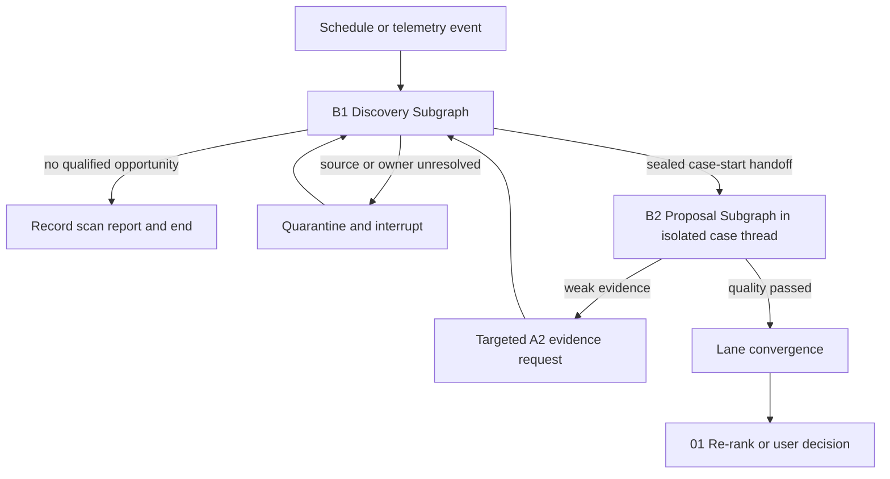

# Lane B Local Codebase Business Specification

## Purpose

Lane B starts optimization cases without a manual feature request. It observes
historical execution data that already exists, detects a measurable opportunity,
binds that opportunity to an exact local codebase and feature, reconstructs an
A1-equivalent optimization contract and A2 baseline, then produces A3-quality
grounded solutions for a human or policy-controlled decision.

Lane B has two business stages:

| Stage | Business outcome |
|---|---|
| [B1 Automatic Discovery](01-b1-automatic-discovery.md) | A qualified, deduplicated opportunity with an A1-equivalent request and real A2 baseline |
| [B2 Automatic Proposal](02-b2-automatic-proposal.md) | Evidence-grounded findings and eligible solutions routed to the correct owner |

Cross-stage orchestration, controls, and traceability are specified in
[03-langgraph-and-operating-model.md](03-langgraph-and-operating-model.md).

## Scope Boundary

- Source code is read from registered local directories only.
- Existing observations may come from local artifact files or approved
  Prometheus, Loki, Tempo, Pyroscope, or MLflow endpoints.
- B1 may query existing historical observations. It must not execute a new
  benchmark merely to discover an optimization candidate.
- After an opportunity is accepted, targeted evidence recollection is permitted
  only under the same A2 rules and must be identified as recollection.
- B2 proposes findings and solutions. It does not edit source code.

## End-to-End Flow



## Mandatory Equivalence with Lane A

Lane B is not a lower-quality shortcut. Before convergence it must produce the
same semantic contracts as Lane A:

```text
B1 opportunity qualification
  = A1 objective + criteria + guardrails + scope + workload identity
  + A2 real baseline + evidence provenance + comparability

B2 automatic proposal
  = A3 findings + cause maturity + solutions + tradeoffs + risk + quality gate
```

No candidate may enter shared step 01 without passing `C0` artifact binding and
quality checks.

One discovery scan may produce multiple qualified opportunities. Each is sealed
by B1.96 and delivered through the transactional outbox to a new invocation of
the same root graph, producing one B2 `case_id`/`thread_id` per opportunity.
This transport boundary does not permit the dispatcher to choose a route or
weaken a gate.
