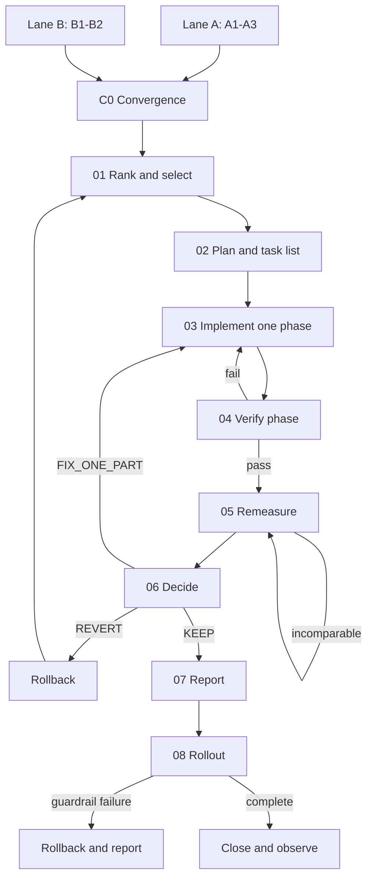

# Shared Optimization Workflow Business Specification

## Scope

This package defines the common process after Lane A or Lane B has produced
evidence-grounded solutions. Both lanes must enter through C0 and then follow
the same selection, planning, implementation, verification, measurement,
decision, reporting and rollout controls.

| Stage | Document | Business outcome |
|---|---|---|
| C0 | [00-convergence.md](00-convergence.md) | One lane-neutral, integrity-checked case |
| 01 | [01-rank-and-select.md](01-rank-and-select.md) | One approved solution selected against A1 criteria |
| 02 | [02-plan-and-task-list.md](02-plan-and-task-list.md) | Executable, phased, reversible plan |
| 03 | [03-implement-phase.md](03-implement-phase.md) | One isolated patch for one approved treatment |
| 04 | [04-verify-phase.md](04-verify-phase.md) | Correctness and safety verification for that patch |
| 05 | [05-controlled-remeasurement.md](05-controlled-remeasurement.md) | Comparable before/after measurement |
| 06 | [06-policy-decision.md](06-policy-decision.md) | KEEP, FIX_ONE_PART or REVERT decision |
| 07 | [07-report.md](07-report.md) | Auditable technical and business report |
| 08 | [08-rollout.md](08-rollout.md) | Progressive release with rollback and monitoring |
| Cross-cutting | [09-langgraph-operating-model.md](09-langgraph-operating-model.md) | State, loops, interrupts, ownership and production controls |

The canonical per-stage owner, SLO, idempotency, retry, error and runbook
requirements are defined in
[../12-production-operating-contracts.md](../12-production-operating-contracts.md).

## Shared Principles

1. LangGraph owns every state transition and loop [SRC-LG-OVERVIEW].
2. Only one logical treatment is implemented and measured per phase.
3. A successful command is not proof of correctness or improvement.
4. LLMs and coding agents propose work; deterministic policy authorizes it.
5. Every approval binds actor, role, artifact digest, policy version and expiry.
6. REVERT includes executed restoration evidence, not merely a status label.
7. Rollout is optional for local-only use, but the case cannot claim production
   delivery unless step 08 is completed against a declared deployment target.
